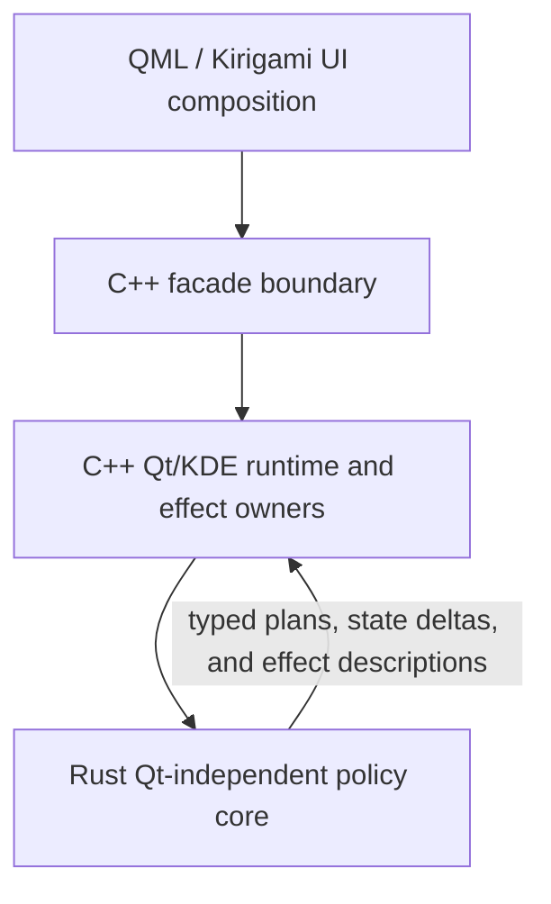
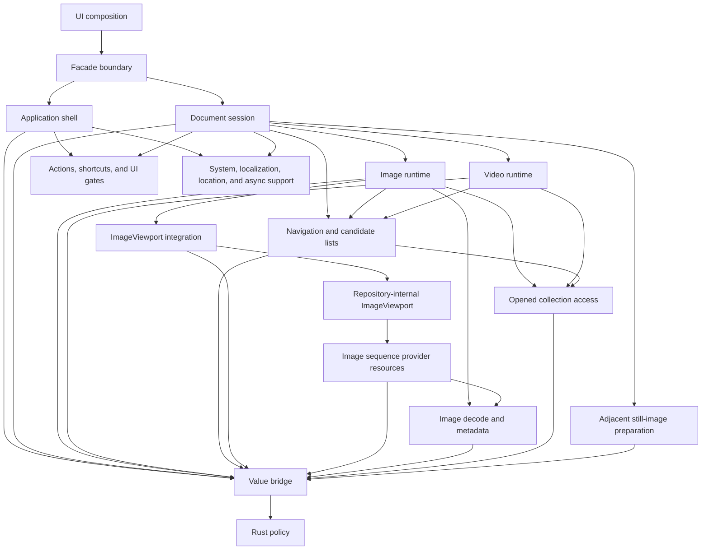

# Architecture Overview

KiriView is a KDE Kirigami image viewer built from cooperating UI, facade, runtime, and policy layers:

The architecture keeps product policy testable without moving Qt object lifetime, KDE side effects, QML rendering objects, or authoritative runtime state into Rust. Rust computes policy from plain values. C++ owns runtime state, executes effects through Qt and KDE, rejects stale completions, and publishes coherent projections to QML.

## Dependency Direction

- QML owns declarative composition and consumes the facade as a placement and interaction surface only.
- The facade owns the QML API boundary, type conversion, and forwarding. It must not own domain workflow state.
- C++ runtime owners own Qt/KDE effects, async lifecycles, projections, and platform integration.
- Rust policy modules consume plain snapshots and return typed plans or values. They must not depend on Qt objects, call KDE adapters, or publish QML-facing state.
- Shared support domains provide explicit capability snapshots or provider ports. Runtime owners consume those ports instead of probing platform state independently.

## Component Ownership Shape

The component graph is a responsibility contract, not a complete call graph:

- The document session owns top-level mixed-media routing, public source identity, active navigation projection, active zoom projection, title subject, displayed-media operation availability, displayed-media operation planning inputs, direct-media deletion follow-up, thumbnail-strip projection, and action-availability inputs.
- Image runtime owns image-mode loading, opened collection page state, viewport target and command adaptation, still-image provider resources, embedded image metadata, image-mode removal fallback facts, and image-specific navigation facts.
- Video runtime owns direct-video resolution, opened-collection video source-device acceptance, playback state, video status, video zoom readout, video metadata where supported, and playback-control readiness.
- Navigation owns candidate ordering, page/media cursor state, boundary facts, live direct-media refresh, and sibling archive discovery. It exposes snapshots and plans rather than public UI state.
- Collection access owns directly opened archive and directory listing, entry-byte access, entry metadata, and eligible collection-video playback devices. It must not update document, video, thumbnail, or QML state directly.
- The repository-internal `ImageViewport` component owns accepted and retained image presentation, geometry, per-role animation playback, render admission, and scene graph resources. The KiriView integration owner maps navigation targets and application commands to the component and correlates component generations back to application source identity without keeping a second presentation state.
- Image provider resources own source access, decode and refinement work, reusable whole-image payloads, predecode adoption, application cache and display-store pressure, typed failure detail, and provider handle leases. They answer component demand but do not own viewport presentation or rendering.
- Decoding owns route-specific image decoding, animation frame enumeration, metadata extraction, and whole-image refinement payloads. Decoder failures preserve typed diagnostics before any user-facing projection is derived.
- Predecode owns still-image-only adjacent preparation. Video rows may be cursor positions for scheduling, but they do not produce video-frame quick-navigation payloads.
- Actions own `QAction` identity, shortcut routing, accepted UI-gate revisions, command dispatch, and unsupported-media shortcut interception. QML reports UI-local gate facts and renders action placements.

## Build and Tooling Ownership

Each language boundary has one build-owned source and configuration inventory. Application builds, tests, lint, and editor tooling consume that inventory rather than maintaining divergent source lists or compiler settings.

The application build is the authority for production Rust, C++, generated boundary code, generated configuration, QML resources, and the application artifact. Test builds own test-local artifacts but consume application artifacts through the production build boundary rather than rebuilding production sources independently.

The application build owns one canonical installed application identity. Desktop metadata, icon identity, runtime metadata, generated configuration, and application artifacts must consume `org.hnjae.kiriview` from that authority and must not introduce alternate application IDs.

Derived build metadata follows the owner of the artifact it describes. Development tooling may orchestrate that metadata but must not become an independent authority for production or test compilation. Shared Qt, language-boundary, runtime, lint, and editor inputs come from one tooling context.
