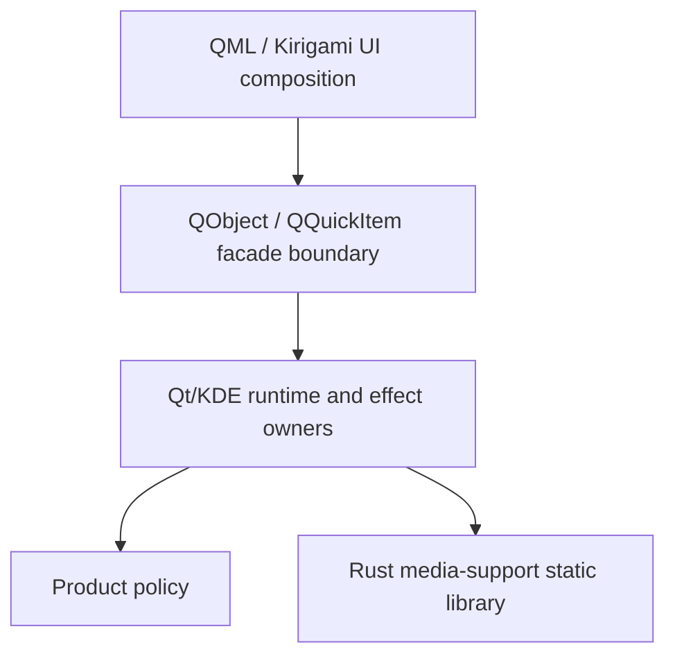

# Architecture Overview

KiriView is a KDE Kirigami image viewer built from cooperating UI, facade, runtime, policy, and media-support layers:

The application owns product policy, runtime state, Qt object lifetime, KDE side effects, stale-completion rejection, and coherent QML projections. Qt-independent policy remains value-oriented rather than becoming QObject plumbing. The statically linked Rust support library provides only the media-support capabilities defined by [Rust Support Boundary](rust-support-boundary.md).

## Dependency Direction

- QML owns declarative composition and consumes the facade as a placement and interaction surface only.
- The facade owns the QML API boundary, type conversion, and forwarding. It must not own domain workflow state.
- Policy and runtime owners own product decisions, Qt/KDE effects, async lifecycles, projections, and platform integration.
- The Rust support library accepts plain values or byte buffers and returns plain results, decoded payloads, or opaque capability-local handles. It must not own product policy, call Qt/KDE adapters, or publish QML-facing state.
- Shared support domains publish coherent capability facts through owned boundaries. Runtime owners consume those facts instead of probing platform state independently.

## Responsibility Boundaries

The following responsibilities are durable ownership boundaries, not a prescribed component graph. An implementation may combine or split internal collaborators when it preserves each authority, the dependency direction above, and the cross-owner contracts:

- The document session owns top-level mixed-media routing, public source identity, active navigation projection, active zoom projection, title subject, displayed-media operation availability, displayed-media operation planning inputs, direct-media deletion follow-up, thumbnail-strip projection, and action-availability inputs.
- Image runtime owns image-mode loading, opened collection page state, viewport target and command adaptation, still-image provider resources, embedded image metadata, image-mode removal fallback facts, and image-specific navigation facts.
- Video runtime owns direct-video resolution, opened-collection video source-device acceptance, playback state, video status, video zoom readout, video metadata where supported, and playback-control readiness.
- Navigation responsibilities own candidate ordering, route-local cursor state, boundary facts, live direct-media refresh, and sibling archive discovery within the enclosing document owner. They expose readonly observations and decisions rather than an alternate public UI state.
- Collection access owns directly opened archive and directory listing, entry-byte access, entry metadata, and eligible collection-video playback devices. It must not update document, video, thumbnail, or QML state directly.
- The KiriView `ImageViewport` integration owner maps navigation targets, application commands, and interaction facts to the dependency's supported interface, correlates public observations with application source identity, and does not keep a second presentation state.
- Image provider resources own source access coordination, adaptation of decoded artifacts into supported provider payloads, reusable payloads, predecode adoption, application cache and display-store pressure, typed failure detail, and provider leases. They answer supported provider requests without inferring presentation or rendering internals.
- Decoding owns route-specific image decoding, animation frame enumeration, metadata extraction, source-neutral decoded and refinement results, and the resource-lifetime holds needed to keep those results usable. Decoder contracts do not depend on provider-resource or presentation-owned abstractions, and decoder failures preserve typed diagnostics before any user-facing projection is derived.
- Predecode owns still-image-only adjacent preparation. Video rows may be cursor positions for scheduling, but they do not produce video-frame quick-navigation payloads.
- Actions own `QAction` identity, shortcut routing, UI-gate freshness, command dispatch, and unsupported-media shortcut interception. QML reports UI-local gate facts and renders action placements.

## Build and Tooling Ownership

Each build boundary has one owned source and configuration inventory. Application builds, tests, lint, and editor tooling consume that inventory rather than maintaining divergent source lists or compiler settings.

The top-level CMake application build is the authority for the executable, production C++, generated configuration, QML resources, application test targets, and application linkage to the supported `ImageViewport` target. The dependency owns its source inventory and private build details. The application build requires ISO C++23 for every application-owned C++ target and generated CXX bridge translation unit, disables vendor C++ language extensions, and owns the application minimum compiler, standard-library, Qt 6, and KDE Frameworks 6 baselines. Cargo owns the Rust support-library source inventory and produces one repository-internal `staticlib` plus generated CXX boundary artifacts for the CMake build to consume. Test builds own test-local artifacts but consume production targets and the same language and dependency baselines through these build boundaries rather than rebuilding production sources or selecting compatibility modes independently.

The application build owns one canonical installed application identity. Desktop metadata, icon identity, runtime metadata, generated configuration, and application artifacts must consume `org.hnjae.kiriview` from that authority and must not introduce alternate application IDs.

The Rust support library's installation and ABI constraints are defined by [Rust Support Boundary](rust-support-boundary.md#build-contract). CXX may implement its typed bridge; CXX-Qt is not an application build or runtime boundary.

Derived build metadata follows the owner of the artifact it describes. Development tooling may orchestrate that metadata but must not become an independent authority for production or test compilation. Shared Qt, language-boundary, runtime, lint, and editor inputs come from one tooling context.
