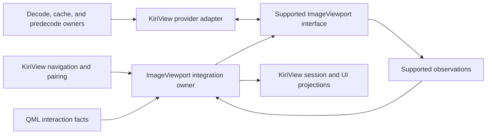

# ImageViewport Integration Architecture

This document defines only KiriView's side of its integration with `ImageViewport`. User-visible image behavior remains in `../spec/image-display.md`. The public contracts in the dependency's [specification index](../../../libs/image-viewport/docs/spec/README.md) are authoritative for its commands, observations, provider protocol, and behavior; KiriView architecture must not restate or constrain the dependency's private state, algorithms, scheduling, rendering, or resource management.

## Ownership

KiriView owns navigation scope, selected source identity, page pairing, reading-direction policy, scan and nearest-point policy, source access, decoding, cache and predecode policy, application resource budgets, source-specific metadata, typed load failures, action routing, video presentation, and user-facing projections.

The ImageViewport integration owner is the image-document runtime's adapter to the supported dependency interface. It creates public sequence values, submits public commands, correlates dependency observations with application source identities, converts application actions and QML-reported interaction facts into supported inputs, resolves opaque application failure references, and derives KiriView-facing projections. It must not retain a parallel mutable copy of image-presentation state or depend on private dependency APIs.

## Integration Flow

Before submitting a target, the integration owner records the intended application source and role identities. A displayed URL, image readiness, toolbar zoom, page-role projection, or error projection is published only from a supported observation that matches that application record. Opaque correlation values from the dependency are compared only as its public contract permits; delayed observations or UI actions associated with an older application target cannot update a newer selection.

The integration owner submits target and presentation requests needed to implement the transitions defined in the product specification. A selected-target replacement may retain only the dependency-observed complete committed display until the accepted target render-commits or becomes terminal; retained pixels remain correlated with their displayed generation and never supply readiness or geometry for the accepted target. A presentation-shape change between single-page and spread modes follows [Image Display](../spec/image-display.md#zoom-controls), immediately revokes the prior presentation, and cannot use selected-target retention as fallback. KiriView publishes coherent application state for those transitions and does not infer intermediate dependency state.

## Sequence Provider Boundary

The KiriView provider adapter implements only the supported provider interface. Source URLs, archive handles, credentials, cache keys, decoder objects, and navigation policy remain behind the application boundary. The adapter treats dependency-supplied request identity, demand, limits, and ownership callbacks as public protocol values rather than deriving their meaning from dependency internals.

Source access, decode routing, cache lookup, predecode reuse, SVG rasterization, animation frame production, and refinement remain KiriView responsibilities. Provider results must carry the current public correlation values and valid payload facts required by the supported interface. Application extensions must not bypass that interface with an alternate image-presentation path.

Decoding publishes source-neutral decoded and refinement results together with the lifetime holds required to use them safely. Provider-resource owners consume those results and adapt them into reusable application payloads and supported provider values. Dependency direction runs from those decoding-owned contracts through provider-resource adaptation to the supported viewport boundary; decoding does not depend on provider-resource or presentation-owned abstractions.

Each accepted provider request has one authoritative application completion owner. A source-derived thumbnail may be emitted only through the protocol's provisional event and cannot consume, replace, or race that request's later authoritative terminal result. Decoded or predecoded authoritative payloads enter that same request owner as reusable source state rather than through a parallel presentation shortcut.

The display image store owns KiriView's reusable decoded entries, byte accounting, priority, eviction, and leases. Provider ownership callbacks are the only dependency inputs that may change the application lease state; QML load status, visual-item lifetime, and polling are not application resource authorities.

The application provider retains source-specific failure detail in a KiriView-owned immutable failure record and sends only values allowed by the public provider protocol. The integration owner resolves an opaque application reference only when a matching supported observation exposes it. A resolved non-empty application message remains authoritative. An empty application message or an absent, stale, or unresolved reference cannot recover detail from another application target and instead maps the typed viewport failure facts to a stable localized KiriView message. Component-authored diagnostic text remains diagnostic detail and is never application-facing copy.

## Preview, Refinement, And Reuse

KiriView may answer public provider demand with a validated preview, bounded-detail payload, cache entry, or exact payload when the supported interface permits it. It may apply stricter application cache, display-store, and source-work budgets than the supplied limits.

Encoded source data for foreground decode, refinement, and preparation is admitted before or while it is materialized under one application-owned source-data budget derived from the shared system-memory facts. Admission bounds both one source and aggregate concurrent source data across direct URLs and opened-collection backends. A backend must stop before exceeding admission, and a source-data resource remains charged while application work or a retained source-backed payload can still access its storage. Cancellation, stale rejection, failure, and payload retirement release that charge without permitting partial publication.

Source-data admission failure is a typed source-access failure owned by the requesting workflow. It cannot fall through to a decoder, populate a cache or display store, or be reclassified as unsupported format merely because a backend reached its resource limit.

Provisional preview production and authoritative still production remain separate source facts even when they overlap in time. A matching preview can improve loading presentation, but only the authoritative terminal result may establish reusable current-still state, report success, or report source failure. Preview-origin and thumbnail-quality payloads are ineligible as authoritative predecode seeds.

Provisional pixels are eligible only when the accepted image transition has no retained complete authoritative display. When a complete display is retained during replacement, it remains the sole visual fallback until the accepted target commits or becomes terminal; preview availability cannot displace it.

KiriView orders authoritative candidates by whether they satisfy the current accepted physical-display demand, not by whether they came from foreground decode, predecode, or cache. A validated authoritative candidate that already satisfies that demand and the active resource limits is used directly without first publishing a lower-detail candidate. An insufficient prepared image is a refinement basis, not evidence that the current request has matching detail.

An initial authoritative completion may use lower detail only when matching current-detail output cannot be produced within KiriView's bounded initial-detail wait policy or cannot be produced under the accepted source and resource constraints, and only when the public demand permits inexact output. The same accepted source lifecycle remains responsible for eventual current-detail refinement without requiring a presentation change. Exact demand never falls back to an inexact authoritative result.

Authoritative reuse requires matching source and navigation-scope identity, freshness, public correlation, and resource admission. A candidate that cannot prove those facts is unavailable to the request rather than a lower-confidence substitute.

Refinement work is best-effort cancelable. A completion may populate an application-owned bounded cache under its reuse identity, but the provider may return it only for a matching current public request. KiriView does not decide whether or how the dependency incorporates a valid result into presentation.

Initial and refined still-image output remains part of one aggregate application decoded-memory admission from producer start through physical producer retirement and result handoff or discard. Admission covers the final display-ready allocation before production and every simultaneously live application-owned raster buffer the producer can create; prepared-result handoff reuses the original charge, and every retained alias of final pixels preserves it until those pixels are physically released. Codec-private transient storage does not become retained output ownership merely because a producer conservatively includes a decoder bound in its producer-start capacity estimate; any separately enforced decoder cap remains an independent constraint. Publication cancellation and stale rejection cannot release capacity early; a replacement that would exceed the admitted aggregate waits, degrades within the accepted request contract, or returns a typed bounded-resource outcome without publishing stale or partial output. Store-local byte limits continue to govern retention and eviction but cannot substitute for producer-start aggregate admission.

Predecoded still images seed the same supported provider source lifecycle as foreground decodes and refinements. Their availability is not a presentation-ready observation, does not independently answer a viewport request, and does not select loading feedback. Video rows may guide adjacent-image preparation but never create still-image provider payloads.

## Animation And SVG

KiriView's decoding boundary owns source-specific animation readers, metadata normalization, frame decode or composition, and source failures. Provider sessions answer supported animation requests with metadata and frame results; KiriView must not create a competing application-owned presentation clock or infer the dependency's scheduling strategy.

Supported animated containers are classified through animation-aware decoding before static fallback so a multi-frame file is not silently reduced to its first frame.

The Rust static SVG capability parses and rasterizes self-contained SVG content with scripts, animation, and external network or file resources disabled. KiriView keys reusable SVG output by application source identity and the public provider request facts that affect raster detail. The selected library and rationale are recorded in the applicable ADR rather than forming part of the provider contract.

## QML Boundary

QML owns workspace layout, panels, focus, context-menu placement, raw gesture sampling, and the presentation delay for transient loading feedback. The delay is correlated with an application-owned accepted-target lifecycle; a pending callback from a superseded lifecycle cannot make feedback visible for the current target. The provider lifecycle owns authoritative initial-detail selection and its bounded wait policy; the QML loading-feedback delay cannot choose payload quality or complete a provider request. QML forwards image interaction facts through the ImageViewport integration owner and renders application projections. It must not invoke the dependency directly, reconstruct its state, derive shared readiness or action state from unmatched observations, use cache availability as presentation readiness, or use visual-item events as provider lifetime acknowledgements.
