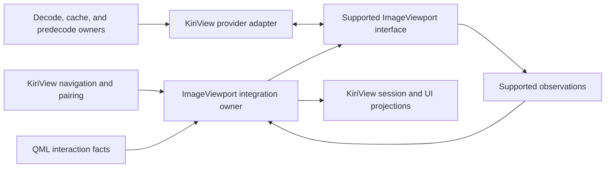

# ImageViewport Integration Architecture

This document defines only KiriView's side of its integration with `ImageViewport`. User-visible image behavior remains in `../spec/image-display.md`. The dependency's supported interface is the authority for its commands, observations, provider protocol, and behavior; KiriView architecture must not restate or constrain the dependency's private state, algorithms, scheduling, rendering, or resource management.

## Ownership

KiriView owns navigation scope, selected source identity, page pairing, reading-direction policy, scan and nearest-point policy, source access, decoding, cache and predecode policy, application resource budgets, source-specific metadata, typed load failures, action routing, video presentation, and user-facing projections.

The KiriView integration owner adapts those application facts to the supported `ImageViewport` interface. It creates public sequence values, submits public commands, correlates dependency observations with application source identities, converts application actions and QML-reported interaction facts into supported inputs, resolves opaque application failure references, and derives KiriView-facing projections. It must not retain a parallel mutable copy of image-presentation state or depend on private dependency APIs.

## Integration Flow

Before submitting a target, the integration owner records the intended application source and role identities. A displayed URL, image readiness, toolbar zoom, page-role projection, or error projection is published only from a supported observation that matches that application record. Opaque correlation values from the dependency are compared only as its public contract permits; delayed observations or UI actions associated with an older application target cannot update a newer selection.

The integration owner submits target and presentation requests needed to implement the transitions defined in the product specification. KiriView publishes the selected target, loading state, displayed source, and requested presentation shape from one coherent application transaction and does not infer intermediate dependency state.

## Sequence Provider Boundary

The KiriView provider adapter implements only the supported provider interface. Source URLs, archive handles, credentials, cache keys, decoder objects, and navigation policy remain behind the application boundary. The adapter treats dependency-supplied request identity, demand, limits, and ownership callbacks as public protocol values rather than deriving their meaning from dependency internals.

Source access, decode routing, cache lookup, predecode reuse, SVG rasterization, animation frame production, and refinement remain KiriView responsibilities. Provider results must carry the current public correlation values and valid payload facts required by the supported interface. Application extensions must not bypass that interface with an alternate image-presentation path.

The display image store owns KiriView's reusable decoded entries, byte accounting, priority, eviction, and leases. Provider ownership callbacks are the only dependency inputs that may change the application lease state; QML load status, visual-item lifetime, and polling are not application resource authorities.

The application provider retains source-specific failure detail in a KiriView-owned immutable failure record and sends only values allowed by the public provider protocol. The integration owner resolves an opaque application reference only when a matching supported observation exposes it. An absent, stale, or unresolved reference cannot recover detail from another application target and falls back to the generic failure exposed by the dependency.

## Preview, Refinement, And Reuse

KiriView may answer public provider demand with a validated preview, bounded-detail payload, cache entry, or exact payload when the supported interface permits it. It may apply stricter application cache, display-store, and source-work budgets than the supplied limits.

Refinement work is best-effort cancelable. A completion may populate an application-owned bounded cache under its reuse identity, but the provider may return it only for a matching current public request. KiriView does not decide whether or how the dependency incorporates a valid result into presentation.

Predecoded still images are adapted through the same supported provider interface as foreground decodes. Video rows may guide adjacent-image preparation but never create still-image provider payloads.

## Animation And SVG

KiriView's decoding boundary owns source-specific animation readers, metadata normalization, frame decode or composition, and source failures. Provider sessions answer supported animation requests with metadata and frame results; KiriView must not create a competing application-owned presentation clock or infer the dependency's scheduling strategy.

Supported animated containers are classified through animation-aware decoding before static fallback so a multi-frame file is not silently reduced to its first frame.

The Rust support static library uses `resvg` for SVG parsing and rasterization because QtSvg does not implement the complete SVG behavior required by KiriView. The support boundary disables scripts, animation, and external network or file resources before payload transfer. KiriView keys reusable SVG output by application source identity and the public provider request facts that affect raster detail.

## QML Boundary

QML owns workspace layout, panels, focus, context-menu placement, raw gesture sampling, and the presentation delay for transient loading feedback. It forwards image interaction facts through the KiriView integration owner and renders application projections. QML must not invoke the dependency directly, reconstruct its state, derive shared readiness or action state from unmatched observations, or use visual-item events as provider lifetime acknowledgements.
