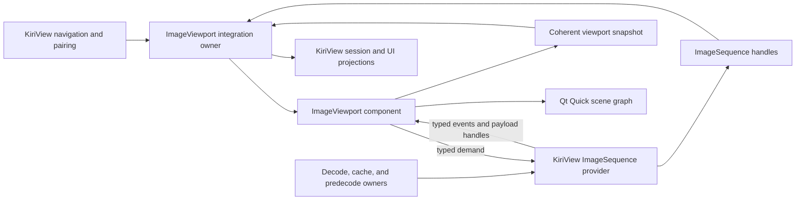

# ImageViewport Integration Architecture

This document defines KiriView's durable boundary with the repository-internal `ImageViewport` component. User-visible image behavior remains in `../spec/image-display.md`. This document is the normative source for KiriView-side ownership, identity, lifecycle, resource, failure, and publication rules at that boundary; component-local API and implementation details may evolve only without violating these rules.

## Ownership

`ImageViewport` is the sole owner of accepted image presentation targets, committed and retained image presentation, fit and zoom state, pan bounds and position, rotation and mirroring, spread geometry, visible image geometry, per-role animation playback, render admission, Qt Quick scene graph resources, and coherent viewport snapshots.

KiriView owns navigation scope, selected source identity, page pairing, reading-direction policy, scan and nearest-point policy, source access, decoding, cache and predecode policy, application cache, display-store, and source-work budgets, source-specific metadata, typed load failures, action routing, video presentation, and user-facing projections that combine application state with a viewport snapshot.

The KiriView integration owner is an adapter, not a second presentation owner. It creates `ImageSequence` handles, is the sole KiriView production submitter of component mutations, correlates component generations with application source identities, converts application actions and QML-reported raw interaction facts into component commands, resolves typed provider failure references, and consumes one coherent component snapshot. It must not maintain parallel zoom, pan, visible-role, playback, retained-display, or render-readiness state.

## Target And Snapshot Flow

Before invoking a target command, the integration owner installs one application operation record containing the intended source and role identities. The accepted snapshot published during or after that serialized command binds its new component generation to that record; reentrant `stateChanged` delivery cannot observe an uncorrelated generation. A displayed URL, active image readiness, toolbar zoom, page-role projection, or error projection is published only by joining the current component snapshot with the matching application correlation. An older generation, provider event, failure reference, or delayed UI action cannot update a newer selection.

KiriView chooses transition policy from product meaning. Ordinary selected-target failures keep the failed target active. A single-page versus Two-Page Spread shape change uses retained display plus restore-on-failure so the component can atomically reactivate the complete prior commit. The application correlation for that command retains only the prior application-owned presentation-shape policy, such as the Two-Page Spread toggle, and restores that policy in the same application publication that accepts the matching restored-transition snapshot. KiriView never simulates component rollback by issuing compensating zoom, pan, role, or source commands.

## Sequence Provider Boundary

The KiriView provider adapter exposes one logical page per sequence and receives component-authored metadata, frame, position, playback, and refinement demand. Source access, decode routing, cache lookup, predecode reuse, SVG rasterization, animation frame production, and whole-image refinement remain behind this adapter. The component never receives source URLs, archive handles, credentials, cache keys, decoder objects, or navigation policy.

Provider results carry the component request token, demand revision, role, complete-frame payload facts, and source-logical identity needed for admission. Payloads may be preview, bounded-detail, or exact whole images; application code must not introduce visual page tiles, application-owned scene graph nodes, native textures, or caller-managed render resources through the provider contract.

The display image store remains an application resource owner for reusable decoded payloads, byte accounting, priority, and eviction. A provider frame handle wraps the matching store lease. `ImageViewport` owns that handle while the payload is pending, visible, or retained and releases it exactly once through the provider boundary; QML image-load acknowledgements and provider URLs are not part of this lifetime.

Provider failure results contain a generic typed cause and an optional opaque application failure handle, never free-form diagnostic text. The application provider registers the handle's reference with the immutable typed load-failure record it already owns, including source identity, load session, failure kind, decode route and operation, user-facing text, diagnostic detail, severity, and retryability. The component owns an admitted handle while its failure snapshot may expose the reference and releases it exactly once when the failure is rejected, stale, superseded, cleared, replaced, or destroyed; the provider's release callback retires the registry entry. The integration owner resolves only a reference exposed by the matching component failure snapshot and never infers registry lifetime from snapshot polling. An absent or unresolved reference falls back to the component-authored generic error and cannot recover detail from another generation or source. The component never interprets application failure detail or branches on text.

## Preview, Refinement, And Reuse

An initial display may use a validated lower-detail preview or bounded first display. Preview acceptance establishes the correct source logical size, orientation, aspect, freshness, and resource bounds before the provider transfers a handle.

Refinement demand is derived by `ImageViewport` from the accepted logical target, visible source rectangle, effective zoom, rotation, device pixel ratio, quality preference, exactness preference, and render limits. KiriView may combine those facts with application source identity and cache policy to choose work, but only the component demand revision authorizes a returned payload for the active presentation.

Refinement work is best-effort cancelable. Results may populate an application-owned bounded cache by reuse identity, but they may replace visible detail only after the component admits the matching demand and commits the complete current role set. Failed optional refinement leaves the accepted display intact.

Predecoded still images enter the same provider sequence, payload, identity, resource-limit, and handle-lifetime path as foreground decodes. Video rows may guide adjacent-image preparation but never create still-image viewport payloads.

## Animation And SVG

KiriView's decoding boundary owns source-specific animation readers, metadata normalization, frame decode or composition, and source failures. `ImageViewport` owns each role's playback intent, timer scheduling, elapsed-time accounting, frame request ordering, authored loop progress, wait state, and stop or pause behavior. A provider session answers role-scoped playback demand; it does not run an independent animation clock.

Primary and secondary animated pages have independent component playback state and scheduler effects. A wait or terminal authored loop on one role does not block scheduling for the other, while every visible frame replacement still commits through a complete-spread render snapshot.

Supported animated containers are classified through animation-aware decoding before static fallback so a multi-frame file is not silently reduced to its first frame.

The Rust support static library uses `resvg` for SVG parsing and rasterization because QtSvg does not implement the complete SVG behavior required by KiriView. The support boundary disables scripts, animation, and external network or file resources before payload transfer. SVG output uses bounded whole-image buckets keyed by application source identity and component demand. Failed refinement retains the last accepted payload; failed initial display follows the selected-target error or transition-restore policy.

## QML And Render Boundary

The component item owns image rendering and its private scene graph resources. QML owns workspace layout, panels, focus, context-menu placement, and raw gesture sampling. KiriView QML hosts the item, forwards raw pointer, wheel, drag, and gesture facts through the image-viewport integration boundary, and renders application projections; it does not invoke component mutating APIs directly or derive shared readiness, action, toolbar, or source projections from uncorrelated component state. It also does not create image `Flickable` or `Image` objects, attach provider URLs, acknowledge image loads, reconstruct component geometry, schedule animation, or own image textures.

Window attachment, item size, scene-graph availability, device-pixel ratio, backend resource limits, viewport payload admission, and per-role display budgets are captured and owned inside the component and reach KiriView providers only as component-authored demand. KiriView providers apply application cache, display-store, and source-work budgets when choosing reuse or producing a payload and may choose a more conservative valid payload than the demand prefers, but provider state and events do not mutate component caps, allocation state, or display budgets. KiriView does not select the render backend or manage scene graph lifetime.
