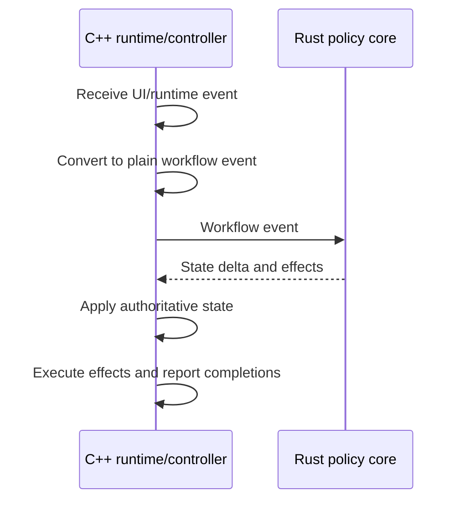

# Workflow Shape

This document defines how product workflows cross the Rust/C++ policy boundary and how runtime plans preserve ownership while composing controllers.

## Event Boundary

Product workflows are event-driven:

Concrete event names are not part of the architecture contract. Request, loading, decoding, failure, presentation, completion, and other out-of-order workflow events must carry enough owner-held identity for the C++ owner to reject stale results.

Rust policy may compute loading status, error recovery, navigation updates, cache policy, and follow-up effects from plain snapshots. C++ keeps the actual KIO job, decoder job, presentation owner, image object, Qt notification, and render update mechanics.

Workflows that update visible state must distinguish committed public state from pending targets. They publish the new state only after the resources required for that state are ready, unless the user-visible spec explicitly defines an intermediate placeholder or retained-display state.

## Runtime Plan Ownership

When multiple C++ policy adapters emit runtime operations for one workflow, the operation contract lives in a dedicated runtime-plan type. Effect planners, Rust policy adapters, and controllers may produce plans, but a named workflow owner binds the operation vocabulary to runtime ports and dispatches the plans.

Cross-controller interactions must cross named ports when they preserve ownership, stale-completion rejection, or public projection ordering. The composition root may bind those ports, but callbacks must not capture sibling controllers just to read state, publish presentation, schedule predecode, gate deletion, or report load errors.

Runtime plans use a shared operation vocabulary at the workflow boundary and delegate operation families to named owners when that preserves lifecycle ownership or removes duplicated operation tables. Internal refactoring that preserves the typed plan boundary and named dispatch ownership does not require an architecture update.

## Image Document Workflow

Image-open workflow transitions apply C++-owned document state and return typed follow-up operations. Controllers dispatch those plans through the image-document runtime workflow owner instead of reporting a second layer of document effects for the same runtime work.

Image-open state deltas own invariant-coupled document facts: source URL, source kind, displayed location, loading, status, error text, sibling archive navigation, unsupported opened-collection video, playable opened-collection video handoff, and embedded metadata. Controllers may prepare decoded images and metadata, but publication of those facts happens through the transition application plan.

Same-scope image-to-image active navigation is a target-selection workflow, not source replacement. For ordinary direct media scopes and opened collection scopes, selecting another image row may update the pending navigation target and active-navigation projection before display commit, but it must not clear the committed image presentation, cancel active navigation, or clear provider-ready predecode/cache state solely because the selected image URL changed.

Source replacement remains the workflow for top-level source assignment, active scope changes, image-to-video or video-to-image mode changes, empty/error clearing, and sibling archive navigation that changes the opened collection scope.

Image-document source-load effects resolve requested source URL, displayed opened-collection scope, sibling archive URL, and directly opened source facts into an opened-collection scope command before crossing into collection source lifetime code. Production filesystem and archive probing belongs to a resolver or adapter boundary that supplies resolved facts; pure image-load planning consumes those facts and must not perform host-environment probes.

The media-entry source store owns media-entry source reuse for an already resolved opened-collection scope. It must not depend on image-document source-load request or image-load planning types.

## Candidate Snapshot Consumers

Candidate-list owners publish confirmed snapshots before dependent workflows derive public active navigation, thumbnail rows, predecode windows, deletion fallback targets, or opened-collection foreground loads. The snapshot identity contract is defined in [State Ownership](state-ownership.md#candidate-snapshot-boundary).

Direct-media sibling discovery accepts a snapshot only when the current direct-media scope still matches the discovery request. Image-document page candidate refresh accepts a snapshot only when its candidate-list source still matches the page navigation owner.

A pending same-source refresh retains the last matching confirmed snapshot while work is in flight. A source-identity change clears the prior snapshot before consumers can use it. Consumers must not synthesize a partial list or use rows from a different source.

Projection and thumbnail workflows consume candidate snapshots by source identity plus candidate-list revision. If row storage is unchanged, projection may update current-row state without rebuilding every row, and thumbnail runtimes may preserve row-derived work while thumbnail navigation generation still matches. If row identity, source identity, or row order changes, the owner publishes a new candidate-list revision and downstream thumbnail navigation generation changes.

Opened collection foreground loading and image-document predecode planning may reuse a confirmed page candidate snapshot only when the snapshot source matches the requested opened-collection or directory source. Pending refreshes, deletion fallback that changes the retained list, sibling archive navigation that changes scope, and direct-media source replacement invalidate or replace the reusable snapshot before downstream consumers can rely on it.

## Routing And Dispatch

Direct media routing uses an explicit document-session plan boundary. A routing plan may classify a requested source as empty, direct video, direct image, archive collection, directory collection, or another image-document input, but C++ executes Qt/KDE side effects through image-document, video-document, session-cursor, candidate-refresh, and predecode command ports.

Opened collection video routing is separate from ordinary direct media routing. When the active opened collection selection resolves to an eligible playable video entry, the session keeps the opened collection active-navigation context, asks the media-entry source boundary for a playback source device, and assigns that device to the video document while preserving the collection entry URL as public source identity.

Eligible archive entries and directory collection entries may both provide playback source devices. Ineligible archive video entries remain in image-mode opened-collection context as unsupported-video placeholders. This path must not synthesize a direct media scope, remount the archive through the direct-media navigation-source path, or reuse the direct-video playback-preparation boundary.

Video-mode adjacent navigation, scan navigation, and shared Previous, Next, First, and Last commands dispatch through the document-session active navigation projection. Direct video mode and opened collection video mode differ by the active scope supplied to the session; shortcut handlers, toolbar actions, and video controls must not hard-code ordinary direct media navigation when the active video belongs to an opened collection.

Document-session plans may compute active navigation projections, action-availability gates, direct media routing, deletion fallback, and predecode eligibility from plain snapshots. They must not publish QML-facing values directly, store independent workflow state, or bypass the session-owned stale-completion identity checks.

Shared navigation dispatch belongs to the document session. The C++ action runtime combines the session projection with accepted UI gate snapshots for shared action and shortcut availability; QML reports UI-local gate facts and renders action placements. Route selection and boundary dispatch policy stay behind session methods.
