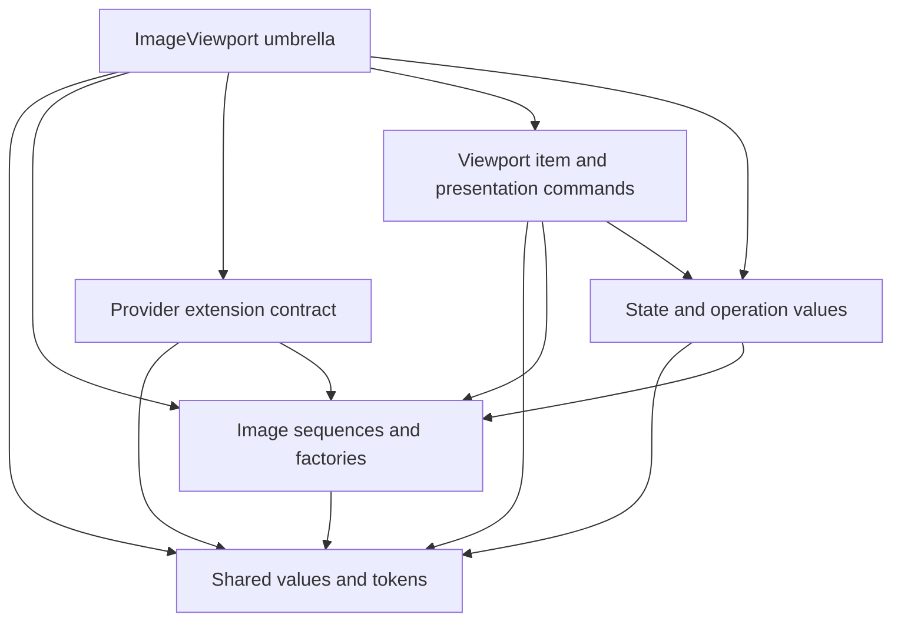

# Build And Package Boundary

The build and package system must produce the complete supported installed interface defined in [ImageViewport Packaging](../spec/image-viewport-packaging.md) from one package target. Static QML registration, import metadata, public headers, library artifacts, and transitive link requirements must be installed coherently so a downstream consumer needs no build-tree artifacts. Unsupported platform and plugin layouts must remain outside this package boundary.

The installed package boundary is narrower than the build tree. Consumers include the public headers they need and link the exported package target; they must not require private headers, source-tree include paths, internal provider transport types, controller internals, render adapter types, scene graph types, native texture handles, private instrumentation types, or build-tree-only QML imports.

## Public Header Boundary

Public declarations are owned by five canonical subject headers: shared values and tokens, image sequences and factories, the provider extension contract, the viewport item and presentation commands, and state snapshots, command results, and coordinate input and result values. The library target builds against these canonical declarations, and the same declarations are installed without deletion, replacement, or other semantic rewriting. Canonical headers may contain non-public declarations required to define a public class, but those declarations remain identical between build and install and do not become supported API. Other implementation-only declarations and all implementation definitions live outside the public headers.

The public umbrella header is declaration-free and includes all canonical subject headers. It is a convenience entry point, not a separate declaration source. The subject headers form an acyclic dependency graph; arrows below point from a subject to a subject it may depend on.

Shared enums, opaque tokens, roles, ranges, and value primitives needed by more than one subject belong to shared values rather than the viewport item. State and operation values must not depend on the item declaration, and provider implementations must not acquire a Qt Quick item dependency merely to use protocol values. Snapshot consumers do not acquire the provider extension contract merely to observe public state. All subjects remain part of one library, QML module, ABI, package target, compatibility policy, and release boundary.

Installed CMake package version, QML module version, public headers, and plugin metadata must consume one compatibility version authority so the installed artifacts cannot advertise divergent versions or compatibility boundaries.

Backend dependencies needed by the installed Linux/static package may be expressed as package target link requirements. Those dependencies do not make render backend selection, graphics API resource ownership, scene graph object lifetime, or native texture injection part of the public API; backend choice remains an internal rendering concern behind the item, public value types, commands, status, and revision tokens.

## Limit Authority

Public source and display limits have one immutable value authority shared by the C++ and QML projections. Sequence factories, presentation-command admission, provider metadata admission, and frame preparation consume that authority rather than duplicating constants. Effective payload admission must satisfy every unconditional public limit and every valid tighter runtime cap for the active render environment; an unavailable runtime cap remains unavailable in provider demand and never relaxes a public limit. Limit checks and derived dimension, pixel, duration, and byte calculations must complete with overflow-safe arithmetic before allocation or render ownership.

Install-consumer boundaries may assume the Linux/static plugin shape. Unsupported platform layouts must not introduce compatibility requirements, dependency exposure, or public API commitments for the supported package.
