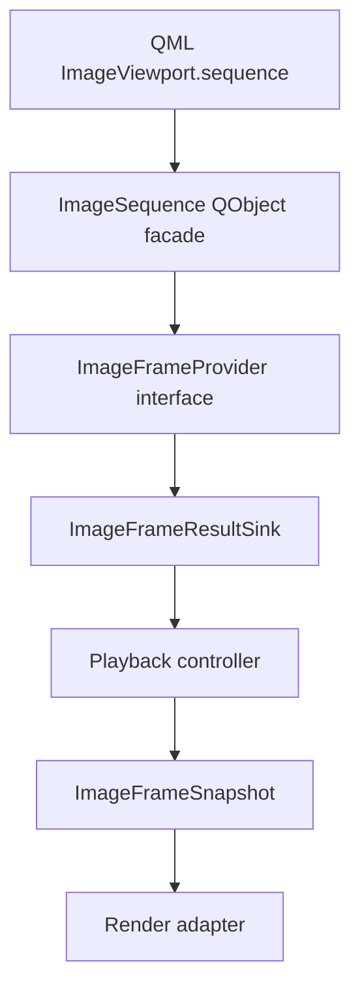

# Minimal C++ Type Sketch

This document sketches the C++ type direction for `ImageViewport` provider integration. It is not a header specification, ABI promise, or implementation task list.

The design should use a Qt-facing facade for QML ownership and binding, while keeping the decoder-facing provider core usable as a pure C++ interface.



## Layering Decision

`ImageSequence` should be the QML-visible object assigned to `ImageViewport.sequence`.

`ImageSequence` should be a `QObject`-based facade because QML object ownership, property binding, change notification, queued signal delivery, and engine lifetime are all naturally expressed through Qt's object model.

`ImageFrameProvider` should be the implementation-facing provider contract behind `ImageSequence`. It should be possible to implement this contract with a pure C++ decoder adapter, a `QObject` provider, or a small wrapper around an application-owned service.

The viewport should depend on the provider protocol through `ImageSequence`, not on individual codec adapters. Codec adapters should translate library-specific behavior into the common request/result model.

The pure C++ provider core should not expose `QSG` objects, QML types, or render-thread resources.

## Candidate Type Roles

`ImageSequence` is the QML-facing sequence handle. It owns or references a provider factory/session, emits coarse invalidation when provider-affecting policy changes, and lets `ImageViewport` open a generation-scoped provider session.

`ImageFrameProvider` is the request receiver for sequence info, display frame requests, preparation hints, cancellation, and generation close.

`ImageFrameResultSink` is the result delivery target supplied by the viewport-side adapter. Providers post result messages to the sink instead of calling directly into `ImageViewport`.

The sink should be represented by a lifetime-safe handle rather than by an unowned long-lived reference. A provider may hold a weak sink token or a reference-counted result channel for the active generation, and posting through that handle after generation close or item destruction must become a no-op rather than a use-after-free.

`ImageSequenceInfo` describes sequence-level metadata such as logical size, frame count, duration, loop count, capabilities, and source metadata.

`ImageProviderCapabilities` describes request constraints such as random access, sequential access, stateful sequential access, single-flight display requests, rewindability, streaming updates, prefetchability, known duration, stable frame durations, provider-side normalization support, and normalization that can be satisfied by viewport CPU preparation.

`ImageFrameRequest` describes a display-critical frame request for initial display, timed playback, seek, or replacement validation.

`ImageFrameTarget` describes whether a request targets a stable frame index, playback position, initial display, or another explicit target kind. Timed-track and streaming providers should not be forced to invent random-access indexes when playback position is the meaningful request shape.

`ImagePrepareHint` describes advisory preparation intent for nearby frames, playback direction, pending target, and memory budget class.

`ImageFrameSnapshot` is an immutable display frame value. It owns or shares stable payload storage and metadata for a frame that the viewport can select and hand to the render adapter.

`ImageFramePayload` is the frame pixel representation. The baseline payload should be `QImage`-backed; future variants may describe texture-compatible or native-buffer-backed payloads.

`ImageProviderResult` is the generation-scoped result message returned by a provider.

`ImageProviderError` carries structured diagnostics for sequence setup, metadata discovery, frame decode, normalization, provider scheduling, provider lifetime, and later render-preparation categories.

`ImageRequestStatusReason` is the item-side reason for the current non-ready request state. It should distinguish provider waiting, render-deferred waiting, upload pending, unsupported request or policy, CPU preparation failure, texture upload failure, and provider failure.

`ImageDisplayedFrameState` is the item-side description of retained content. It should include the displayed snapshot identity, displayed generation, and whether that generation matches the active sequence.

## Pseudo Interface Shape

The rough shape should look like this, with names and signatures expected to change during implementation.

```cpp
class ImageSequence : public QObject {
    Q_OBJECT
    Q_PROPERTY(bool valid READ isValid NOTIFY changed)

public:
    bool isValid() const;

    // Implementation-facing, not QML API.
    std::shared_ptr<ImageFrameProvider> createProviderSession() const;

signals:
    void changed();
};
```

```cpp
class ImageFrameProvider {
public:
    virtual ~ImageFrameProvider() = default;

    virtual ImageProviderCapabilities capabilities() const = 0;

    virtual void openGeneration(ImageGenerationId generation, std::shared_ptr<ImageFrameResultSink> sink) = 0;
    virtual void requestSequenceInfo(const ImageSequenceInfoRequest& request) = 0;
    virtual void requestFrame(const ImageFrameRequest& request) = 0;
    virtual void prepare(const ImagePrepareHint& hint) = 0;
    virtual void cancel(ImageGenerationId generation, ImageRequestId requestId) = 0;
    virtual void closeGeneration(ImageGenerationId generation) = 0;
};
```

```cpp
class ImageFrameResultSink {
public:
    virtual ~ImageFrameResultSink() = default;

    // Thread-safe entry point; implementation marshals to the item-side controller.
    virtual void postResult(ImageProviderResult result) = 0;
};
```

```cpp
struct ImageProviderResult {
    ImageGenerationId generation;
    std::optional<ImageRequestId> requestId;
    ImageProviderResultKind kind;
    std::optional<ImageSequenceInfo> sequenceInfo;
    std::shared_ptr<const ImageFrameSnapshot> frame;
    std::optional<ImageProviderError> error;
    QString diagnostic;
};
```

`postResult()` should be safe to call from provider-owned worker threads. The sink implementation should marshal results to the item-side controller before QML-visible state changes.

Closing a generation should invalidate the sink token for that generation. Late provider results are allowed, but they must either fail to post through an expired weak token or be ignored by generation and request checks after queued delivery.

## Value Type Direction

Generation and request identifiers should be small value types, not raw integers passed everywhere. This keeps stale-result checks visible in code.

Frame indexes should use a signed or optional representation for unknown and invalid states at API boundaries, but internal request targets should prefer explicit variants such as frame index, playback position, or initial display.

Durations and timestamps should use a monotonic duration type in C++ internals. QML-facing values can be converted later if exposed.

`ImageFrameSnapshot` should be immutable after construction. It should hold frame index, logical size, visible rect or canvas rect, duration or presentation time, normalization state, dirty region, dependency hints, source generation, and payload.

`ImageFrameSnapshot` should be self-contained for display. Dirty regions, logical rects, and dependency hints can describe how the provider produced or optimized the frame, but they should not make the viewport responsible for codec-native composition.

`ImageFramePayload` should start with a `QImage` variant whose storage is detached, owned, or otherwise immutable for the snapshot lifetime. Additional variants should be added only when render-thread ownership and backend compatibility are designed.

The public construction surface should make simple providers easy to build. A minimal sequence should be constructible from an already-owned still image, a small list of already-owned frames with durations, or an application provider object without requiring the caller to implement every advanced capability hook.

## QObject Versus Pure C++ Judgment

The QML-facing edge should be `QObject` because QML needs object properties, engine ownership, and change notifications.

The provider core should not have to be `QObject`. A pure C++ interface makes decoder adapters easier to test, easier to run on non-Qt schedulers, and less coupled to thread affinity.

A `QObject` provider should still be easy to support by wrapping it in an `ImageSequence` facade or adapting its signals into `ImageFrameResultSink::postResult()`.

The first implementation can choose a QObject-backed adapter internally if that is faster to build, but the architecture should preserve the pure C++ core boundary.

## Ownership And Threading Direction

`ImageViewport` should keep a strong reference to the active `ImageSequence` facade while it is assigned.

The active generation should keep a provider session alive until the generation is closed, replaced, or the item is destroyed.

Provider sessions should not own the viewport. Results should flow through a lifetime-safe `ImageFrameResultSink` channel, where stale generations and stale request ids can be rejected.

Snapshots should use shared immutable ownership so that provider workers, the GUI-side controller, and the render adapter can overlap safely without copying pixels unnecessarily.

Cancellation should not assume immediate provider cooperation. Closing a generation plus stale-result filtering is the correctness mechanism; cancellation is a latency and resource hint.

## Deferred Type Questions

Whether `ImageSequence` is subclassed by application code or constructed around a provider object remains open.

Whether provider result delivery is implemented with Qt queued signals, a custom thread-safe queue, or both remains open.

Whether `ImageFrameSnapshot` stores `QImage` directly, stores `QSharedPointer<const QImage>`, or stores a custom payload object remains open.

Whether native-buffer payloads require a separate `ImageFramePayloadFactory` or a variant inside `ImageFramePayload` remains open.
