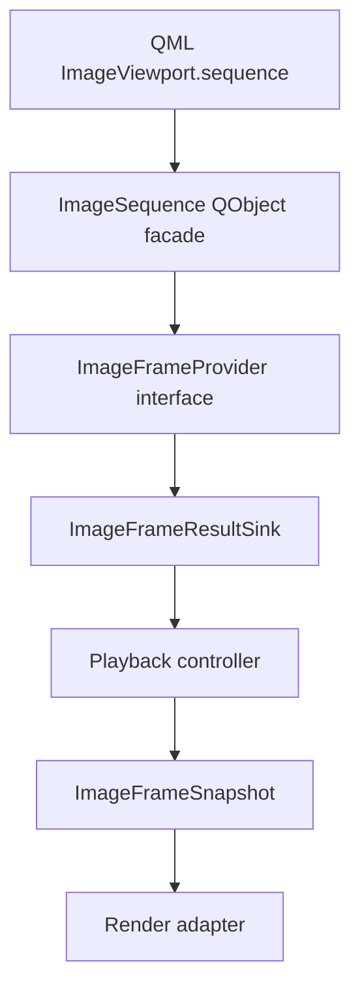

# Minimal C++ Type Sketch

This document sketches the C++ type direction for `ImageViewport` provider integration. It is not a header specification, ABI promise, or implementation task list.

The design should use a Qt-facing facade for QML ownership and binding, while keeping the decoder-facing provider core usable as a pure C++ interface.



## Layering Decision

`ImageSequence` should be the QML-visible object assigned to `ImageViewport.sequence`.

`ImageSequence` should be a `QObject`-based facade because QML object ownership, property binding, change notification, queued signal delivery, and engine lifetime are all naturally expressed through Qt's object model.

`ImageFrameProvider` should be the implementation-facing provider contract behind `ImageSequence`. It should be possible to implement this contract with a pure C++ decoder adapter, a `QObject` provider, or a small wrapper around an application-owned service.

The viewport should depend on the provider protocol through `ImageSequence`, not on individual codec adapters. Codec adapters should translate library-specific behavior into the common request/result model.

The pure C++ provider core should not expose `QSG` objects, QML types, or render-thread resources.

## Candidate Type Roles

`ImageSequence` is the QML-facing sequence handle. It owns or references immutable sequence data and a provider factory, and it lets `ImageViewport` open a generation-scoped provider session. From the viewport's perspective, an assigned sequence should be immutable; provider-affecting changes should normally be represented by constructing and assigning a new `ImageSequence` facade rather than mutating the active one in place.

`ImageSequence` should be QML-visible as a property type but should not be QML-creatable or directly default-constructible by ordinary C++ callers. Construction should go through `ImageSequenceFactory`, a direct C++ factory, or another explicit helper that attaches immutable sequence data and provider-session creation state. This prevents `ImageSequence {}` or an empty C++ facade from looking like valid displayable content while still allowing QML properties and bindings to carry sequence handles.

`ImageFrameProvider` is the request receiver for sequence info, display frame requests, preparation hints, cancellation, and generation close.

`ImageFrameResultSink` is the result delivery target supplied by the viewport-side adapter. Providers post result messages to the sink instead of calling directly into `ImageViewport`.

The sink should be represented by a lifetime-safe handle rather than by an unowned long-lived reference. A provider may hold a weak sink token or a reference-counted result channel for the active generation, and posting through that handle after generation close or item destruction must become a no-op rather than a use-after-free.

`ImageSequenceInfo` describes sequence-level metadata such as logical size, frame count, duration, source loop behavior, capabilities, and source metadata. Source loop behavior should be concrete provider metadata, not the caller-facing `SourceLoop` override mode.

`ImageProviderCapabilities` describes request constraints such as stable display indexes, random access, sequential access, stateful sequential access, single-flight display requests, eventual terminal result for single-flight display requests, rewindability, streaming updates, prefetchability, known duration, stable frame durations, provider-side normalization support, and normalization that can be satisfied by viewport CPU preparation.

`ImageFrameRequest` describes a display-critical frame request for initial display, timed playback, seek, or replacement validation.

`ImageFrameTarget` describes whether a request targets a stable frame index, playback position, initial display, or another explicit target kind. Timed-track and streaming providers should not be forced to invent random-access indexes when playback position is the meaningful request shape.

`ImagePrepareHint` describes advisory CPU or decoder preparation intent for nearby frames, playback direction, pending target, and memory budget class. Render upload preparation intent belongs to the render adapter boundary, not to this provider-facing hint.

`ImageFrameSnapshot` is an immutable display frame value. It owns or shares stable payload storage and metadata for a frame that the viewport can select and hand to the render adapter.

`ImageFrameSnapshotIdentity` should identify the provider's logical display snapshot inside one generation. It is not a texture cache key by itself and is not required to equal a stable frame index.

`ImageFramePayloadIdentity` should identify the normalized immutable pixel payload after CPU preparation choices that affect upload. It may be shared by multiple snapshot or presentation occurrences.

`ImagePresentationRevision` or an equivalent presentation identity should identify the viewport's concrete display occurrence after item-side presentation state and render-node acceptance.

`ImageFramePayload` is the frame pixel representation. The baseline payload should be `QImage`-backed; future variants may describe texture-compatible or native-buffer-backed payloads.

`ImageFrame` is the QML-visible opaque frame handle used by helper construction paths. It should wrap a module-owned display-ready frame payload or a C++ frame object without asking QML to manufacture raw pixel buffers.

`TimedImageFrame` is the QML-visible helper value or object that pairs an `ImageFrame` with a millisecond duration for small explicit animations.

`ImageSequenceProviderAdapter` is the QObject bridge that lets applications expose custom decoder or storage services as an `ImageSequence` source without assigning the provider object directly to `ImageViewport`. The base type should be a non-creatable abstract handle in QML until a concrete adapter contract is designed; applications can expose C++ concrete subclasses or module-provided adapters that satisfy the provider protocol.

`ImageSequenceFactory` is the QML-facing construction helper for baseline recipes. It should create sequences from module-owned frame objects, typed timed frame lists or builders, and concrete provider adapters. C++ may expose direct factory functions with the same semantics when the input is not QML-representable, such as raw `QImage`.

`ImageProviderResult` is the generation-scoped result message returned by a provider.

`ImageProviderResultKind` should include at least sequence info ready, frame ready, waiting, end of sequence, cancelled, unsupported, and error. `Cancelled` is request-scoped and terminal for the request slot; it is used to let single-flight providers acknowledge that a superseded request no longer blocks the next display-critical request.

`ImageProviderError` carries structured diagnostics for provider-originated sequence setup, metadata discovery, frame decode, provider-side normalization, provider scheduling, and provider lifetime failures. Render preparation, CPU preparation owned by the viewport, and texture upload failures should be represented by item-side status reasons or diagnostics rather than by provider errors.

Recoverable provider warnings should be diagnostics attached to successful result messages, not standalone result kinds. This keeps best-effort orientation, preserved color metadata, timing, or capability warnings scoped to the same accepted generation, request, and frame as the data they describe.

`ImageRequestStatusReason` is the item-side reason for the current non-ready request state. It should distinguish provider waiting, render-deferred waiting, upload pending, unsupported request or policy, CPU preparation failure, texture upload failure, and provider failure.

`ImageDisplayedFrameState` is the item-side description of retained content. It should include the displayed snapshot identity, payload identity when known, viewport-owned presentation revision, displayed generation, and whether that generation matches the active sequence.

## Pseudo Interface Shape

The rough shape should look like this, with names and signatures expected to change during implementation.

```cpp
class ImageSequence : public QObject {
    Q_OBJECT
    QML_UNCREATABLE("Use ImageSequenceFactory to create sequence handles")

private:
    explicit ImageSequence(std::shared_ptr<const ImageSequenceData> data, QObject *parent = nullptr);
    friend class ImageSequenceFactory;

public:
    // Implementation-facing, not QML API. The returned session data is held
    // strongly by the active generation even if the QObject facade later dies.
    std::shared_ptr<ImageFrameProvider> createProviderSession() const;

signals:
    void changed();
};
```

```cpp
class ImageSequenceFactory : public QObject {
    Q_OBJECT
    QML_SINGLETON

public:
    Q_INVOKABLE ImageSequence *fromImage(ImageFrame *frame);
    Q_INVOKABLE ImageSequence *fromFrames(const QList<TimedImageFrame *> &frames);
    Q_INVOKABLE ImageSequence *fromProvider(ImageSequenceProviderAdapter *adapter);
};
```

Factory-returned QObjects should have explicit Qt ownership. QML-callable factory methods should return unparented objects with QML engine ownership or an equivalent documented ownership policy, while the active viewport generation should retain strong shared ownership of immutable sequence data independent of the facade QObject. Invalid inputs should return `nullptr` and set factory diagnostics once that diagnostics surface exists; valid inputs should not produce empty facades.

```cpp
class ImageFrameProvider {
public:
    virtual ~ImageFrameProvider() = default;

    virtual ImageProviderCapabilities capabilities() const = 0;

    virtual void openGeneration(ImageGenerationId generation, std::shared_ptr<ImageFrameResultSink> sink) = 0;
    virtual void requestSequenceInfo(const ImageSequenceInfoRequest& request) = 0;
    virtual void requestFrame(const ImageFrameRequest& request) = 0;
    virtual void prepare(const ImagePrepareHint& hint) = 0;
    virtual void cancel(ImageGenerationId generation, ImageRequestId requestId) = 0;
    virtual void closeGeneration(ImageGenerationId generation) = 0;
};
```

```cpp
class ImageFrameResultSink {
public:
    virtual ~ImageFrameResultSink() = default;

    // Thread-safe entry point; implementation marshals to the item-side controller.
    virtual void postResult(ImageProviderResult result) = 0;
};
```

```cpp
struct ImageProviderResult {
    ImageGenerationId generation;
    std::optional<ImageRequestId> requestId;
    ImageProviderResultKind kind;
    std::optional<ImageSequenceInfo> sequenceInfo;
    std::shared_ptr<const ImageFrameSnapshot> frame;
    std::optional<ImageProviderError> error;
    QList<ImageProviderDiagnostic> diagnostics;
};
```

`postResult()` should be safe to call from provider-owned worker threads. The sink implementation should marshal results to the item-side controller before QML-visible state changes.

Closing a generation should invalidate the sink token for that generation. Late provider results are allowed, but they must either fail to post through an expired weak token or be ignored by generation and request checks after queued delivery.

## Value Type Direction

Generation and request identifiers should be small value types, not raw integers passed everywhere. This keeps stale-result checks visible in code.

Frame indexes should use a signed or optional representation for unknown and invalid states at API boundaries, but internal request targets should prefer explicit variants such as frame index, playback position, or initial display.

Durations and timestamps should use a monotonic duration type in C++ internals. QML-facing values can be converted later if exposed.

`ImageFrameSnapshot` should be immutable after construction. It should hold a generation-local snapshot identity, payload identity or enough data to derive one after CPU preparation, frame index only when stable, logical size, visible rect or canvas rect, duration or provider presentation timestamp, normalization state, dirty region, provider-managed decode dependency hints, source generation, and payload. It should not hold viewport presentation identity; that identity is assigned after item-side mapping and render commit.

`ImageFrameSnapshot` identity should not depend on a stable frame index existing. Providers without stable indexes should still assign a stable snapshot identity for each accepted display frame so the controller and diagnostics can correlate results. Caches should refine that identity with payload identity, normalization policy, output format, upload options, and scene graph compatibility as appropriate instead of treating snapshot identity as a universal cache key.

`ImageFrameSnapshot` should be self-contained for display. Dirty regions, logical rects, and dependency hints can describe how the provider produced or optimized the frame, but they should not make the viewport responsible for codec-native composition.

`ImageFramePayload` should start with a `QImage` variant whose storage is detached, owned, or otherwise immutable for the snapshot lifetime. Additional variants should be added only when render-thread ownership and backend compatibility are designed.

The public construction surface should make simple providers easy to build. A minimal sequence should be constructible from an already-owned still image, a small list of already-owned frames with durations, or an application provider object without requiring the caller to implement every advanced capability hook.

The initial construction recipes should be documented as caller-facing helper paths rather than as `ImageViewport` loading properties: `ImageSequenceFactory::fromImage()` for an in-memory still image, `ImageSequenceFactory::fromFrames()` for a small typed timed frame list or builder, and `ImageSequenceFactory::fromProvider()` or an equivalent C++ helper that wraps an application provider object. Names may change, but these three recipes should exist so callers can start without subclassing the whole sequence facade. QML should assign the resulting `ImageSequence` object; C++ may use factory functions, create module-owned `ImageFrame` objects, or register helper objects that return sequences to QML, but it should not create empty facades as content.

QML-callable construction should be limited to inputs that have module-defined QML types or values. Because QML has no native `QImage`, image and frame helpers may expose module-owned frame objects, typed timed-frame helper objects, provider adapter objects, or C++ factory-returned sequences rather than accepting bare pixel buffers or arbitrary JavaScript objects.

`ImageSequence` should normally be constructed around a provider object, provider factory, or immutable frame list rather than subclassed or directly instantiated by QML application code. This keeps sequence lifetime, generation creation, and provider result routing under the module's control while still allowing applications to supply custom decoder adapters.

Explicit frame-list sequences should copy or freeze their frame descriptors at construction. Mutable QML helper objects should not remain live inputs to an active generation unless a future API explicitly adds editable sequence models.

## QObject Versus Pure C++ Judgment

The QML-facing edge should be `QObject` because QML needs object properties, engine ownership, and change notifications.

The provider core should not have to be `QObject`. A pure C++ interface makes decoder adapters easier to test, easier to run on non-Qt schedulers, and less coupled to thread affinity.

A `QObject` provider should still be easy to support by wrapping it in an `ImageSequence` facade or adapting its signals into `ImageFrameResultSink::postResult()`.

The first implementation can choose a QObject-backed adapter internally if that is faster to build, but the architecture should preserve the pure C++ core boundary.

## Ownership And Threading Direction

`ImageViewport` should guard the active `ImageSequence` QObject facade according to normal Qt ownership rules, but correctness should not depend on the facade object being kept alive as the sole owner of active work. When a sequence is accepted, the active generation should retain strong shared ownership of the immutable sequence data, provider factory, provider session, sink channel, and snapshots it needs. If the QML-owned facade is later destroyed, the viewport should treat `sequence` as null for observable property purposes, close or supersede the active generation through the same stale-result filtering path, emit the same state notifications as an explicit null assignment where observable values change, and avoid dangling QObject access.

The item should connect the active facade's `destroyed` signal to one controller entry point that closes or supersedes the active generation. `QPointer<ImageSequence>` is useful only as a weak facade observation; it is not sufficient generation state by itself. The controller should store an explicit generation id, active facade guard, strong sequence data/provider-session ownership, request ids, retained candidate/displayed snapshots, render availability state, and diagnostics state.

The active generation should keep a provider session alive until the generation is closed, replaced, or the item is destroyed.

Provider sessions should not own the viewport. Results should flow through a lifetime-safe `ImageFrameResultSink` channel, where stale generations and stale request ids can be rejected.

Snapshots should use shared immutable ownership so that provider workers, the GUI-side controller, and the render adapter can overlap safely without copying pixels unnecessarily.

Cancellation should not assume immediate provider cooperation for ordinary providers. Closing a generation plus stale-result filtering is the correctness mechanism; cancellation is a latency and resource hint. A provider that advertises single-flight display-critical requests should eventually close each display-critical request slot with a terminal result or `Cancelled` acknowledgement so the controller can issue queued targets without relying on timeouts.

## Deferred Type Questions

Whether C++ applications may subclass a non-QML provider interface directly remains open, but QML-facing `ImageSequence` subclassing is not the preferred extension model.

Whether provider result delivery is implemented with Qt queued signals, a custom thread-safe queue, or both remains open.

Whether `ImageFrameSnapshot` stores `QImage` directly, stores `QSharedPointer<const QImage>`, or stores a custom payload object remains open.

Whether native-buffer payloads require a separate `ImageFramePayloadFactory` or a variant inside `ImageFramePayload` remains open.
