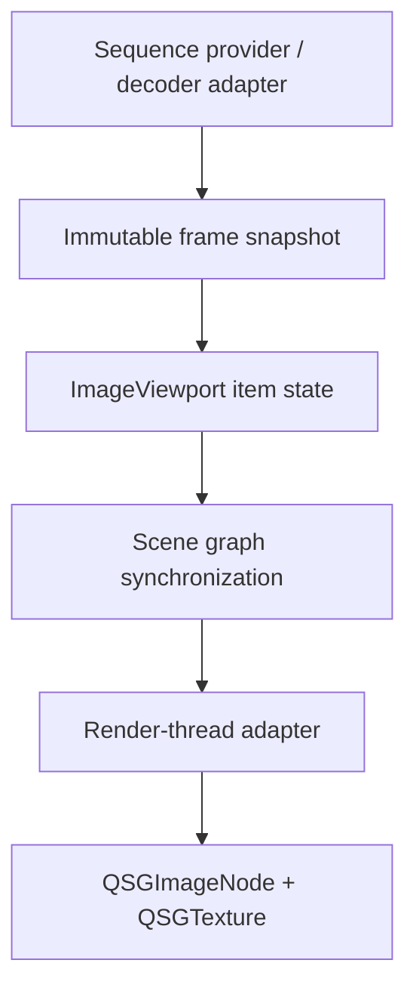

# Frame Provider Boundary

This document defines the architecture direction for the first three implementation boundaries: provider responsibility, frame lifetime and threading, and frame representation.

The design keeps codec integration, playback state, and Qt Quick scene graph resources separated. A provider produces displayable frame data; `ImageViewport` owns QML-visible state and playback decisions; the render-thread adapter turns candidate frames into scene graph resources and commits them to displayed state.

## Provider Boundary

The provider boundary should be defined around display frames, not URLs, files, archive entries, or codec-native frame fragments.

The caller or provider owns source resolution. It may read from files, archives, memory, network caches, application storage, or custom container formats, but `ImageViewport` should only see an `ImageSequence` facade that can open a provider session able to describe and deliver frames.

The provider owns codec-native composition. Blending, disposal, reference frames, palettes, alpha reconstruction, internal layers, progressive passes, and format-specific timing repair should be resolved before a frame is accepted as displayable by the viewport.

The delivered display frame should be a self-contained canvas-equivalent snapshot. Dirty regions, subrect metadata, and dependency descriptions may be carried as hints, but they must not require `ImageViewport` to perform codec-specific composition before rendering.

The provider may expose derived hints from codec internals when they are useful but not semantically required. Examples include dirty regions, independent-decode boundaries, key-frame-like seek points, dependency descriptions, frame coalescing state, and preparation cost.

`ImageViewport` owns presentation and playback interpretation. It chooses the requested display target, tracks the scene graph committed display frame, applies fill mode, alignment, mirroring, zoom, pan, sampling, viewport clipping, retain-on-replacement behavior, and QML-visible request and display status.

The provider should be replaceable without changing `ImageViewport` behavior. A GIF provider, WebP provider, AVIF provider, HEIF sequence provider, JXL provider, QMovie compatibility provider, archive-backed provider, and application-generated provider should all map into the same display-frame contract.

Provider capabilities should describe access constraints instead of forcing every provider into random access. Stable display indexes are a capability, not a minimum requirement. Sequential and stateful sequential decoders remain valid providers when they can produce immutable display snapshots in their supported order and report unsupported or waiting behavior for requests they cannot satisfy directly.

## Threading And Lifetime

The item side should treat provider output as immutable snapshots. Once a frame snapshot is handed to `ImageViewport`, the pixel payload and metadata visible to the viewport should remain stable until the snapshot is destroyed.

Provider work may occur on a worker thread, the GUI thread, or an application-owned scheduler. The boundary should therefore use ownership and notification rules that do not require provider callbacks to run on the render thread.

`ImageViewport` QML state lives on the GUI thread. Sequence assignment, playback state, requested-frame selection, displayed-frame reporting, status reporting, and coordinate conversion should be item-side state and should not expose `QSG` objects.

Scene graph resources live on the scene graph rendering thread. `QSGNode`, `QSGTexture`, and related scene graph objects should be created, mutated, and destroyed through the render-thread adapter and Qt Quick scene graph lifecycle.

The synchronization point from item state to scene graph should pass only the latest candidate or retained display snapshot and presentation parameters needed for drawing. It should not call into decoders, block on I/O, or perform codec composition.

Frame snapshots should be reference-counted or otherwise explicitly owned so that a worker-produced frame cannot be freed while the GUI side is selecting it or while the render adapter is uploading it.

Replacing a sequence should create a new generation token. Late frames from an old generation should be ignored for status and display replacement, while already retained display content may remain visible according to retain policy.

Scene graph invalidation should discard render-thread texture state without invalidating provider snapshots or QML-visible sequence state. Uploaded texture caches are rebuildable optimization state.

## Frame Representation

The baseline display payload should be a CPU image frame, conceptually equivalent to a `QImage`, with stable pixel storage, logical size, visible rect or canvas rect, timing metadata, and normalization metadata.

The baseline pixel format should favor a format that Qt Quick can upload predictably through `QQuickWindow::createTextureFromImage()`. Format conversion may happen inside the provider or inside a viewport-owned preparation step, but the render adapter should receive a texture-upload-ready image whenever practical.

The detailed CPU-image upload contract is defined in [QImage Texture Upload Contract](qimage-texture-upload-contract.md).

The display frame should distinguish logical image coordinates from the stored pixel buffer. This allows descriptive content regions, provider-managed coalescing, dirty-region hints, and future large-image work without forcing codec fragments into the viewport API.

The frame representation should record whether orientation, alpha premultiplication, and color metadata have already been normalized, preserved, deferred, or approximated under the policies supported by the initial pipeline. The viewport should not guess whether a frame has already applied metadata transforms.

Texture-compatible payloads are a future extension, not the first contract. The initial design should not require callers to create `QSGTexture`, pass native texture handles, or understand scene graph threading.

Future frame payload variants may include texture factories, `QRhiTexture`-backed frames, native texture import, or platform video/image buffers. These variants must preserve the same ownership rule: provider-side objects describe displayable frames, while render-thread adapters own the final scene graph resource binding.

The representation should allow preparation hints to flow backward from viewport to provider without making cache behavior observable as correctness. A provider may prepare decoded frames, and the render adapter may prepare uploaded textures, but playback correctness must not depend on either cache being warm.

## Design Consequences

The first implementation should prefer the simplest complete path: provider delivers immutable image snapshots, the item stores the candidate or retained display snapshot and presentation state, and `updatePaintNode()` updates a `QSGImageNode` backed by a `QSGTexture`.

The public API should describe sequence content and viewport behavior, not graphics resources. Internal preparation intent may flow from the controller to providers or caches, but it should not be required public API for correctness. This keeps the API usable from QML and keeps the Qt Quick render-thread rules inside the implementation.

Native texture paths should be added only after the image snapshot path proves the provider boundary and playback model. When added, they should be parallel payload variants rather than a replacement for the baseline frame contract.

## References

- Qt `QQuickItem` documentation describes custom scene graph items through `updatePaintNode()` and warns that scene graph interaction belongs on the rendering thread: <https://doc.qt.io/qt-6/qquickitem.html>
- Qt Quick scene graph documentation describes threaded and non-threaded render loops and identifies synchronization as the point where QML items and scene graph nodes interact: <https://doc.qt.io/qt-6/qtquick-visualcanvas-scenegraph.html>
- Qt `QSGImageNode` documentation describes the textured node abstraction, including texture, target rect, source rect, filtering, mipmap filtering, and texture-coordinate mirroring: <https://doc.qt.io/qt-6/qsgimagenode.html>
- Qt `QQuickWindow` documentation describes scene graph invalidation and render-thread scene graph signals relevant to resource lifetime: <https://doc.qt.io/qt-6/qquickwindow.html>
