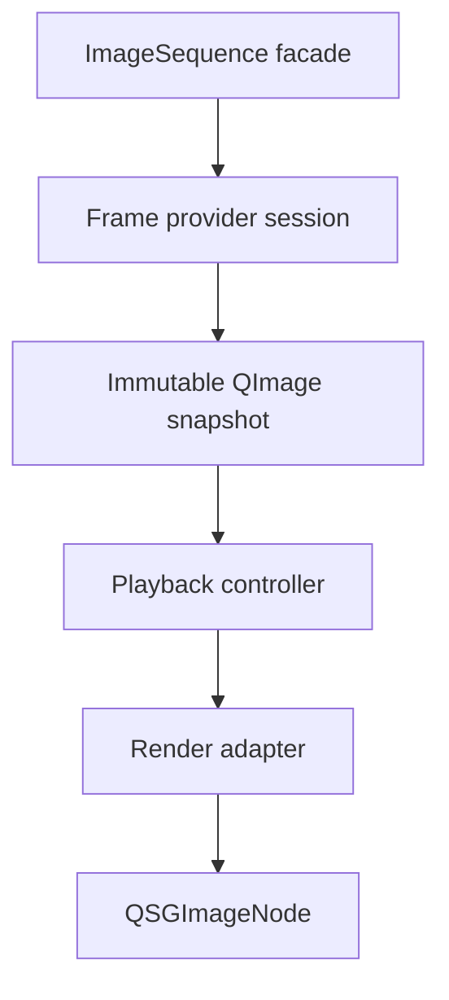

# Initial Implementation Boundary

This document defines the first implementation boundary for `ImageViewport`. It describes the initial delivery slice that should prove the architecture without collapsing future extension points into the first implementation.

The boundary is architectural intent, not a statement of current implementation status and not a user-facing capability specification.

## Milestone Shape

The first delivery should be split into two architectural milestones.

`M0 proof slice` is an internal, testable skeleton that proves the provider, controller, render-package, and scene graph adapter split. It may use fake providers and minimal public scaffolding, but it should not introduce shortcuts that contradict the public API direction.

`M1 initial public implementation` is the first caller-usable boundary. It should expose the minimum public sequence construction surface, the `ImageViewport.sequence` item surface, and the presentation/playback/status behavior needed to display still and timed multi-frame content from caller-supplied sequences.

## M0 Proof Slice

The first implementation should support caller-supplied sequence content through the provider boundary, not `source: url`.

The baseline frame payload should be an immutable CPU image snapshot, conceptually equivalent to a `QImage`, with explicit metadata for logical size, stable frame index when available, millisecond duration, alpha state, orientation normalization state, color policy state, and generation identity.

The first render path should upload candidate or retained `QImage` snapshots to `QSGTexture` through the render adapter and present them with `QSGImageNode`.

The first render path should create image nodes through `QQuickWindow::createImageNode()` and should disable texture atlas participation entirely so source rectangles, mirroring, nearest sampling, DPR conversion, mipmap fallback, and texture-coordinate behavior stay testable before atlas optimization is introduced.

The initial scene graph subtree should be limited to the nodes needed for viewport backing, textured image presentation, and viewport image clipping. It should not introduce a custom renderer, framebuffer path, or general-purpose graphics pipeline.

The first proof slice may be narrower than the complete initial boundary: a known frame count, random-access fake provider, immutable full-frame `QImage` snapshots, one display-committed texture, positive item bounds supplied by the test, and deterministic playback/controller tests are enough to validate the core split. Even in that slice, controller code should preserve display-target abstraction rather than baking all request flow into raw integer indexes. Sequential providers, streaming unknown-count sources, previous/next uploaded texture warming, and richer provider capabilities can follow without changing the boundary.

The M0 public QML item may expose default state and no-op command behavior while provider-backed display is being wired, but the header should already move toward the v0 property, enum, and invokable surface so QML tests and examples do not grow around an unrelated placeholder item. Public QML enum keys should be globally unambiguous within the `ImageViewport` type scope; duplicate names such as generic `Unsupported` or `PreserveMetadata` should be avoided even when C++ scoped enums would compile.

M0 scaffolding should register `ImageSequence` as a QML property type without allowing direct `ImageSequence {}` construction or public empty C++ construction. It may include placeholder `ImageFrame`, `TimedImageFrame`, `ImageSequenceProviderAdapter`, and `ImageSequenceFactory` types before they can create displayable content, as long as their observable behavior follows the public direction: factory failures return null or diagnostics, valid factory inputs are the only route to non-empty sequence handles, and raw provider or frame objects are not assigned directly to `ImageViewport.sequence`.

The base `ImageSequenceProviderAdapter` should remain non-creatable in QML until its callable/signal contract exists. A concrete application adapter may still be supplied from C++ and passed to the factory, but opening the base type as a creatable QML object would imply a provider protocol that the milestone has not defined.

M0 factory scaffolding may return null for invalid or not-yet-constructible inputs, but tests should not encode null return as the permanent behavior for valid inputs. The first implementation should turn valid `ImageFrame`, typed `TimedImageFrame` list or builder, and concrete provider-adapter inputs into non-null sequence handles with explicit Qt ownership and immutable generation data.

Before the first real upload, implementation scaffolding should introduce the controller generation state and render adapter boundary even if the render adapter still returns no nodes. This keeps `setSequence()`, `clear()`, facade destruction, render-deferred status, and later `updatePaintNode()` commit acknowledgements from growing around unrelated placeholder state.

## M1 Initial Public Implementation

The first caller-usable implementation should include the minimum sequence construction surface: a way to construct an `ImageSequence` from an in-memory still image, from an explicit timed frame list, and from an application provider adapter. QML-callable recipes should go through `ImageSequenceFactory` or an equivalent helper and may use module-owned `ImageFrame`, `TimedImageFrame`, and provider adapter objects; direct `QImage` construction may remain C++-only where QML has no natural value type.

The first playback path should use the sequence playback controller, generation-scoped provider requests, retained displayed snapshots, waiting/error status, seek handling, loop handling, and frame-duration timing as already described by the architecture documents.

The first preparation path should allow decoded-frame retention and a minimal uploaded texture cache. A single displayed texture is sufficient for correctness; previous/next texture preparation can remain an optimization behind the same cache boundary.

The first caller-usable implementation should preserve item-local coordinate conversion, content rectangle reporting, fill/alignment behavior, mirroring, smooth/nearest sampling, mipmap request handling, transparent/solid/checkerboard viewport backing, internal viewport image clipping, and retained-display behavior.

The first implementation should share one mapping value object between coordinate conversion and render synchronization so the item-side hit-testing model and scene graph geometry cannot drift apart.

## Explicit Non-Goals

The first implementation should not expose `source: url`. Source resolution, archive access, network loading, application storage, and filesystem policy remain caller/provider responsibilities.

The first implementation should not expose caller-owned `QSGTexture`, native texture handles, or render-thread callbacks as provider requirements.

Native texture import, `QRhiTexture` payloads, platform video/image buffers, and texture factories are outside the first implementation boundary.

Large-image region loading, level-of-detail provider protocols, tiled presentation, and arbitrary content rotation are outside the first implementation boundary.

Streaming sequences with unknown frame count, sequential-only seek recovery, and advanced provider-side scheduling are outside M0 even though the architecture should preserve room for them. M1 should not require exhaustive real decoder support for these classes, but its public capability model should not make them impossible.

Full viewer-grade color management is outside the first implementation boundary. The baseline path may assume display-ready sRGB-like content according to the selected color policy while preserving source color metadata needed for diagnostics and a later richer color pipeline. Strict or best-effort color conversion is not part of the first policy surface.

Custom checkerboard colors and cell sizing are outside M0 and may remain outside M1 unless a concrete caller needs them. The initial backing path only needs transparent, solid color, and a default checkerboard mode that fills the item-local viewport bounds so alpha inspection behavior is represented in the render architecture from the start.

Custom GPU effects, shader pipelines, `QSGRenderNode`, `QQuickRhiItem`, `QQuickFramebufferObject`, and `QQuickPaintedItem` are outside the first implementation boundary.

Automatic input handling for wheel zoom, drag pan, pinch gestures, selection tools, annotation, or crop handles is outside the first implementation boundary. Applications can build those interactions on top of exposed viewport state and coordinate conversion.

## Extension Points To Preserve

The frame payload model should remain variant-friendly so future payloads can add texture-compatible or native-resource-backed representations without replacing the `QImage` snapshot path.

The provider protocol should preserve capability reporting, preparation hints, generation-scoped requests, cancellation, and derived frame metadata so GIF, WebP, AVIF, HEIF, JXL, QMovie-compatible, archive-backed, and application-generated providers can converge on the same display-frame contract.

The render adapter should keep texture upload and node binding behind one boundary so future native texture paths can be added without exposing `QSGTexture` ownership to QML callers.

The cache model should preserve the distinction between decoded-frame preparation and uploaded-texture preparation. Cache warmth should remain an optimization and not a correctness requirement.

The color and orientation metadata model should preserve enough information for later full color management, profile conversion, wide-gamut handling, HDR policy, and orientation-policy changes.

The coordinate model should remain based on logical image space and item-local mapping so future region/LOD, crop UI, annotation, and pixel inspection can reuse the same conceptual coordinate system.

## M0 Completion Criteria

The proof slice is satisfied when a fake caller-supplied provider can describe a known-count sequence, deliver immutable `QImage` snapshots, and have `ImageViewport` display a still frame through `QSGImageNode` at positive item bounds.

It should be possible to verify generation-scoped request flow, one frame commit acknowledgement, retained item-side snapshot state, basic render package creation, and scene graph resource cleanup without real decoder libraries or advanced sequence construction helpers.

## M1 Completion Criteria

The initial implementation boundary is satisfied when a caller-supplied provider can describe a sequence, deliver immutable `QImage` snapshots, and have `ImageViewport` display still and timed multi-frame content through `QSGImageNode`.

It should be possible to replace a sequence, retain the previous displayed frame while the replacement is waiting, report provider or upload errors without clearing retained content by default, and recover through a later scene graph committed frame or replacement.

It should be possible to resize the item, change placement controls, mirror content, change sampling flags, seek, pause, resume, loop, and observe item-side content geometry without changing provider implementation details.

It should be possible to test the playback controller without Qt scene graph resources and to test render-adapter decisions without real decoder libraries.

Crossing this boundary does not require every future optimization to exist. It requires the first implementation to leave native texture payloads, large-image supply, richer color management, and advanced interaction features as additive extensions rather than incompatible rewrites.
