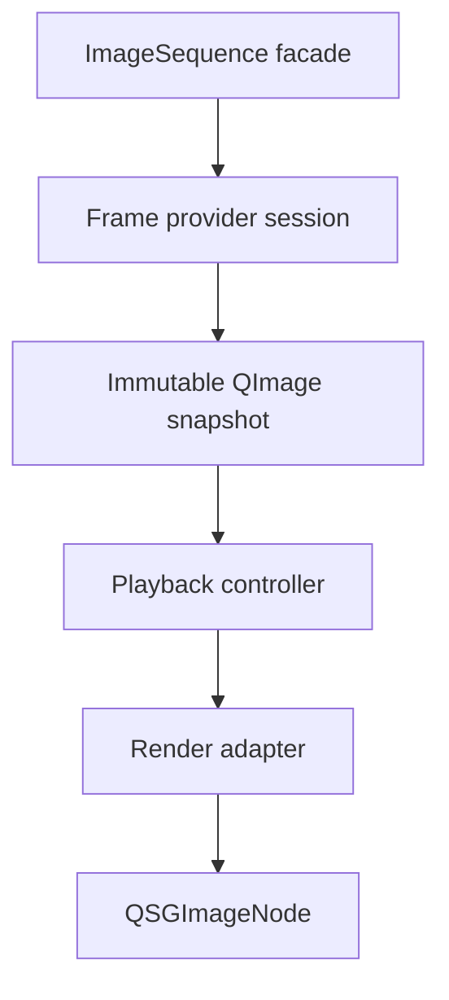

# Initial Implementation Boundary

This document defines the first implementation boundary for `ImageViewport`. It describes the initial delivery slice that should prove the architecture without collapsing future extension points into the first implementation.

The boundary is architectural intent, not a statement of current implementation status and not a user-facing capability specification.

## Initial Scope

The first implementation should support caller-supplied sequence content through the provider boundary, not `source: url`.

The baseline frame payload should be an immutable CPU image snapshot, conceptually equivalent to a `QImage`, with explicit metadata for logical size, frame index, duration, alpha state, orientation normalization state, color policy state, and generation identity.

The first render path should upload candidate or retained `QImage` snapshots to `QSGTexture` through the render adapter and present them with `QSGImageNode`.

The initial scene graph subtree should be limited to the nodes needed for textured image presentation and viewport image clipping. It should not introduce a custom renderer, framebuffer path, or general-purpose graphics pipeline.

The first playback path should use the sequence playback controller, generation-scoped provider requests, retained displayed snapshots, waiting/error status, seek handling, loop handling, and frame-duration timing as already described by the architecture documents.

The first proof slice may be narrower than the complete initial boundary: a known frame count, random-access fake provider, immutable full-frame `QImage` snapshots, one display-committed texture, and deterministic playback/controller tests are enough to validate the core split. Sequential providers, streaming unknown-count sources, previous/next uploaded texture warming, and richer provider capabilities can follow without changing the boundary.

The first preparation path should allow decoded-frame retention and a minimal uploaded texture cache. A single displayed texture is sufficient for correctness; previous/next texture preparation can remain an optimization behind the same cache boundary.

The first implementation should preserve item-local coordinate conversion, content rectangle reporting, fill/alignment behavior, mirroring, smooth/nearest sampling, mipmap request handling, internal viewport image clipping, and retained-display behavior.

The first implementation should share one mapping value object between coordinate conversion and render synchronization so the item-side hit-testing model and scene graph geometry cannot drift apart.

## Explicit Non-Goals

The first implementation should not expose `source: url`. Source resolution, archive access, network loading, application storage, and filesystem policy remain caller/provider responsibilities.

The first implementation should not expose caller-owned `QSGTexture`, native texture handles, or render-thread callbacks as provider requirements.

Native texture import, `QRhiTexture` payloads, platform video/image buffers, and texture factories are outside the first implementation boundary.

Large-image region loading, level-of-detail provider protocols, tiled presentation, and arbitrary content rotation are outside the first implementation boundary.

Streaming sequences with unknown frame count, sequential-only seek recovery, and advanced provider-side scheduling are outside the first proof slice even though the architecture should preserve room for them.

Full viewer-grade color management is outside the first implementation boundary. The baseline path may assume display-ready content according to the selected color policy while preserving metadata and compliance diagnostics needed for a later richer color pipeline.

Custom GPU effects, shader pipelines, `QSGRenderNode`, `QQuickRhiItem`, `QQuickFramebufferObject`, and `QQuickPaintedItem` are outside the first implementation boundary.

Automatic input handling for wheel zoom, drag pan, pinch gestures, selection tools, annotation, or crop handles is outside the first implementation boundary. Applications can build those interactions on top of exposed viewport state and coordinate conversion.

## Extension Points To Preserve

The frame payload model should remain variant-friendly so future payloads can add texture-compatible or native-resource-backed representations without replacing the `QImage` snapshot path.

The provider protocol should preserve capability reporting, preparation hints, generation-scoped requests, cancellation, and derived frame metadata so GIF, WebP, AVIF, HEIF, JXL, QMovie-compatible, archive-backed, and application-generated providers can converge on the same display-frame contract.

The render adapter should keep texture upload and node binding behind one boundary so future native texture paths can be added without exposing `QSGTexture` ownership to QML callers.

The cache model should preserve the distinction between decoded-frame preparation and uploaded-texture preparation. Cache warmth should remain an optimization and not a correctness requirement.

The color and orientation metadata model should preserve enough information for later full color management, profile conversion, wide-gamut handling, HDR policy, and orientation-policy changes.

The coordinate model should remain based on logical image space and item-local mapping so future region/LOD, crop UI, annotation, and pixel inspection can reuse the same conceptual coordinate system.

## Completion Criteria

The initial implementation boundary is satisfied when a caller-supplied provider can describe a sequence, deliver immutable `QImage` snapshots, and have `ImageViewport` display still and timed multi-frame content through `QSGImageNode`.

It should be possible to replace a sequence, retain the previous displayed frame while the replacement is waiting, report provider or upload errors without clearing retained content by default, and recover through a later scene graph committed frame or replacement.

It should be possible to resize the item, change placement controls, mirror content, change sampling flags, seek, pause, resume, loop, and observe content geometry without changing provider implementation details.

It should be possible to test the playback controller without Qt scene graph resources and to test render-adapter decisions without real decoder libraries.

Crossing this boundary does not require every future optimization to exist. It requires the first implementation to leave native texture payloads, large-image supply, richer color management, and advanced interaction features as additive extensions rather than incompatible rewrites.
