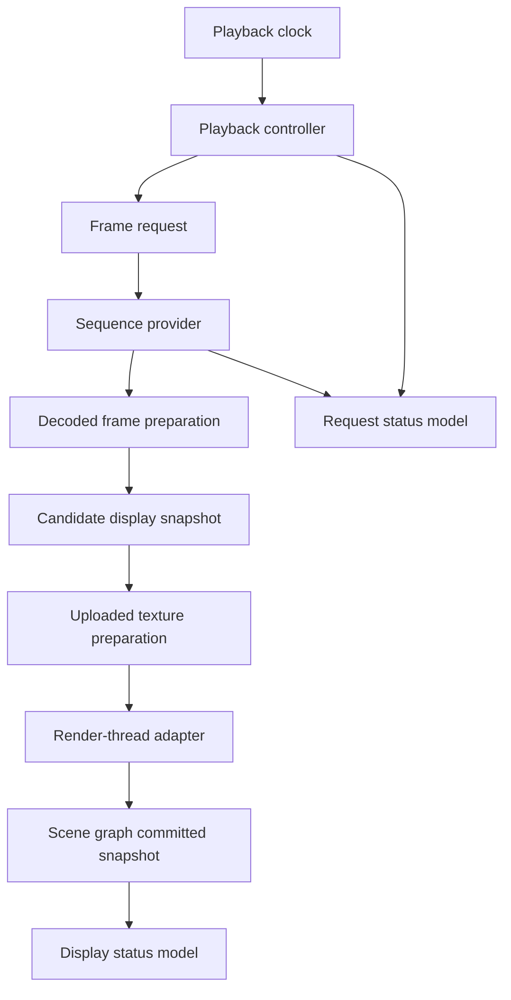

# Playback, Preparation, And Status

This document defines the architecture direction for playback control, frame preparation, and provider error propagation.

The design treats playback as a deterministic item-side controller that requests immutable display frames from a provider, uses preparation layers only as optimizations, and reports provider and render outcomes through separate request and display status state.

## Playback Controller

The playback controller should live on the item side and should own the sequence timeline interpretation for `ImageViewport`.

The controller should translate playback commands, requested playback phase, `requestedFrame`, `speed`, `loopMode`, `loopCount`, sequence timing metadata, and seek requests into display-frame target requests. It should not decode images, compose codec fragments, upload textures, or mutate scene graph nodes.

The detailed controller state machine is defined in [Playback State Machine](playback-state-machine.md).

Still images should use the same controller path as sequences. A single-frame sequence can be displayed, paused, stopped, and retained without a separate still-image pipeline.

The controller should use frame durations supplied by the provider when available. A fixed fallback duration may exist as an implementation policy for incomplete metadata, but source-provided per-frame durations should remain the preferred timeline.

Timed playback should be driven from scene graph committed frames, not from wall-clock time while no frame can be presented. If no scene graph context exists, the controller may keep a pending candidate or request, but it should not consume frame durations or advance through multiple frames offscreen by default. Provider results that match the active generation and request may be accepted as pending candidates while render availability is absent; displayed state and frame-duration consumption should still wait for scene graph commit.

Finite loop handling should be a controller concern. The controller should normalize provider source loop metadata and caller overrides into an effective loop policy, advance `completedLoops`, detect the end condition, and enter the ended phase without requiring the provider to simulate looped frame indexes. Provider source metadata should be concrete finite, infinite, none, or unknown data; the caller-facing `SourceLoop` mode should be resolved only inside the controller. When source metadata is absent, none, or unknown, `SourceLoop` should resolve to a single complete play-through.

Seeking should create an explicit target request against the current sequence generation. If the target frame is already available and render preparation succeeds, display can update immediately; if it is not available, the requested target remains pending while the display-committed frame remains stable.

When the next timed frame is unavailable, the controller should hold the current display-committed snapshot and wait for the requested frame instead of skipping ahead. This preserves frame order and avoids making provider latency visible as dropped animation semantics.

When rendering resumes after deferred scene graph work, playback timing should continue from the latest scene graph committed frame. The controller should avoid burst-advancing through elapsed hidden time unless a future explicit wall-clock playback policy is introduced.

The controller should treat frame indexes and provider results as generation-scoped. Results produced for an older sequence generation, older normalization policy, or superseded seek request should not replace current status or display state.

## Cache And Preparation Policy

Preparation should be divided into decoded-frame preparation and uploaded-texture preparation.

Decoded-frame preparation belongs to the provider side or to a CPU-side preparation cache owned near the provider boundary. It may retain immutable frame snapshots, timing metadata, normalized images, coalesced display frames, and seek acceleration data.

Uploaded-texture preparation belongs to the render-thread adapter. It may retain a small set of textures that correspond to the displayed frame and nearby likely frames, but it should remain discardable whenever the scene graph is invalidated or memory pressure policy requires it.

The playback controller should emit preparation intent, not cache commands. Intent can describe the displayed frame, requested display target, playback direction, likely next frames, and memory budget class.

The provider may respond to preparation intent by decoding ahead, retaining previous frames needed for composition, warming seek points, or doing nothing. The viewport must remain correct if the provider ignores preparation hints.

The render-thread adapter may respond to preparation intent by uploading nearby decoded frames to textures when the scene graph is valid and the window/backend allows it. Texture preparation must not become visible API state required for correctness.

Prepared frames may be admitted to decoded-frame caches or uploaded-texture caches without changing request status, display status, displayed frame, or playback phase. A prepared frame becomes a candidate only when it also satisfies the current display-critical target for the active generation and normalized payload identity.

Decoded cache identity should be based on a prepared-frame identity, not merely on an integer frame index. Every accepted snapshot should provide a generation-local `snapshotIdentity`, and every normalized payload should have or derive a `payloadIdentity`. Stable frame index, provider target or playback position, presentation timestamp, provider frame revision, normalization policy, pixel format or payload representation, and provider-side source identity may refine the identity when relevant.

Preparation that starts before a snapshot exists should use a separate pre-snapshot preparation key. That key should include the generation, requested target shape and value, normalization policy, output preference, playback direction when relevant, and provider-side source identity when available. Once a provider returns a snapshot, the cache entry should be reconciled under the snapshot or prepared-frame identity rather than continuing to rely on an integer frame index.

Uploaded texture cache identity should additionally include payload identity, requested mipmap or upload-affecting options, actual texture capability or fallback result, and scene graph compatibility such as window, backend, graphics device, or other context identity. Non-index targets should enter decoded caches under their snapshot or prepared-frame identity, while uploaded textures should use payload identity plus upload and scene graph compatibility. Frame index should be only one optional component of those identities.

Decoded caches may survive scene graph invalidation. Uploaded texture caches must be treated as tied to the scene graph context and should be rebuilt from retained frame snapshots when needed.

Cache eviction should prefer semantic stability over raw recency. The currently displayed frame and pending target should be protected before speculative previous or next frames.

## Error And Status Propagation

Request status should describe the latest content request or replacement attempt, while display status describes the frame currently visible to the user.

Provider outcomes should enter the item side through generation-scoped result messages. The expected result categories are sequence metadata ready, frame ready, request waiting, end of sequence, cancelled request, unsupported, and error.

Recoverable warnings should travel as diagnostics attached to accepted sequence-info, frame-ready, render-preparation, or commit events. This keeps request success and warning text scoped to the same generation, request, frame, and presentation revision.

The internal request status should carry a reason separate from the coarse public status. Expected reasons include provider waiting, request queued behind an in-flight single-flight request, render deferred because no scene graph context exists, upload pending, invalid request input, CPU preparation failed, texture upload failed, unsupported provider request, unsupported normalization policy, and provider failure.

An error should carry enough context to identify whether it belongs to sequence setup, metadata discovery, frame decode, normalization, preparation, or texture upload. The public `errorString` may be compact, but the internal status model should preserve the category for logging and later diagnostics.

Frame-level failure during playback should not automatically clear an already displayed frame. The controller should expose an error or waiting state for the latest request while `hasDisplayableFrame` and item-side content geometry continue to describe the retained display-committed frame.

Replacement failure should be generation-scoped. If a new sequence fails before becoming displayable, the previous generation may remain rendered according to the viewport replacement `retentionPolicy`, while request status reports the failed replacement. Within the active displayed generation, playback, seek, and frame-level failures retain the current display-committed snapshot until another snapshot commits, the viewport is cleared, or the sequence is replaced.

Display state should preserve sequence ownership for retained content. When the visible frame belongs to an older generation, item-side state should record that the displayed snapshot does not belong to the active sequence so QML-facing state can avoid treating old frame indexes, geometry, or metadata as current content.

Playback commands and seek commands should always target the active sequence generation. Retained older-generation content is only a display fallback; it should not receive play, pause, seek, stop, or preparation commands after replacement unless the caller assigns that sequence again.

Provider waiting, unsupported request, and provider error are different outcomes. Waiting means the request may still become displayable; unsupported means the active provider or viewport preparation path cannot satisfy the requested access pattern or policy; error means an operation that should have been possible failed unless the caller or provider issues a new generation or retry.

Texture upload failure should be reported through request status as a render-preparation failure, but it belongs to the viewport/render adapter rather than the provider. A decoded frame that cannot be uploaded is only a candidate snapshot; it does not become display-committed until a renderable texture is available.

Lack of render availability should be treated as deferred render preparation rather than an error. Internally, render availability should distinguish at least render context unavailable, presentation suspended, and commit pending. Render context unavailable covers missing, invalidated, released, detached, or backend-incompatible scene graph resources. Presentation suspended covers observable window or item lifecycle that prevents presentation progress while not necessarily invalidating textures. Commit pending covers candidate upload or node update work that has not yet been accepted. These causes may map to the same public render-deferred reason, but tests and diagnostics should keep them separate.

A not-yet-windowed item, invalidated scene graph, released render resources, backend/window replacement, non-exposed suspended window, or `visible: false` item that Qt Quick does not render should not appear failed solely because display progress is deferred, and render-deferred waiting should not be reported as provider latency. Baseline behavior should not classify an item as render-deferred solely because its transformed bounds are geometrically outside the current view, clipped by an ancestor, or transparent.

Deferred render preparation should leave request status in a waiting or loading-like state when a newer frame is pending, while display status continues to describe the retained display-committed frame if one exists.

If render availability is lost after a frame has already become scene graph committed, display status should continue to describe that committed snapshot. A newer candidate may be pending with a render-deferred reason, but the existing displayed snapshot remains the observable display state until another snapshot is committed or the caller clears content.

Late success after an error should only replace display state if it still matches the active generation and request. This prevents asynchronous retries or old worker results from reviving stale content.

## Design Consequences

The first implementation should use a small internal state machine: active generation, requested display target, candidate snapshot, scene graph committed snapshot, pending request, playback phase, request status, display status, render availability, and preparation intent.

The controller should be testable without Qt scene graph resources. Given sequence metadata, frame availability events, timer ticks, and seek commands, it should produce frame requests, display acceptance decisions, loop transitions, and status transitions.

The render-thread adapter should be testable separately at the boundary level. It receives candidate snapshots and presentation parameters, creates or reuses textures, updates the node, reports render-preparation failure back to item-side request status, and reports node-commit acknowledgement back to item-side display status.

The design should avoid exposing cache warmth, upload success, or provider scheduling as hard API promises. These mechanisms improve latency, but the observable model remains stable retained content plus request status.
