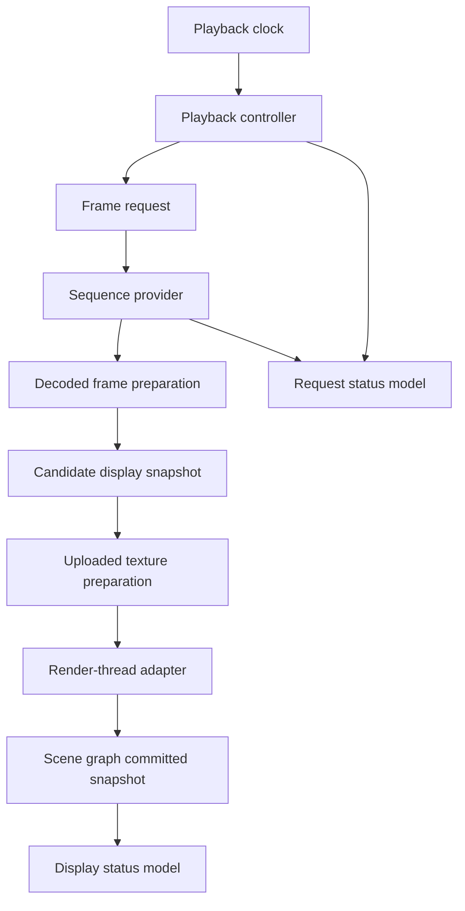

# Playback, Preparation, And Status

This document defines the architecture direction for playback control, frame preparation, and provider error propagation.

The design treats playback as a deterministic item-side controller that requests immutable display frames from a provider, uses preparation layers only as optimizations, and reports provider and render outcomes through separate request and display status state.

## Playback Controller

The playback controller should live on the item side and should own the sequence timeline interpretation for `ImageViewport`.

The controller should translate `playbackState`, `requestedFrame`, `speed`, `loopCount`, sequence timing metadata, and seek requests into display-frame requests. It should not decode images, compose codec fragments, upload textures, or mutate scene graph nodes.

The detailed controller state machine is defined in [Playback State Machine](playback-state-machine.md).

Still images should use the same controller path as sequences. A single-frame sequence can be displayed, paused, stopped, and retained without a separate still-image pipeline.

The controller should use frame durations supplied by the provider when available. A fixed fallback duration may exist as an implementation policy for incomplete metadata, but source-provided per-frame durations should remain the preferred timeline.

Timed playback should be driven from scene graph committed frames, not from wall-clock time while no frame can be presented. If no scene graph context exists, the controller may keep a pending candidate or request, but it should not consume frame durations or advance through multiple frames offscreen by default.

Finite loop handling should be a controller concern. The controller should advance `completedLoops`, detect the end condition, and enter the ended phase without requiring the provider to simulate looped frame indexes.

Seeking should create an explicit target request against the current sequence generation. If the target frame is already available and render preparation succeeds, display can update immediately; if it is not available, the requested target remains pending while the display-committed frame remains stable.

When the next timed frame is unavailable, the controller should hold the current display-committed snapshot and wait for the requested frame instead of skipping ahead. This preserves frame order and avoids making provider latency visible as dropped animation semantics.

When rendering resumes after deferred scene graph work, playback timing should continue from the latest scene graph committed frame. The controller should avoid burst-advancing through elapsed hidden time unless a future explicit wall-clock playback policy is introduced.

The controller should treat frame indexes and provider results as generation-scoped. Results produced for an older sequence generation, older normalization policy, or superseded seek request should not replace current status or display state.

## Cache And Preparation Policy

Preparation should be divided into decoded-frame preparation and uploaded-texture preparation.

Decoded-frame preparation belongs to the provider side or to a CPU-side preparation cache owned near the provider boundary. It may retain immutable frame snapshots, timing metadata, normalized images, coalesced display frames, and seek acceleration data.

Uploaded-texture preparation belongs to the render-thread adapter. It may retain a small set of textures that correspond to the displayed frame and nearby likely frames, but it should remain discardable whenever the scene graph is invalidated or memory pressure policy requires it.

The playback controller should emit preparation intent, not cache commands. Intent can describe the displayed frame, requested frame target, playback direction, likely next frames, and memory budget class.

The provider may respond to preparation intent by decoding ahead, retaining previous frames needed for composition, warming seek points, or doing nothing. The viewport must remain correct if the provider ignores preparation hints.

The render-thread adapter may respond to preparation intent by uploading nearby decoded frames to textures when the scene graph is valid and the window/backend allows it. Texture preparation must not become visible API state required for correctness.

Cache identity should include sequence generation, frame index, normalization policy, pixel format or payload representation, and device or scene graph compatibility when relevant.

Decoded caches may survive scene graph invalidation. Uploaded texture caches must be treated as tied to the scene graph context and should be rebuilt from retained frame snapshots when needed.

Cache eviction should prefer semantic stability over raw recency. The currently displayed frame and pending target should be protected before speculative previous or next frames.

## Error And Status Propagation

Request status should describe the latest content request or replacement attempt, while display status describes the retained frame currently visible to the user.

Provider outcomes should enter the item side through generation-scoped result messages. The expected result categories are sequence metadata ready, frame ready, request waiting, end of sequence, unsupported, recoverable warning, and error.

The internal request status should carry a reason separate from the coarse public status. Expected reasons include provider waiting, render deferred because no scene graph context exists, upload pending, CPU preparation failed, texture upload failed, unsupported provider request, unsupported normalization policy, and provider failure.

An error should carry enough context to identify whether it belongs to sequence setup, metadata discovery, frame decode, normalization, preparation, or texture upload. The public `errorString` may be compact, but the internal status model should preserve the category for logging and later diagnostics.

Frame-level failure during playback should not automatically clear an already displayed frame. The controller should expose an error or waiting state for the latest request while `hasDisplayableFrame` and content geometry continue to describe the retained display-committed frame.

Replacement failure should be generation-scoped. If a new sequence fails before becoming displayable, the previous generation may remain rendered according to retain policy, while request status reports the failed replacement.

Display state should preserve sequence ownership for retained content. When the visible frame belongs to an older generation, item-side state should record that the displayed snapshot does not belong to the active sequence so QML-facing state can avoid treating old frame indexes, geometry, or metadata as current content.

Provider waiting, unsupported request, and provider error are different outcomes. Waiting means the request may still become displayable; unsupported means the active provider or viewport preparation path cannot satisfy the requested access pattern or policy; error means an operation that should have been possible failed unless the caller or provider issues a new generation or retry.

Texture upload failure should be reported through request status as a render-preparation failure, but it belongs to the viewport/render adapter rather than the provider. A decoded frame that cannot be uploaded is only a candidate snapshot; it does not become display-committed until a renderable texture is available.

Lack of a scene graph context, such as an offscreen or not-yet-windowed item, should be treated as deferred render preparation rather than an error. It should not make a hidden or temporarily unrendered item appear failed, and it should not be reported as provider latency.

Deferred render preparation should leave request status in a waiting or loading-like state when a newer frame is pending, while display status continues to describe the retained display-committed frame if one exists.

Late success after an error should only replace display state if it still matches the active generation and request. This prevents asynchronous retries or old worker results from reviving stale content.

## Design Consequences

The first implementation should use a small internal state machine: active generation, requested frame target, candidate snapshot, scene graph committed snapshot, pending request, playback phase, request status, display status, and preparation intent.

The controller should be testable without Qt scene graph resources. Given sequence metadata, frame availability events, timer ticks, and seek commands, it should produce frame requests, display acceptance decisions, loop transitions, and status transitions.

The render-thread adapter should be testable separately at the boundary level. It receives candidate snapshots and presentation parameters, creates or reuses textures, updates the node, reports render-preparation failure back to item-side request status, and reports scene graph commit acknowledgement back to item-side display status.

The design should avoid exposing cache warmth, upload success, or provider scheduling as hard API promises. These mechanisms improve latency, but the observable model remains stable retained content plus request status.
