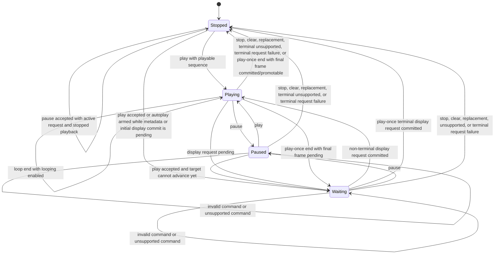

# Playback State Machine

Playback state belongs to the viewport engine, not the render adapter, provider, scheduler, or caller QML. The engine advances accepted timed sequences and authored image animations for the addressed page role, issues frame request effects, preserves request ordering, tracks loop progress, and projects public playback state. Playback is single-driver per viewport: only one page role may own playback advancement at a time, and accepting playback for another role supersedes the previous playback driver before new playback-origin requests are published.

## States

`Stopped` means no playback clock is consuming frame duration. `Playing` means the engine is allowed to advance when the current display request is ready and presentation is not suspended. `Waiting` means playback has been accepted but is waiting for metadata to select a target, or has selected a target frame or position but cannot consume additional sequence time while the display request is queued, waiting for provider work, waiting for preparation or upload ownership, blocked by non-positive item geometry, or waiting for render commit. `Paused` preserves the current target without consuming additional playback time.

The public playback phase is a direct projection of the active playback driver's state. Internal loop progress is engine state used to choose the next target for that driver; it is not a public sequencing primitive and must not be required for callers to interpret snapshot request or display status. Public behavior is expressed through role-scoped requested frame, requested position, displayed frame, displayed position, playback phase, and snapshot request/display status.

Clear and sequence replacement always leave playback stopped for the old generation. Replacement may start playback for the new generation only through an explicit play command or authored autoplay eligibility accepted by the viewport for the new initial display. `pause()` changes playback phase only from `Playing` or `Waiting` to `Paused` for the active playback driver; when an active request is not playing or waiting for playback, an accepted `pause()` preserves the current playback phase and target. `pause(role)` or `stop(role)` addressed to a present role that is not the active playback driver is accepted as a no-op for playback ownership and must not pause or stop another role's driver.

If a pending display request commits after the caller has paused, the display may update but playback remains paused and does not consume additional sequence time until `play()` is accepted again. `stop()` supersedes pending display requests created only by playback advancement; late results for those requests are stale and cannot commit display content or restart advancement. The engine restores the latest non-playback target when one exists by keeping the still-active non-playback request, creating a fresh accepted non-playback display request identity for the same target, or promoting already committed same-generation content for that target to the accepted display identity. If playback-start waiting on metadata had superseded the unknown-target initial request, `stop()` creates a fresh unknown-target non-playback initial request identity so validated metadata can later select the initial frame without reviving stale playback or initial identities. If no latest non-playback target exists, the public requested target remains unknown until metadata or an explicit command selects one. Explicit seek requests that remain active across `stop()` may commit display content, but they cannot restart playback. A request identity already superseded by an earlier accepted `play()` command is not revived by `stop()`; its late provider, preparation, or render results remain stale.

After the engine chooses a restored target for `stop()`, provider-backed restoration must issue non-playback provider frame work only for that restored target and only through engine-owned provider dispatch effects.

Ready-display promotion during stop restoration is allowed only when already committed same-generation content has the same resolved target identity as the restored request.

## Requests

Playback target advancement must use the same role-scoped request path as explicit seeking so status, retention, provider waiting, request queueing, upload pending, render waiting, spread atomicity, and errors remain consistent. The request path records both addressed role and request origin so `stop()` can cancel playback-generated requests without cancelling explicit seek requests, and so accepting playback for one role can supersede playback-generated work for any previously playing role without disturbing that other role's latest non-playback target.

Explicit seek acceptance is source-neutral: the engine records the accepted target, latest non-playback target, diagnostics reset, and playback waiting projection once, then target materialization dispatches a provider request effect, waits for provider metadata, or publishes an in-memory frame.

Seeking while playing must select the requested target and preserve playback intent. If the selected target is unresolved because metadata, request queueing, provider work, preparation or upload ownership, positive item geometry becoming available, or render commit is pending, the public playback phase becomes `Waiting` and returns to `Playing` after a non-terminal display request commits. A provider `Frame ready` result alone does not resume playback; the payload must pass validation and reach the accepted display identity through the render commit path. Invalid or unsupported seeks leave the previous accepted target and playback phase intact. If a target accepted while metadata bounds were unknown is rejected after metadata validation, the request follows the public invalid-target failure rule and playback stops when the target was playback-generated. If `play()` is accepted before metadata is available, it supersedes any current unknown-bounds explicit or initial display request for playback start and waits for metadata to select the first playable target.

A request selected by playback is generation-scoped. If a provider or render result arrives for an older playback target after a newer seek, loop, clear, or replacement, the stale result cannot change playback state or displayed content.

## Timing

Frame timing must come from sequence metadata and authored animation facts. Engine time advances through scheduler-delivered monotonic elapsed intervals so timing behavior can be reproduced without making correctness depend on wall-clock sleeps.

If timing metadata is unavailable, playback waits with unknown requested frame and position, without inventing loop progress or accumulating catch-up time. If the active sequence proves unplayable, playback stops and the request reports unsupported according to the public capability failure rule without treating the condition as an unexpected crash.

Frame intervals are half-open over the sequence duration. A play-once sequence that reaches total duration selects the final frame as the terminal display target without publishing a beyond-final display request. If the same generation already displays that final frame from an earlier request, the engine may promote the visible payload to the accepted display identity, advance the display revision token when ownership or status changes, and project ready request, ready display, and stopped playback without changing pixels. If the final frame is not already visible for the same generation, the engine keeps the final-frame display request active and projects playback waiting until the request commits or fails. A looping sequence wraps from total duration to position zero without exposing a transient out-of-range position.

Loop progress changes only after the frame request that crosses the loop boundary is accepted. Authored finite loop counts and authored infinite loops are represented separately from the caller `looping` override; the engine resolves effective loop behavior before selecting the next target, with `looping: true` forcing infinite looping and `looping: false` following authored loop policy. Invalid seeks, unsupported seeks, provider failures, render failures, and stale results do not increment loop progress.
