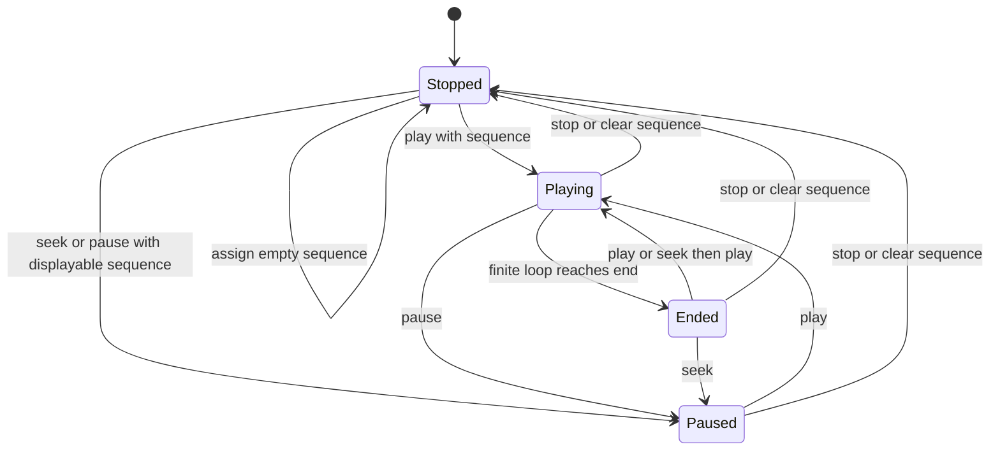
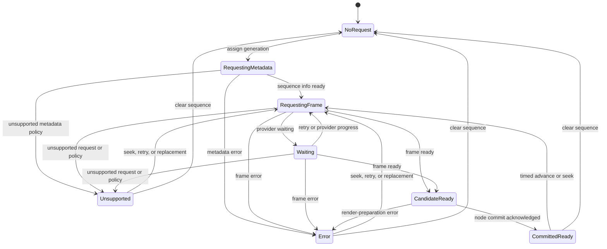
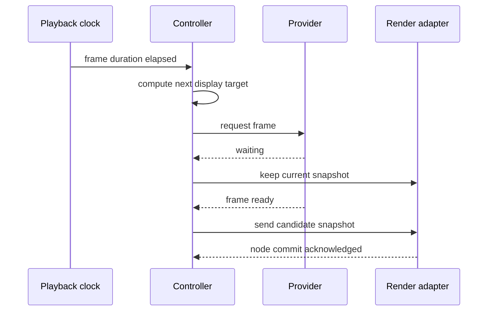
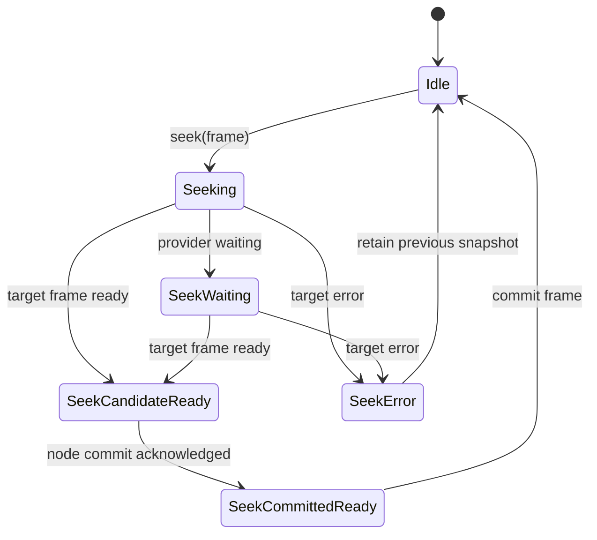
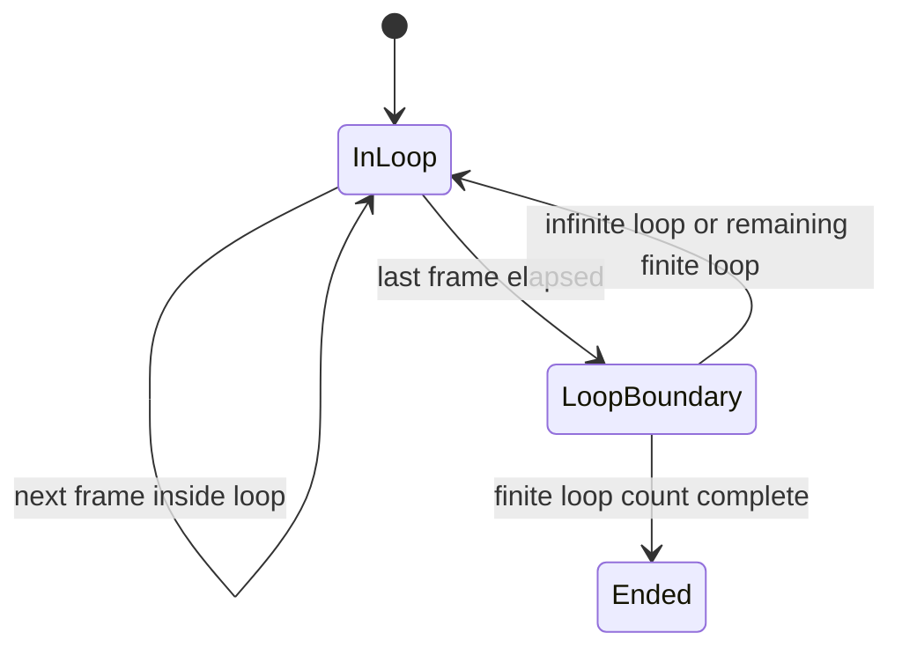

# Playback State Machine

This document defines the architecture direction for the `ImageViewport` playback controller state machine. It is intended to make later implementation and tests precise without turning internal state names into public API.

The controller state should be modeled as a small set of orthogonal concerns rather than one overloaded enum: playback phase, active generation, requested frame target, candidate snapshot, scene graph committed snapshot, pending display request, request status, display status, loop counters, and preparation intent.

## State Axes

`PlaybackPhase` is the user-visible playback mode concept. The expected phases are `Stopped`, `Playing`, `Paused`, and `Ended`.

`RequestedTarget` is the caller-selected display target. It may be an initial-frame target, next-frame target, stable display index, or playback position depending on sequence capabilities. It may advance before a provider result or texture upload has made the target visible.

`CandidateSnapshot` is an immutable frame snapshot that satisfied a provider request and is waiting for render preparation or scene graph commit. It always has a generation-local snapshot identity.

`DisplayedSnapshot` is the immutable frame currently committed to rendered output or retained display state. It may exist even while the latest request is loading, waiting, failed, or represented by a newer candidate snapshot.

`PendingRequest` is the current display-critical request, such as initial display, timed advance, explicit seek, or replacement validation.

`RequestStatus` describes the latest display-critical request. The important internal values are empty, requesting metadata, requesting frame, waiting, candidate ready, committed ready, unsupported, error, and superseded.

`DisplayStatus` describes the current visible content independently of the latest request. The important internal values are empty, retaining previous display, and display committed.

`Generation` scopes provider results. A result can affect display or status only when it matches the active generation and the current request intent.

`LoopState` tracks completed loops and finite end detection independently of provider frame indexes. Source-defined loop behavior should be normalized into an effective loop policy before timed playback starts; finite loop counts represent total sequence play-throughs, not additional repeats.

`RenderAvailability` tracks whether the item can currently make scene graph display progress. It should be modeled with separate causes such as render context unavailable, presentation suspended, and commit pending. Render context unavailable covers missing or invalid scene graph resources; presentation suspended covers a valid context that cannot currently make visible progress because of window or item lifecycle; commit pending covers candidate upload or node update work that has not yet been accepted. These causes should gate display-driven timed advancement without becoming provider errors.

## Top-Level Playback Phase

The public playback phase should stay mutually exclusive and simple.

`Stopped` should mean playback time is reset or inactive. It does not require clearing retained display content unless the caller explicitly clears or replaces content without retain behavior.

`Playing` should mean the controller advances according to sequence timing, speed, and loop policy.

`Paused` should mean the controller does not advance time automatically, but explicit seek can still request and accept frames.

`Ended` should mean finite playback reached its configured end and will not advance further without caller action.

## Display Request Lifecycle

Display request state should be tracked separately from playback phase.

`CandidateReady` means the latest display-critical request produced a candidate snapshot that can proceed to render preparation. It is an internal state and should not be exposed as public request `Ready`.

`CommittedReady` means the latest display-critical request has been acknowledged by the render adapter as accepted into the viewport's scene graph node subtree. This is the internal state that can map to public request `Ready` when the active request still matches the committed revision.

`Waiting` means the request remains active and may still succeed. While waiting, the controller should retain the previous display-committed snapshot when one exists.

While in `Waiting`, the same logical display-critical request remains active unless the controller supersedes it with seek, stop, replacement, clear, or generation close. Providers that support push-style progress may deliver a later terminal result for the same request id. Providers that require polling should expose a waiting-requires-explicit-retry capability or diagnostic so the controller can schedule explicit retry without treating waiting as failure. Retry may use the same request id or an internal attempt id, but it should not release a single-flight slot for an unrelated target until the logical request reaches a terminal result or is explicitly superseded.

For single-flight providers, superseding an in-flight display-critical request should be logical first. The controller updates the requested target and request status immediately, but it should not send the next display-critical provider request until the in-flight request produces a terminal result, acknowledges cancellation with a request-scoped terminal result, or is closed with its generation.

If a provider that advertised single-flight or eventual-terminal behavior never closes the request slot, the controller should apply a bounded diagnostic policy and defensively close the request or generation rather than waiting forever. This should surface as internal diagnostics and public unsupported or error status according to the failure category. For the active generation, the current display-committed snapshot should remain stable until another frame commits, the viewport is cleared, or the sequence is replaced; for replacement generations, older-generation visibility follows replacement retention policy.

When a `Cancelled` result arrives for the in-flight display-critical request, it should close that request slot without becoming a public error or unsupported state. If a queued target still represents the current caller intent, the controller should issue the queued target next. If no queued target remains, the controller should return to an idle request state or keep the retained display state according to the current playback phase and request status.

When a superseded in-flight request produces a frame that no longer matches the current display target, the controller should not promote that frame to `CandidateSnapshot`. It may keep the snapshot as preparation data when identities and policies are compatible, then immediately request the queued current target if the single-flight slot has become available.

`Unsupported` means the active request cannot be satisfied because the target shape, access pattern, output policy, or normalization policy is outside the active sequence or viewport preparation capabilities. It maps to public unsupported request status rather than public error status.

`Error` means the latest request failed. If the request belongs to the active displayed generation and a previous display-committed snapshot exists, rendered content should continue to describe that retained snapshot while request status describes the failed request. If the error belongs to a replacement generation before it commits, older-generation visibility follows replacement retention policy.

`Superseded` does not need to be a long-lived state. A request becomes superseded when seek, replacement, stop, clear, or generation change makes its late results irrelevant.

If render availability is lost while a candidate is waiting for scene graph commit, the request should remain waiting or candidate-ready according to the last successful step. Losing render availability should not synthesize a provider error.

If the provider delivers a frame while render availability is absent, the controller may accept it as `CandidateSnapshot` when generation, request id, and request intent still match. The snapshot should not become `DisplayedSnapshot`, and playback duration should not be consumed, until render commit is acknowledged.

## Timed Advance

Timed playback should advance only from a display-committed frame and its timing metadata.

If the next frame is unavailable, the controller should hold the display-committed frame and keep the request active. It should not skip ahead by default.

When the next frame arrives late, the controller should make it a candidate if it still matches the active generation and current timed-advance request. Timing after a late frame should restart from the scene graph committed frame rather than trying to replay accumulated missed durations in a burst.

Speed should scale elapsed playback time, not mutate provider-supplied frame durations. The controller should accept only finite positive speed values; pause, stop, and reverse playback should remain separate concepts rather than special speed values.

Elapsed time should be measured across time in which the controller can make display progress. While render availability is absent, the controller should pause display-driven timing rather than accumulating elapsed time that later causes a burst of frame requests.

## Seek Flow

Seek should supersede pending timed playback requests.

A valid seek request should update the requested frame target immediately. The displayed frame should update only when the target frame becomes scene graph committed. If the provider reports waiting, the displayed snapshot remains stable and the pending target remains visible to internal status.

An out-of-range seek should fail before issuing a provider frame request when the frame count is known. If the frame count is unknown, the provider may reject the request as unsupported or error.

Seeking while `Playing` should preserve the caller's requested phase. If the target becomes scene graph committed and the phase is still `Playing`, timed playback continues from the committed target.

Seeking while `Paused` or `Ended` should accept the target and remain non-advancing unless the caller calls play.

## Loop End

Loop handling should be controller-owned and should not require providers to expose virtual looped indexes.

At a loop boundary, `completedLoops` should advance only after the last display frame of that loop has completed its duration.

For finite loop counts, the configured value should mean total complete sequence play-throughs. A finite loop count of `1` means the sequence plays once and then enters `Ended`. The controller should enter `Ended` after the configured number of loops has completed. The final displayed snapshot should remain the last scene graph committed frame unless the caller stops or clears content.

For infinite loops, the controller should request the first frame of the next loop without asking the provider to duplicate sequence metadata.

For source-defined looping, the controller should resolve the caller-facing source-loop mode against provider metadata. Provider metadata may say finite, infinite, no loop metadata, or unknown; it should not contain a recursive source-loop value. If source loop metadata is absent, none, or unknown, the viewport should resolve source-defined looping to one complete play-through.

If a provider reports `EndOfSequence`, the controller should interpret it as a provider access-pattern result rather than as public playback completion. The controller should decide whether to rewind, request the first frame of the next loop, wait, report unsupported, or enter `Ended` according to loop policy and provider capabilities.

If the effective loop policy requires another play-through but the provider cannot rewind or otherwise provide the first frame of the next loop, the controller should report an unsupported request rather than a provider error. The existing displayed frame may remain retained, but infinite or finite looping should not silently degrade into ended playback when the caller requested a loop policy that cannot be satisfied.

## Render Availability

Render availability should be an explicit controller input with distinct internal causes. Render context unavailable includes missing scene graph context, scene graph invalidation, `releaseResources()`, window detach or backend change, and item destruction. Presentation suspended includes states where the context may remain valid but Qt Quick cannot make presentation progress, such as a non-exposed or suspended window when observable or `visible: false` preventing the item from being rendered. Commit pending includes queued upload or node update work that cannot currently complete. Baseline playback should not infer render unavailability merely from geometric offscreen position, parent clipping, opacity, or scene placement. Regaining render availability may come from window assignment, scene graph initialization, exposure changes that allow presentation progress, visibility changes that allow the item to render again, successful scene graph rebuild, or retryable upload availability.

When render availability is regained and there is a pending candidate or retained snapshot that needs scene graph commit, the controller should schedule an item update. If playback is `Playing`, elapsed display time should resume from the latest scene graph committed snapshot rather than from hidden wall-clock time.

If a snapshot was already scene graph committed before render availability was lost, display status should continue to describe that committed snapshot. A newer pending candidate should use render-deferred request state rather than replacing display state early.

Render availability changes should not create provider requests by themselves unless a display-critical request is already pending or the current phase requires initial display after a sequence assignment. They should never be reported as provider latency, decode failure, or source metadata failure.

## Error And Retention Rules

The controller should never let an error result from a stale generation or superseded request replace current status or display state.

For active display-critical requests, unsupported request shapes, unsupported access patterns, and unsupported normalization policies should move request status to unsupported.

For active display-critical requests, metadata failures, decode failures, normalization failures for policies that should have been supported, CPU preparation failures, and render-preparation failures should move request status to error.

An error should not clear `DisplayedSnapshot` automatically. Clearing is a separate caller action or sequence replacement policy decision.

If the active sequence has never produced a displayable frame, an error leaves the viewport without displayable content.

If a replacement generation fails before producing a scene graph committed frame, the previous generation's retained display may remain visible while the active request status reports the replacement error.

## Test Model

The state machine should be testable without `QQuickItem`, `QSGNode`, `QSGTexture`, or real decoder libraries.

Useful test inputs are sequence assignment, metadata result, frame ready result, waiting result, error result, clock tick, play, pause, stop, seek, clear, generation replacement, and late stale result.

Useful assertions are phase, requested target, displayed frame, completed loops, pending request identity, request status, display status, candidate snapshot identity, displayed snapshot identity, payload identity when known, presentation revision, preparation intent, render availability, and whether a provider result was accepted or ignored.
