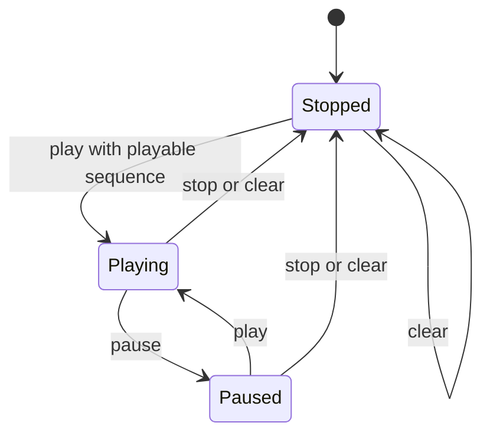

# Playback State Machine

Playback state belongs to the controller, not the render adapter. The controller advances accepted timed sequences, issues frame requests, preserves request ordering, and projects public playback state.

## States

`Stopped` means no playback clock is consuming frame duration. `Playing` means the controller is allowed to advance when the current display request is ready and presentation is not suspended. `Paused` preserves the current target without consuming additional playback time.

## Requests

Playback frame advancement should use the same request path as explicit seeking so status, retention, provider waiting, render deferral, and errors remain consistent.

Seeking while playing should select the requested target and keep the playback phase unless the command is invalid or unsupported. Invalid or unsupported seeks should leave the previous accepted target and playback phase intact.

## Timing

Frame timing should come from sequence metadata. Tests and controller logic should use deterministic clocks where timing matters, avoiding wall-clock sleeps as correctness requirements.

If timing metadata is temporarily unavailable, playback should wait without inventing loop progress. If the active sequence proves unplayable, playback should stop or report unsupported without treating the condition as an unexpected crash.
