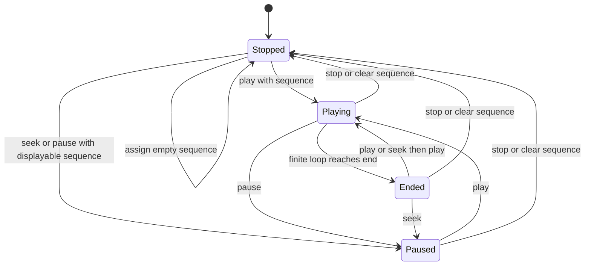
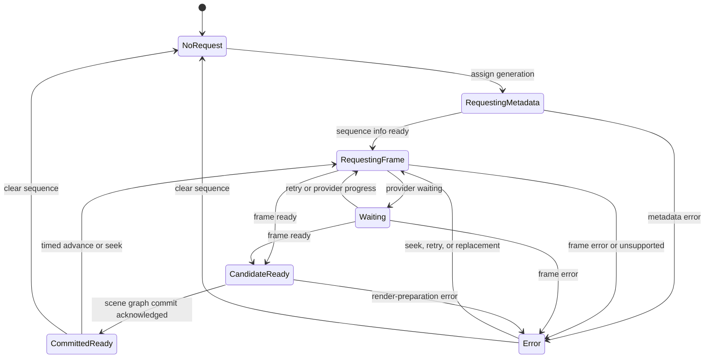
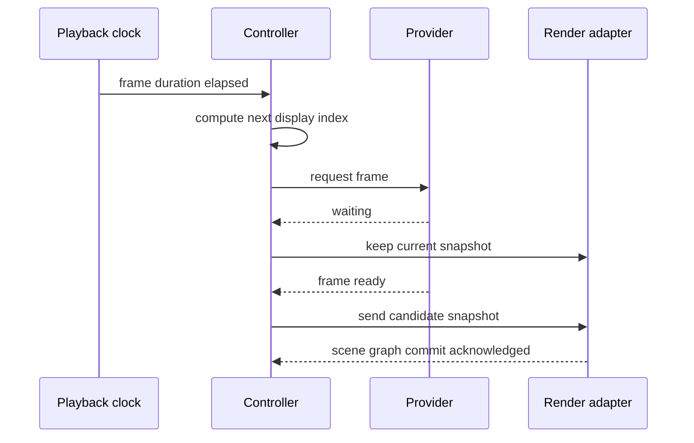
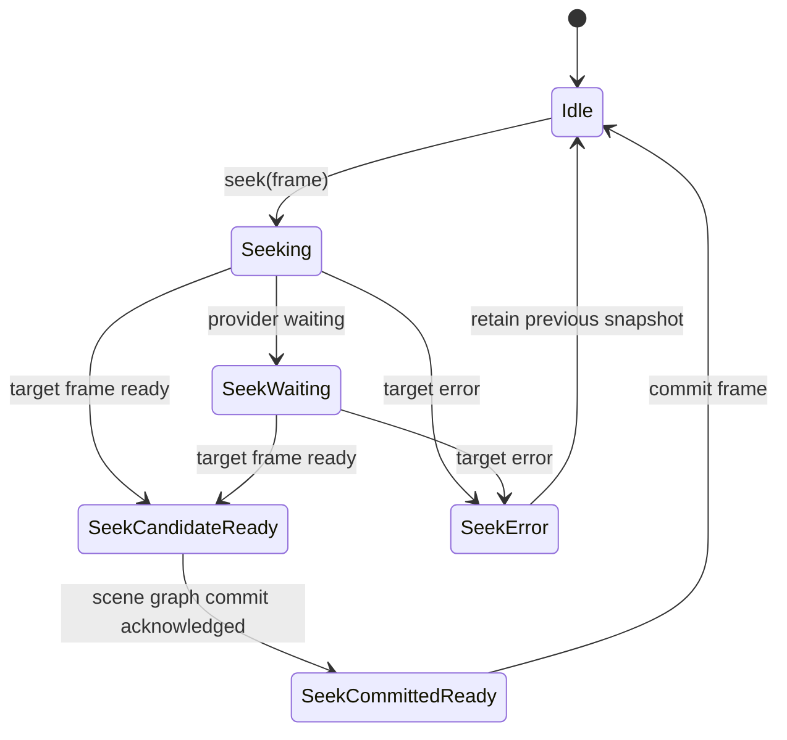
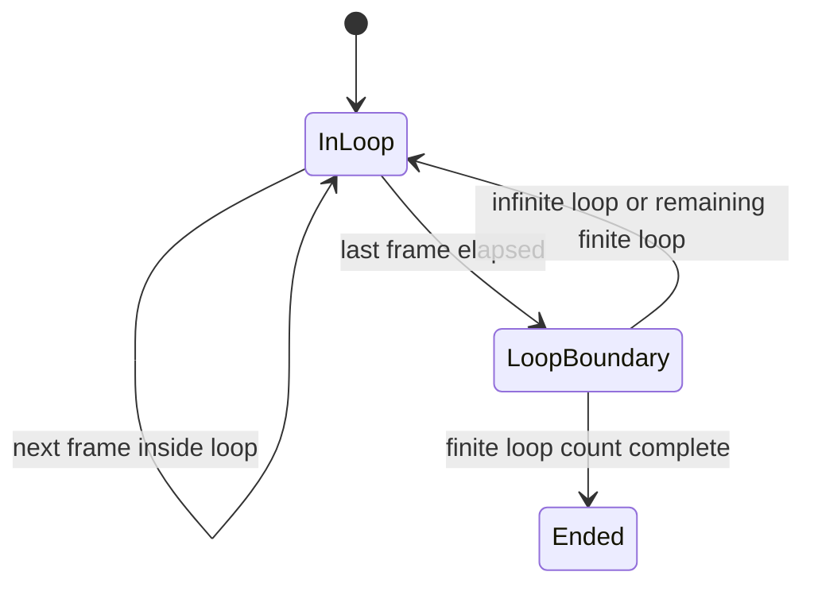

# Playback State Machine

This document defines the architecture direction for the `ImageViewport` playback controller state machine. It is intended to make later implementation and tests precise without turning internal state names into public API.

The controller state should be modeled as a small set of orthogonal concerns rather than one overloaded enum: playback phase, active generation, requested frame target, candidate snapshot, scene graph committed snapshot, pending display request, request status, display status, loop counters, and preparation intent.

## State Axes

`PlaybackPhase` is the user-visible playback mode concept. The expected phases are `Stopped`, `Playing`, `Paused`, and `Ended`.

`RequestedFrame` is the caller-selected frame target. It may advance before a provider result or texture upload has made the target visible.

`CandidateSnapshot` is an immutable frame snapshot that satisfied a provider request and is waiting for render preparation or scene graph commit.

`DisplayedSnapshot` is the immutable frame currently committed to rendered output or retained display state. It may exist even while the latest request is loading, waiting, failed, or represented by a newer candidate snapshot.

`PendingRequest` is the current display-critical request, such as initial display, timed advance, explicit seek, or replacement validation.

`RequestStatus` describes the latest display-critical request. The important internal values are empty, requesting metadata, requesting frame, waiting, candidate ready, committed ready, unsupported, error, and superseded.

`DisplayStatus` describes the current visible content independently of the latest request. The important internal values are empty, retaining previous display, and display committed.

`Generation` scopes provider results. A result can affect display or status only when it matches the active generation and the current request intent.

`LoopState` tracks completed loops and finite end detection independently of provider frame indexes.

`RenderAvailability` tracks whether the item currently has a scene graph context that can accept render preparation. It should gate display-driven timed advancement without becoming a provider error.

## Top-Level Playback Phase

The public playback phase should stay mutually exclusive and simple.

`Stopped` should mean playback time is reset or inactive. It does not require clearing retained display content unless the caller explicitly clears or replaces content without retain behavior.

`Playing` should mean the controller advances according to sequence timing, speed, and loop policy.

`Paused` should mean the controller does not advance time automatically, but explicit seek can still request and accept frames.

`Ended` should mean finite playback reached its configured end and will not advance further without caller action.

## Display Request Lifecycle

Display request state should be tracked separately from playback phase.

`CandidateReady` means the latest display-critical request produced a candidate snapshot that can proceed to render preparation. It is an internal state and should not be exposed as public request `Ready`.

`CommittedReady` means the latest display-critical request has been acknowledged by the render adapter as scene graph committed. This is the internal state that can map to public request `Ready` when the active request still matches the committed revision.

`Waiting` means the request remains active and may still succeed. While waiting, the controller should retain the previous display-committed snapshot when one exists.

`Error` means the latest request failed. If a previous display-committed snapshot exists and retain policy allows it, rendered content should continue to describe that retained snapshot while request status describes the failed request.

`Superseded` does not need to be a long-lived state. A request becomes superseded when seek, replacement, stop, clear, or generation change makes its late results irrelevant.

If render availability is lost while a candidate is waiting for scene graph commit, the request should remain waiting or candidate-ready according to the last successful step. Losing render availability should not synthesize a provider error.

## Timed Advance

Timed playback should advance only from a display-committed frame and its timing metadata.

If the next frame is unavailable, the controller should hold the display-committed frame and keep the request active. It should not skip ahead by default.

When the next frame arrives late, the controller should make it a candidate if it still matches the active generation and current timed-advance request. Timing after a late frame should restart from the scene graph committed frame rather than trying to replay accumulated missed durations in a burst.

Speed should scale elapsed playback time, not mutate provider-supplied frame durations.

Elapsed time should be measured across time in which the controller can make display progress. While render availability is absent, the controller should pause display-driven timing rather than accumulating elapsed time that later causes a burst of frame requests.

## Seek Flow

Seek should supersede pending timed playback requests.

A valid seek request should update the requested frame target immediately. The displayed frame should update only when the target frame becomes scene graph committed. If the provider reports waiting, the displayed snapshot remains stable and the pending target remains visible to internal status.

An out-of-range seek should fail before issuing a provider frame request when the frame count is known. If the frame count is unknown, the provider may reject the request as unsupported or error.

Seeking while `Playing` should preserve the caller's requested phase. If the target becomes scene graph committed and the phase is still `Playing`, timed playback continues from the committed target.

Seeking while `Paused` or `Ended` should accept the target and remain non-advancing unless the caller calls play.

## Loop End

Loop handling should be controller-owned and should not require providers to expose virtual looped indexes.

At a loop boundary, `completedLoops` should advance only after the last display frame of that loop has completed its duration.

For finite loop counts, the controller should enter `Ended` after the configured number of loops has completed. The final displayed snapshot should remain the last scene graph committed frame unless the caller stops or clears content.

For infinite loops, the controller should request the first frame of the next loop without asking the provider to duplicate sequence metadata.

## Error And Retention Rules

The controller should never let an error result from a stale generation or superseded request replace current status or display state.

For active display-critical requests, metadata errors, decode errors, unsupported request shape, normalization failure, and render-preparation failure should move request status to error.

An error should not clear `DisplayedSnapshot` automatically. Clearing is a separate caller action or sequence replacement policy decision.

If the active sequence has never produced a displayable frame, an error leaves the viewport without displayable content.

If a replacement generation fails before producing a scene graph committed frame, the previous generation's retained display may remain visible while the active request status reports the replacement error.

## Test Model

The state machine should be testable without `QQuickItem`, `QSGNode`, `QSGTexture`, or real decoder libraries.

Useful test inputs are sequence assignment, metadata result, frame ready result, waiting result, error result, clock tick, play, pause, stop, seek, clear, generation replacement, and late stale result.

Useful assertions are phase, requested frame target, displayed frame, completed loops, pending request identity, request status, display status, candidate snapshot identity, displayed snapshot identity, preparation intent, and whether a provider result was accepted or ignored.
