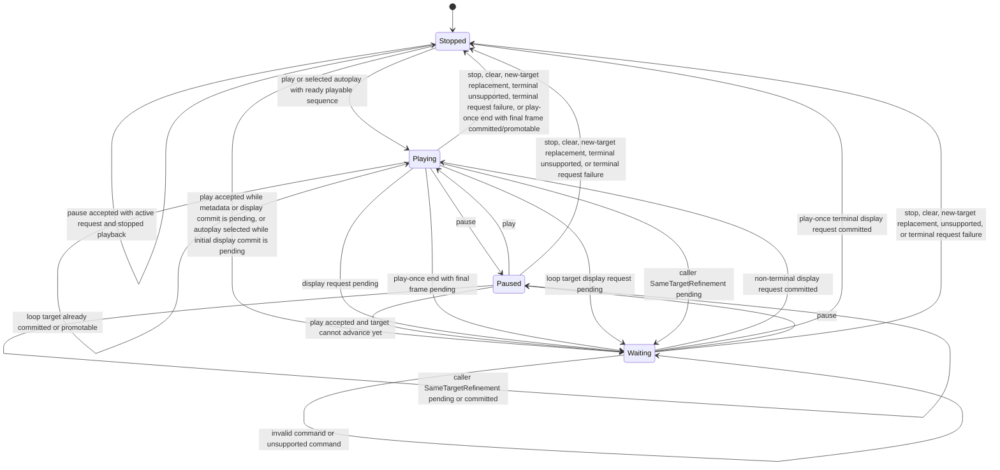

# Playback State Machine

Playback state belongs to the viewport engine, not the render adapter, provider, scheduler, or caller QML. The engine advances accepted timed sequences and authored image animations for the addressed page role, issues frame request effects, preserves request ordering, tracks loop progress, and projects public playback state. Playback is single-driver per viewport: only one page role may own playback advancement at a time, and accepting playback for another role retires the previous playback driver before new playback-origin requests are published.

## States

`Stopped` means no playback clock is consuming frame duration. `Playing` means the engine may advance when the current display request is ready. `Waiting` means playback has been accepted but is waiting for metadata to select a target, or has selected a target frame or position but cannot consume additional sequence time while the display request is queued, waiting for provider work, waiting for preparation or upload ownership, blocked by unavailable render geometry, or waiting for render commit. `Paused` preserves the current target without consuming additional playback time.

The public playback phase is a direct projection of the active playback driver's state. Before autoplay arbitration selects an eligible role, playback remains stopped with no driver; unresolved autoplay metadata does not arm a public waiting phase. Stopped state projects a null playback role, every other phase projects the sole present accepted role that owns the driver, and terminal aggregate request state retires the driver. Internal loop progress is engine state used to choose the next target for that driver; it is not a public sequencing primitive and must not be required for callers to interpret snapshot request or display status. Public behavior is expressed through role-scoped requested frame, requested position, displayed frame, displayed position, playback phase, and snapshot request/display status.

Clear and `NewTarget` replacement stop playback for the replaced generation. The new generation starts only through an explicit play command or authored autoplay eligibility accepted for its initial display. The engine resolves authored autoplay only after eligibility has settled for every present role, treating unavailable autoplay metadata as ineligible; it selects primary when both roles are eligible and otherwise selects the sole eligible role, so provider completion order cannot select the driver. Autoplay arbitration must not replace driver intent already established by an accepted explicit playback command. `SameTargetRefinement` transfers the existing driver intent, selected target, elapsed frame progress, and authored loop progress to the replacement generation: playing becomes waiting until the refined target commits, paused remains paused, and stopped remains stopped. `pause(role)` changes playback phase only from `Playing` or `Waiting` to `Paused` for the addressed active driver. `pause(role)` or `stop(role)` addressed to a present role that is not the active driver is an accepted no-op and must not affect another role.

If a pending display request commits after pause, display may update but the driver remains paused and consumes no sequence time until `play(role)` is accepted again. `stop(role)` retires pending work created only by playback advancement, preserves independent explicit seek work, and restores the latest non-playback target when one exists. Restoration creates or keeps one active non-playback request identity; it may promote already committed pixels only when generation, role, and resolved target all match.

Stop must never revive a retired request identity. If playback start retired an unknown-target initial request while metadata was pending, restoration creates a fresh unknown-target non-playback request that later metadata may bind. If no non-playback target exists, the requested target remains unknown. Provider work issued by restoration is limited to the restored target, and late playback results remain stale.

## Requests

Playback target advancement must use the same role-scoped request path as explicit seeking so status, retention, provider waiting, request queueing, upload pending, render waiting, spread atomicity, and errors remain consistent. The request path records both addressed role and request origin so `stop(role)` can cancel playback-generated requests without cancelling explicit seek requests, and so accepting playback for one role can retire playback-generated work for any previously playing role without disturbing that other role's latest non-playback target.

Explicit seek acceptance is source-neutral: the engine records the accepted target, latest non-playback target, diagnostics reset, and playback waiting projection once, then target materialization dispatches a provider request effect, waits for provider metadata, or publishes an in-memory frame.

Seeking while playing must select the requested target and preserve playback intent. If the selected target is unresolved because metadata, request queueing, provider work, preparation or upload ownership, usable render geometry, or render commit is pending, the public playback phase becomes `Waiting` and returns to `Playing` after a non-terminal display request commits. A provider `Frame ready` result alone does not resume playback; the payload must pass validation and reach the accepted display identity through the render commit path. Invalid or unsupported seeks leave the previous accepted target and playback phase intact. If a target accepted while metadata bounds were unknown is rejected after metadata validation, the request follows the public invalid-target failure rule and terminal aggregate projection stops playback regardless of request origin. If `play(role)` is accepted before metadata is available, it retires any current unknown-bounds explicit or initial display request for playback start and waits for metadata to select the first playable target.

A request selected by playback is generation-scoped. If a provider or render result arrives for an older playback target after a newer seek, loop, clear, or replacement, the stale result cannot change playback state or displayed content.

## Timing

Frame timing must come from sequence metadata and authored animation facts. Engine time advances through scheduler-delivered monotonic elapsed intervals so timing behavior can be reproduced without making correctness depend on wall-clock sleeps.

If timing metadata is unavailable, playback waits with unknown requested frame and position, without inventing loop progress or accumulating catch-up time. If the active sequence proves unplayable, playback stops and the request reports unsupported according to the public capability failure rule without treating the condition as an unexpected crash.

Frame intervals are half-open over the sequence duration. A play-once sequence that reaches total duration selects the final frame as the terminal display target without publishing a beyond-final display request. If the same generation already displays that final frame from an earlier request, the engine may promote the visible payload to the accepted display identity, advance the display revision token when ownership or status changes, and project ready request, ready display, and stopped playback without changing pixels. If the final frame is not already visible for the same generation, the engine keeps the final-frame display request active and projects playback waiting until the request commits or fails. A looping sequence wraps from total duration to position zero without exposing a transient out-of-range position.

The engine may reserve a candidate loop crossing when it accepts the wrapped-frame request, but authored loop progress advances only when that wrapped target commits or is promoted from matching visible pixels. It stores progress as completed plays against total authored plays: `PlayOnce` permits one total play, `Finite` permits its declared total of at least two, and `Infinite` has no total. The caller `looping` override is separate; `looping: true` forces infinite looping and `looping: false` follows authored policy. Invalid seeks, unsupported seeks, provider failures, render failures, and stale results discard any reservation and do not increment completed loop progress.
