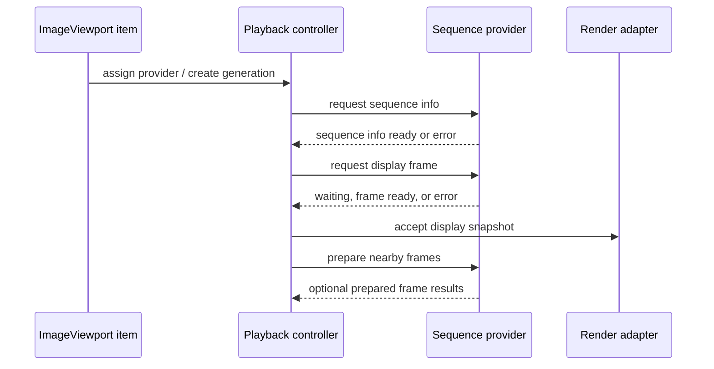

# Provider Protocol

This document defines the architecture direction for the provider protocol between `ImageViewport` and caller-supplied sequence providers.

The protocol is not a final C++ ABI. It describes the request/result model that the implementation should preserve when concrete Qt types are introduced.

## Goals

The provider protocol should let `ImageViewport` consume displayable image sequences without knowing where bytes came from, how a codec composes frames, or which scheduling model the caller uses.

The protocol should support still images, finite animations, infinite-loop animations, random-access sequences, sequential decoders, streaming sources, and providers that can prepare frames opportunistically.

The protocol should also have a small minimum provider profile. A provider that can report basic sequence info and deliver immutable full-frame snapshots in its supported access pattern should be valid even if it ignores preparation hints, does not support cancellation beyond stale-result filtering, and reports conservative capabilities. Random indexed access is useful, but it is not part of the minimum provider profile.

The protocol should keep all provider interaction outside the Qt Quick render thread. Providers may decode or prepare data on any scheduler they own, but scene graph resources remain the viewport render adapter's responsibility.

## Session And Generation Model

Assigning a new provider or changing a provider-affecting policy should create a new sequence generation.

A generation is the identity boundary for metadata, frame requests, preparation hints, results, and errors. Results from older generations must not replace status or displayed content for the active generation.

Each request within a generation should have a request identifier. Request identifiers let the controller distinguish a current playback request, a superseded seek request, and speculative preparation work that completed late.

Cancellation should be best-effort for ordinary providers. A cancelled request may still produce a late result, but the controller should ignore it unless it still matches the active generation and request intent. Providers that serialize display-critical requests should acknowledge cancellation with a terminal request result when they can stop or close the in-flight request without producing a display frame. A provider that advertises single-flight display-critical requests should eventually close each display-critical request slot with `FrameReady`, `Waiting` plus a later terminal result, `EndOfSequence`, `Cancelled`, `Unsupported`, or `Error`; otherwise the controller cannot safely issue the next queued target without closing the generation.

If a provider violates its advertised single-flight or eventual-terminal contract, the controller should not block indefinitely. The implementation should treat the generation or request slot as internally failed or unsupported after a bounded diagnostic policy, close the affected generation when necessary, and preserve retained display content according to normal status rules. This defensive closure is an implementation safeguard rather than a public timeout API.

Closing or replacing a generation should release provider-side work associated with that generation when practical, but retained display content from an older generation may remain visible according to viewport retain policy.

## Protocol Flow

The viewport should normalize provider interaction into request/result messages even when a provider can complete immediately.

The controller should be able to issue a sequence-info request before any frame request. Providers that discover metadata lazily may return partial information first and later publish updated sequence info for the same generation.

Frame requests should be display-intent requests. They should ask for a frame by a target such as initial frame, next frame, display index, or playback position, plus desired normalization policy and output preferences, without exposing codec fragment mechanics.

The request target should make the caller's intent explicit. A direct frame index is appropriate when the sequence model has stable random-access frame numbers; a playback position is the primary target for timed tracks, streaming sequences, and event-stream-like providers where frame index may be unavailable, unstable, or expensive to derive. The controller should preserve this target shape internally instead of prematurely collapsing every request to an integer frame index.

Preparation hints should be advisory messages. They should not require completion callbacks, and failure to prepare should not affect status unless the same frame is later requested for display and fails.

## Request Shapes

Sequence info requests should carry the generation, requested metadata scope, and policy inputs that can affect sequence-level interpretation.

Frame requests should carry the generation, request id, target kind, target value when applicable, request reason, orientation policy with compliance level, baseline color policy, output format preference, and cancellation token.

The request reason should distinguish display-critical work from advisory work. Expected reasons include initial display, timed playback advance, explicit seek, replacement validation, and preparation.

Preparation hints sent to providers should carry the generation, displayed frame, requested frame target, playback direction, nearby frame window, memory budget class, and CPU or decoder preparation intent. Render-thread upload preparation is an internal render-adapter intent, not a provider protocol field.

Sequence metadata should report source loop behavior as concrete source data: finite total play-through count, infinite loop, no loop metadata, or unknown. It should not report `SourceLoop` as provider metadata because `SourceLoop` is a caller override meaning “use the provider's source metadata”.

The protocol should not require a provider to understand every field. Unsupported policy or output preferences should be reported as unsupported, ignored when safe, or satisfied through the closest supported display-ready frame according to the requested policy semantics.

Orientation normalization preferences should not silently degrade when the requested policy is semantically important. Orientation compliance should distinguish strict normalization, best-effort presentation, and metadata-preserving presentation.

Strict orientation normalization means the provider or viewport CPU preparation must satisfy the requested orientation before the frame can become a candidate snapshot. Failure should produce `Unsupported` when the policy is outside provider capability, or `Error` when the policy should have been supported but normalization failed.

Best-effort presentation means the provider may return the closest supported display-ready result. The result should carry a warning or diagnostic when it differs from the requested policy.

Metadata-preserving presentation means source orientation metadata may be retained for later inspection or future rendering paths while the pixel payload is treated according to its actual displayed geometry.

Baseline color handling is intentionally narrower than orientation handling. The provider or CPU preparation path should either treat pixels as display-ready sRGB-like content or preserve source color metadata for diagnostics and future rendering paths. Strict or best-effort embedded-profile conversion, display-profile-aware rendering, HDR tone mapping, and gain-map processing are future capabilities rather than baseline provider request modes.

## Result Shapes

Provider results should carry generation, request id when applicable, result category, and provider diagnostics.

Expected result categories are `SequenceInfoReady`, `FrameReady`, `Waiting`, `EndOfSequence`, `Cancelled`, `Unsupported`, and `Error`.

`FrameReady` should carry an immutable display frame snapshot. From the viewport's perspective, the snapshot should already represent the displayable result of codec composition.

Every accepted display frame snapshot should carry distinct provider-side identity concepts rather than overloading one token. `snapshotIdentity` is generation-local and describes the logical display snapshot accepted from the provider. `payloadIdentity` describes the normalized immutable pixel payload and upload-relevant CPU preparation result. Stable frame indexes, playback-position targets, presentation timestamps, source revisions, and provider payload identifiers may contribute to these identities, but the controller and caches should not use any one optional value as a universal substitute.

Providers should not supply `presentationIdentity`. Presentation identity or presentation revision is owned by the viewport controller and render adapter because it describes a concrete viewport display occurrence after item geometry, presentation options, and scene graph commit. A provider can describe what frame and payload it produced; it cannot know how a specific `ImageViewport` item will map, retain, clip, or commit that payload.

The same `payloadIdentity` may appear in multiple snapshots or presentation occurrences, for example when a single-frame animation loops, when a provider coalesces duplicate frames, or when a retained frame is rebound after scene graph invalidation. Conversely, a normalization-policy or pixel-format change may create a new payload for the same source frame. Decoded-frame caches should key primarily by snapshot or prepared-frame identity; uploaded-texture caches should key by payload identity plus upload options and scene graph compatibility; display-change observation should use viewport-owned presentation revision and display status.

Recoverable warnings should be attached diagnostics on `SequenceInfoReady`, `FrameReady`, or another successful result that produced usable information. A standalone warning result should not race independently against the success result it describes. Public `warningString` should be derived from diagnostics attached to the accepted generation, request, frame, or presentation revision.

A display frame snapshot should be self-contained and canvas-equivalent. Dirty regions, logical subrects, reference-frame boundaries, and dependency descriptions may exist as optimization or diagnostic hints, but the viewport must not need to apply codec disposal, blending, reference-frame, or previous-frame reconstruction rules before presentation.

Decode dependency hints should describe how the provider may decode or prepare nearby frames, not what the viewport must composite. Even a delta-like dependency hint must still accompany a full canvas-equivalent delivered snapshot.

`Waiting` should mean that the request is not displayable yet but may still complete. It should not clear the displayed frame or imply failure.

A `Waiting` result should keep the same display-critical logical request open unless the controller supersedes or cancels it. A provider that can push progress may later deliver `FrameReady`, `Unsupported`, `Error`, or `EndOfSequence` for the same generation and request id. A provider that cannot push later progress should report `waitingRequiresExplicitRetry` or an equivalent diagnostic so the controller can retry explicitly rather than leaving the request permanently open. Explicit retry should remain part of the same logical request slot from the controller's perspective; the implementation may reuse the same request id or issue a retry attempt id, but it must not free a single-flight slot for an unrelated target until the original logical request reaches a terminal result, is cancelled, or is superseded by generation close. Controller-owned retry should be driven by provider hints, timers, or backoff policy; it must not become a tight polling loop.

`EndOfSequence` should mean that the provider cannot produce another physical frame for the current generation and access pattern without a controller decision such as rewind, loop restart, or end-of-playback handling. It should not decide public finite-loop completion, infinite-loop continuation, or transition to `Ended`; those are playback-controller responsibilities.

`Cancelled` should be a terminal result for a specific request id. It should mean the provider has stopped producing results for that request or has closed the request slot so the controller may issue another display-critical request to a single-flight provider. `Cancelled` should not imply public error or unsupported state by itself; the controller should use the queued or current display intent to decide the next request status.

`Unsupported` should mean that the provider cannot satisfy the request shape or policy. For display-critical work, the controller should map unsupported to public unsupported request status rather than generic error status; for preparation work, it should be ignored or recorded as capability information.

`Error` should distinguish sequence setup, metadata discovery, frame decode, normalization, provider scheduling, and provider lifetime failures when practical.

## Capability Handling

Providers should advertise capabilities so the controller can avoid impossible request patterns.

Important capability dimensions include known or unknown frame count, known or unknown duration, stable display indexes, playback-position seeking, random access, sequential access, stateful sequential access, single-flight display requests, eventual terminal result for single-flight display requests, rewindability, streaming updates, push progress results, waiting requires explicit retry, prefetchability, stable frame durations, provider-side coalescing, independent frame snapshots, provider-side orientation normalization support, color metadata preservation support, and whether viewport-side CPU preparation can satisfy requested orientation normalization policies.

The provider protocol capability set is the canonical internal source. QML-facing booleans such as `frameCountKnown`, `durationKnown`, `canSeekByFrame`, `canSeekByPosition`, and `streaming` should be derived from provider capabilities plus viewport preparation capability and current sequence metadata. Lower-level traits such as seek cost, single-flight serialization, random-access class, rewind cost, and frame-addressing mode should remain internal or diagnostic until a concrete caller need justifies exposing them. QML behavior should branch on the small derived viewport properties so application code is not coupled to every low-level provider flag.

Stable display indexes should be an explicit capability. Providers without stable display indexes can still deliver displayable content by initial, next, or playback-position targets, but the controller should not expose their frames as reliable QML frame numbers.

Capability information should be usable by QML-facing state without exposing every provider trait. The controller should translate provider capabilities into the small public capability booleans and request status reasons used by ordinary QML controls. More detailed interaction hints, such as whether a seek is expected to be immediate, waiting, serialized, rewind-backed, or expensive, should remain internal or diagnostic until a concrete caller-facing control justifies a compact advisory API.

Random access should allow the controller to request arbitrary display indexes directly. Sequential access should make forward playback the primary path and may reject arbitrary seek requests. Rewindable sequential providers may restart internally to satisfy earlier requests, but that cost should be treated as provider policy.

When an infinite loop or another finite loop iteration requires a sequential provider to return to the first frame, the controller should use provider capabilities to determine whether rewind is supported, may wait, or is unsupported. A provider's `EndOfSequence` result is not enough by itself to decide whether playback should end.

Stateful sequential providers should be allowed to maintain a single decode cursor. If such a provider reports single-flight display requests, the controller should not issue overlapping display-critical frame requests for that generation. It may still send advisory preparation hints only when the provider reports that they are safe.

QMovie-like providers should be adapted into this request/result model rather than owning viewport playback. The adapter may drive a stateful decoder cursor internally or use decoder timers as an implementation detail for readiness, but public playback phase, loop policy, frame-duration consumption, visibility/render-deferred behavior, and seek decisions remain owned by the viewport controller. A QMovie-compatible adapter should behave like a paused pull/sequential provider from the viewport's perspective, even if it uses QMovie signals internally to discover when a requested frame becomes available.

When QML requests a seek that the active provider cannot satisfy directly, the controller should expose a request outcome rather than pretending the target is displayed. Depending on capabilities and provider response, the visible result may be waiting for a slow rewind, an unsupported request status, or a later scene graph committed frame.

Sequential seek outcomes should preserve this distinction. A backward seek on a non-rewindable sequential provider should be unsupported. A backward seek on a rewindable but slow provider may enter waiting while the provider restarts or advances. A seek into a streaming range that has not arrived yet may enter waiting when future data can satisfy it, or unsupported when the provider states that the target cannot become available.

Streaming providers may have unknown frame count, unknown duration, and frames that become available over time. They should use `Waiting` for not-yet-available display frames and updated sequence info when new metadata becomes known.

Providers that cannot preserve source timing exactly should report that limitation through capabilities or attached diagnostics so the controller can choose a fallback timing policy.

## Ordering And Coalescing

The controller may have multiple outstanding requests when provider capabilities allow it, but only the active generation and current display intent should be allowed to replace displayed content.

For single-flight or stateful sequential providers, the controller should keep at most one display-critical request in flight. Seek, stop, clear, or replacement may supersede the in-flight request logically, but the controller should rely on generation/request filtering rather than assuming the provider can cancel instantly.

For a single-flight provider, logical supersede should update the controller's requested target and QML-visible request state immediately, but the controller should not issue another display-critical provider request until the existing in-flight request reaches a terminal result, the provider acknowledges cancellation with `Cancelled`, or the generation is closed. While the new target is queued behind the in-flight request, request status should make that queuing observable instead of treating the retained display as success. If a provider cannot eventually close a superseded display-critical request slot, it should not advertise single-flight display-critical behavior as a usable capability for interactive seeking or playback.

If the superseded in-flight request later returns `FrameReady`, that result should not become display-committed unless it still matches the current display intent. For a queued different target, the controller should ignore the stale display result for presentation, optionally admit it to preparation caches when safe, and issue the queued target as soon as the single-flight slot becomes available. This prevents one-frame flashes from older seek or playback requests.

Seek requests should supersede pending timed playback requests. A late result for a superseded playback request should not overwrite the sought frame.

If multiple requests target the same normalized frame representation, the implementation may coalesce them internally. Coalescing should preserve the result semantics for every request that still matters.

Preparation results should not become displayed content unless they also satisfy the current display request. A prepared frame can be admitted to decoded-frame or uploaded-texture caches without changing request status, displayed status, or playback phase. It can be promoted to candidate display only when generation, snapshot identity, target identity, normalization policy, payload compatibility, and request intent match the current display-critical request.

## Threading Contract

Provider callbacks or result delivery should be marshaled to the item-side controller before they affect QML-visible state.

The provider protocol should not deliver `QSGNode`, `QSGTexture`, or other scene graph objects. Texture-compatible future payloads must still be handed off through a render-thread adapter that owns final scene graph binding.

The provider should not block the GUI thread or render thread for I/O, heavy decoding, archive access, network access, or codec composition. Immediate in-memory completion is allowed, but the protocol should not rely on synchronous completion for correctness.

Frame snapshots should have explicit ownership independent of the provider's worker buffers. A provider may recycle its internal buffers only after the delivered snapshot no longer references them.

## Design Consequences

The initial implementation can model the provider protocol with a small adapter around a QObject-style provider: generation-scoped request methods, queued result signals, immutable frame snapshot values, and best-effort cancellation.

The architecture should still allow a pure C++ provider interface behind that adapter. This keeps QML integration straightforward while leaving room for non-QObject decoder backends.

The minimal type direction for that split is sketched in [Minimal C++ Type Sketch](cpp-type-sketch.md).

The playback controller should be written against this request/result model rather than against a concrete decoder library. Decoder-specific adapters then become narrow translators from library behavior into sequence info, display frames, capabilities, and diagnostics.
