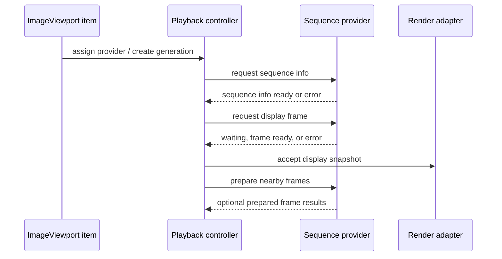

# Provider Protocol

This document defines the architecture direction for the provider protocol between `ImageViewport` and caller-supplied sequence providers.

The protocol is not a final C++ ABI. It describes the request/result model that the implementation should preserve when concrete Qt types are introduced.

## Goals

The provider protocol should let `ImageViewport` consume displayable image sequences without knowing where bytes came from, how a codec composes frames, or which scheduling model the caller uses.

The protocol should support still images, finite animations, infinite-loop animations, random-access sequences, sequential decoders, streaming sources, and providers that can prepare frames opportunistically.

The protocol should also have a small minimum provider profile. A provider that can report basic sequence info and deliver immutable full-frame snapshots in its supported access pattern should be valid even if it ignores preparation hints, does not support cancellation beyond stale-result filtering, and reports conservative capabilities. Random indexed access is useful, but it is not part of the minimum provider profile.

The protocol should keep all provider interaction outside the Qt Quick render thread. Providers may decode or prepare data on any scheduler they own, but scene graph resources remain the viewport render adapter's responsibility.

## Session And Generation Model

Assigning a new provider or changing a provider-affecting policy should create a new sequence generation.

A generation is the identity boundary for metadata, frame requests, preparation hints, results, and errors. Results from older generations must not replace status or displayed content for the active generation.

Each request within a generation should have a request identifier. Request identifiers let the controller distinguish a current playback request, a superseded seek request, and speculative preparation work that completed late.

Cancellation should be best-effort. A cancelled request may still produce a late result, but the controller should ignore it unless it still matches the active generation and request intent.

Closing or replacing a generation should release provider-side work associated with that generation when practical, but retained display content from an older generation may remain visible according to viewport retain policy.

## Protocol Flow

The viewport should normalize provider interaction into request/result messages even when a provider can complete immediately.

The controller should be able to issue a sequence-info request before any frame request. Providers that discover metadata lazily may return partial information first and later publish updated sequence info for the same generation.

Frame requests should be display-intent requests. They should ask for a frame by display index or playback position, plus desired normalization policy and output preferences, without exposing codec fragment mechanics.

The request target should make the caller's intent explicit. A direct frame index is appropriate when the sequence model has stable random-access frame numbers; a playback position is the primary target for timed tracks, streaming sequences, and event-stream-like providers where frame index may be unavailable, unstable, or expensive to derive.

Preparation hints should be advisory messages. They should not require completion callbacks, and failure to prepare should not affect status unless the same frame is later requested for display and fails.

## Request Shapes

Sequence info requests should carry the generation, requested metadata scope, and policy inputs that can affect sequence-level interpretation.

Frame requests should carry the generation, request id, target frame index or playback position, request reason, normalization policy with compliance level, output format preference, and cancellation token.

The request reason should distinguish display-critical work from advisory work. Expected reasons include initial display, timed playback advance, explicit seek, replacement validation, and preparation.

Preparation hints should carry the generation, displayed frame, requested frame target, playback direction, nearby frame window, memory budget class, and whether the hint is for CPU decoded frames, render-thread upload preparation, or both.

The protocol should not require a provider to understand every field. Unsupported policy or output preferences should be reported as unsupported, ignored when safe, or satisfied through the closest supported display-ready frame according to the requested compliance level.

Normalization preferences for orientation and color should not silently degrade when the requested policy is semantically important. The compliance level should distinguish strict normalization, best-effort presentation, and metadata-preserving presentation.

Strict normalization means the provider or viewport CPU preparation must satisfy the requested orientation or color conversion before the frame can become a candidate snapshot. Failure should produce `Unsupported` when the policy is outside provider capability, or `Error` when the policy should have been supported but conversion failed.

Best-effort presentation means the provider may return the closest supported display-ready result. The result should carry a warning or diagnostic when it differs from the requested policy.

Metadata-preserving presentation means source orientation or color metadata may be retained for later inspection or future rendering paths while the pixel payload is treated as already suitable for baseline display.

## Result Shapes

Provider results should carry generation, request id when applicable, result category, and provider diagnostics.

Expected result categories are `SequenceInfoReady`, `FrameReady`, `Waiting`, `EndOfSequence`, `Unsupported`, `Warning`, and `Error`.

`FrameReady` should carry an immutable display frame snapshot. From the viewport's perspective, the snapshot should already represent the displayable result of codec composition.

A display frame snapshot should be self-contained and canvas-equivalent. Dirty regions, logical subrects, reference-frame boundaries, and dependency descriptions may exist as optimization or diagnostic hints, but the viewport must not need to apply codec disposal, blending, reference-frame, or previous-frame reconstruction rules before presentation.

`Waiting` should mean that the request is not displayable yet but may still complete. It should not clear the displayed frame or imply failure.

`Unsupported` should mean that the provider cannot satisfy the request shape or policy. For display-critical work, the controller should map unsupported to public unsupported request status rather than generic error status; for preparation work, it should be ignored or recorded as capability information.

`Error` should distinguish sequence setup, metadata discovery, frame decode, normalization, provider scheduling, and provider lifetime failures when practical.

`Warning` should allow providers to surface recoverable diagnostics without changing displayed content or request success.

## Capability Handling

Providers should advertise capabilities so the controller can avoid impossible request patterns.

Important capability dimensions include known or unknown frame count, known or unknown duration, random access, sequential access, stateful sequential access, single-flight display requests, rewindability, streaming updates, prefetchability, stable frame durations, provider-side coalescing, independent frame snapshots, provider-side normalization support, and whether viewport-side CPU preparation can satisfy requested normalization policies and compliance levels.

Capability information should be usable by QML-facing state. Applications should be able to infer whether random seeking is expected to be immediate, may wait or rewind, is unsupported, or is serialized behind a single display-critical request.

Random access should allow the controller to request arbitrary display indexes directly. Sequential access should make forward playback the primary path and may reject arbitrary seek requests. Rewindable sequential providers may restart internally to satisfy earlier requests, but that cost should be treated as provider policy.

Stateful sequential providers should be allowed to maintain a single decode cursor. If such a provider reports single-flight display requests, the controller should not issue overlapping display-critical frame requests for that generation. It may still send advisory preparation hints only when the provider reports that they are safe.

QMovie-like providers should be adapted into this request/result model rather than owning viewport playback. The adapter may drive a stateful decoder cursor internally, but it should still report capabilities, accept display-intent requests, deliver generation-scoped results, and let the viewport controller own play, pause, seek, loop, and visible status semantics.

When QML requests a seek that the active provider cannot satisfy directly, the controller should expose a request outcome rather than pretending the target is displayed. Depending on capabilities and provider response, the visible result may be waiting for a slow rewind, an unsupported request status, or a later scene graph committed frame.

Streaming providers may have unknown frame count, unknown duration, and frames that become available over time. They should use `Waiting` for not-yet-available display frames and updated sequence info when new metadata becomes known.

Providers that cannot preserve source timing exactly should report that limitation through capabilities or warnings so the controller can choose a fallback timing policy.

## Ordering And Coalescing

The controller may have multiple outstanding requests when provider capabilities allow it, but only the active generation and current display intent should be allowed to replace displayed content.

For single-flight or stateful sequential providers, the controller should keep at most one display-critical request in flight. Seek, stop, clear, or replacement may supersede the in-flight request logically, but the controller should rely on generation/request filtering rather than assuming the provider can cancel instantly.

Seek requests should supersede pending timed playback requests. A late result for a superseded playback request should not overwrite the sought frame.

If multiple requests target the same normalized frame representation, the implementation may coalesce them internally. Coalescing should preserve the result semantics for every request that still matters.

Preparation results should not become displayed content unless they also satisfy the current display request. A prepared frame can be promoted only when generation, frame index or playback position, normalization policy, and payload compatibility match the current request.

## Threading Contract

Provider callbacks or result delivery should be marshaled to the item-side controller before they affect QML-visible state.

The provider protocol should not deliver `QSGNode`, `QSGTexture`, or other scene graph objects. Texture-compatible future payloads must still be handed off through a render-thread adapter that owns final scene graph binding.

The provider should not block the GUI thread or render thread for I/O, heavy decoding, archive access, network access, or codec composition. Immediate in-memory completion is allowed, but the protocol should not rely on synchronous completion for correctness.

Frame snapshots should have explicit ownership independent of the provider's worker buffers. A provider may recycle its internal buffers only after the delivered snapshot no longer references them.

## Design Consequences

The initial implementation can model the provider protocol with a small adapter around a QObject-style provider: generation-scoped request methods, queued result signals, immutable frame snapshot values, and best-effort cancellation.

The architecture should still allow a pure C++ provider interface behind that adapter. This keeps QML integration straightforward while leaving room for non-QObject decoder backends.

The minimal type direction for that split is sketched in [Minimal C++ Type Sketch](cpp-type-sketch.md).

The playback controller should be written against this request/result model rather than against a concrete decoder library. Decoder-specific adapters then become narrow translators from library behavior into sequence info, display frames, capabilities, and diagnostics.
