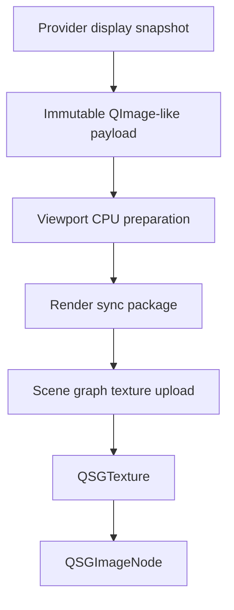

# QImage Texture Upload Contract

This document defines the architecture direction for the baseline CPU-image upload path from provider-produced image snapshots to `QSGTexture` resources.

The contract exists to keep provider output, CPU-side preparation, and render-thread texture creation separated. It is not a public API and should not require QML callers or sequence providers to manage Qt Quick scene graph resources.

## Snapshot Lifetime

Provider-produced image payloads should be immutable for the lifetime of the frame snapshot. Once a snapshot is delivered, pixel storage, logical size, alpha state, color state, orientation state, and visible/source rect metadata should not change.

The item side may retain a candidate or display-committed snapshot while it is being displayed, while a replacement is loading, while the render adapter uploads it, or while a scene graph rebuild needs to recreate the texture.

The render adapter may hold a reference to a snapshot only as long as it needs the pixel payload for upload or texture-cache rebuild. After a `QSGTexture` has been successfully created, the displayed texture should not depend on the `QImage` storage staying mapped or mutable.

Uploaded texture caches may keep snapshot references when they need rebuild capability after device loss or scene graph invalidation, but this is an optimization policy. It should not make snapshot lifetime observable as public behavior.

Providers may reuse their internal decode buffers only after the delivered snapshot has taken ownership or made a stable copy of the pixels visible to `ImageViewport`.

A `const QImage` reference is not sufficient as an immutability guarantee. The delivered payload should either own detached `QImage` storage, share a custom immutable pixel buffer with a well-defined cleanup lifetime, or otherwise prove that provider-side aliasing cannot mutate or recycle pixels while the snapshot is retained.

## Upload Context

The baseline path should create `QSGTexture` objects only inside the Qt Quick scene graph update/render lifecycle, such as the `updatePaintNode()` path or another explicitly scene-graph-safe preparation hook.

Providers, worker threads, and item-side playback code should not create `QSGTexture` objects in the first implementation path.

The design should describe this as scene-graph-context ownership rather than a hard assumption that every platform always uses a separate render thread. In Qt Quick's threaded render loop this work belongs to the render thread; in other render loops it still belongs to the scene graph update phase, not arbitrary application code.

Texture upload should be scheduled by candidate snapshot changes, scene graph rebuilds, cache preparation intent, or retry policy. Upload should not block provider callbacks, frame decoding, or QML property evaluation.

If no scene graph context is available, the render adapter should keep the candidate snapshot and defer upload until rendering resumes instead of asking the provider to resend the frame. Deferred upload due to missing scene graph context is not a render error.

## Pixel Format Responsibility

Providers should prefer to deliver images in a texture-upload-friendly Qt image format when doing so is cheap and semantically safe.

The viewport may include a CPU-side preparation step between provider delivery and render synchronization. This step can normalize pixel format, alpha representation, orientation policy, and other upload requirements before the render package reaches the adapter.

The render adapter should receive an upload-ready image whenever practical. It may still perform a last-resort conversion when required by Qt Quick upload constraints, but that conversion should be treated as render-preparation work and should be visible to diagnostics or performance instrumentation.

Pixel-format cache identity should include the converted payload identity. A texture uploaded from a converted image should not be confused with a texture uploaded from the provider's original backing storage when those payloads have different memory, alpha, color, or orientation state.

The provider contract should record whether the payload is already normalized. The viewport should not infer premultiplication, byte order, orientation, or color conversion from format names alone when explicit metadata is available.

## Alpha And Premultiplication

Frame snapshots should explicitly describe whether the payload is opaque, straight-alpha, premultiplied-alpha, or alpha-unknown.

The preferred upload payload for alpha content should be a premultiplied representation when that matches Qt Quick's efficient rendering path and avoids repeated conversion.

Premultiplication should happen at most once. If a provider delivers premultiplied pixels, the viewport should preserve that fact through CPU preparation and upload rather than premultiplying again.

If a provider delivers straight-alpha pixels, the viewport-owned preparation step may convert them to premultiplied pixels before render synchronization. This keeps expensive or format-dependent conversion out of the hot `updatePaintNode()` path when possible.

Opaque frames should be marked as opaque when reliable. This allows the render adapter to choose opacity-relevant node or texture options later without changing presentation semantics.

Alpha handling should remain separate from transparent-background presentation. Background color or checkerboard rendering is a viewport presentation decision, while frame alpha state describes the uploaded image payload.

## Device Pixel Ratio And Logical Size

The viewport's image coordinates should be logical image coordinates. Device-pixel ratio should not leak into QML item coordinates, `contentRect`, pan/zoom behavior, or item-to-image conversion.

The render package should carry both logical image geometry and physical pixel payload size when they differ. Texture upload uses the physical pixel buffer; layout, mapping, and coordinate conversion use the normalized logical geometry.

Provider-supplied `QImage::devicePixelRatio()` should not silently scale viewport content. If high-DPI image data is meaningful, the provider or CPU preparation step should translate it into explicit logical size and pixel size metadata.

Texture cache identity should include pixel size and scene graph compatibility. A texture uploaded for one device or backend context should not be reused after a scene graph invalidation or backend change unless the adapter can prove it is still compatible.

## Color And Orientation State

The baseline upload path assumes frames are display-ready for the viewport's current color policy, typically sRGB-like content unless a richer color pipeline is added.

Frame snapshots should record whether color conversion has been applied, preserved, or deferred. The render adapter should not perform implicit ICC/profile interpretation in the baseline path.

Orientation policy should be resolved before upload whenever possible. The render adapter should receive a payload and source geometry that already match the viewport's selected orientation policy, so scene graph texture coordinates do not need to encode metadata correction.

The CPU preparation stage should evaluate the requested color and orientation compliance level before a payload is sent to the render adapter. Strict policy failure should stop the candidate before upload. If strict color handling asks for conversion outside the supported baseline, such as viewer-grade ICC management, HDR tone mapping, or gain-map processing that the viewport cannot perform, the request should become unsupported rather than approximate success. Best-effort policy differences should be recorded as diagnostics. Metadata-preserving policy should keep metadata attached without asking the render adapter to interpret it.

When metadata-preserving orientation leaves pixels unnormalized, geometry passed to the render adapter should describe the actual displayed pixel orientation. The render adapter should not pretend that source orientation metadata was applied for coordinate conversion or texture-coordinate selection.

If orientation or color policy changes for the active sequence, the item side should treat the affected frames as new prepared payloads and request or build new texture cache entries with distinct identity.

## Failure Handling

CPU preparation failure should be reported as preparation or normalization failure before the render package asks for texture upload.

Texture upload failure should be reported as render-preparation failure by the render adapter, scoped by generation, frame identity, payload identity, and presentation revision.

Neither CPU preparation failure nor texture upload failure should mutate provider-owned data or require the provider to rewind. Recovery should use normal retry, replacement, cache rebuild, or generation replacement paths.

The retained displayed texture may remain visible after a newer frame fails preparation or upload. The newer frame remains a candidate and should not update displayed-frame state until it becomes scene graph committed. The observable state should follow the retained-content, request-status, and display-status rules defined by the playback and render lifecycle documents.

## Design Consequences

The first implementation can use immutable `QImage` payloads and `QQuickWindow::createTextureFromImage()` behind the render adapter boundary without exposing that choice to QML callers.

The provider-facing contract should ask for stable display snapshots, not `QSGTexture` objects, native handles, or render-thread callbacks.

Future native texture payloads should be added as parallel payload variants. They should still declare lifetime, alpha, logical-size, color, orientation, and compatibility metadata so the render adapter can apply the same presentation model.
