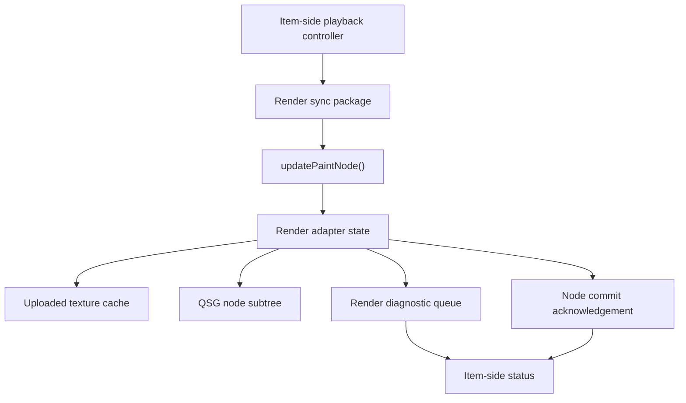

# Render Adapter Lifecycle

This document defines the architecture direction for the render-thread adapter that turns candidate `ImageViewport` frame snapshots into Qt Quick scene graph resources and reports when a frame has been accepted into the viewport's scene graph node subtree.

The render adapter is an implementation boundary, not a public API. It receives immutable display snapshots and presentation parameters from the item side, owns the scene graph subtree used for drawing, reports render-preparation failures back to the item-side status model, and emits a node-commit acknowledgement for QML-visible displayed snapshot state.

## Thread Boundary

`ImageViewport` QML state, provider sessions, playback decisions, coordinate conversion state, and request status should remain item-side state.

The render adapter should not call into providers, resolve sequence data, wait for frame availability, perform codec composition, or read mutable QML-facing objects while updating scene graph nodes.

The synchronization payload from item side to render side should be a compact render package: active generation, candidate snapshot identity, payload identity when known, immutable frame payload, a precomputed mapping value object, source rect, target/content rect, viewport clip rect, mirroring flags, filtering flags, background mode, background color, opacity-relevant state, and a monotonically increasing presentation revision.

The mapping value object should be computed once on the item side and reused by coordinate conversion and render synchronization. It should contain the normalized source geometry, target geometry, visible content rect, clip rect, mirror state, zoom and pan transform, and enough inverse-mapping data for hit testing. Render and coordinate conversion should not maintain independent layout calculations.

The render package should be treated as a value snapshot. If item-side state changes while a render pass is in flight, the next synchronization should deliver a newer revision rather than mutating render-thread data in place.

Presentation revision is an internal stale-filter and render-package identity. It may change for geometry-only presentation work such as resize, pan, zoom, alignment, mirroring, clipping, or sampler-state changes. Public `displayRevision` is narrower: it changes only when a displayed snapshot identity is newly scene graph committed or cleared. A node-commit acknowledgement for a newer presentation revision must not by itself increment public `displayRevision` when it accepts the same already display-committed snapshot with only geometry or presentation-state changes.

Render-preparation diagnostics should cross back to item-side status through a queued or synchronized handoff. The render adapter should not directly mutate QML-visible status from arbitrary render-thread code, and QML property notifications should be emitted only from the item-side object after stale event filtering.

The first implementation should report render diagnostics and node-commit acknowledgements through generation-, snapshot-, and presentation-revision-scoped item-side events. Queued delivery is acceptable, but stale events must be dropped when their generation, snapshot identity, or revision no longer matches the active render package. The acknowledgement event should carry only scoped value data, not render-thread object pointers.

Render-thread resources should be owned by render-side adapter state attached to or lifetime-coupled with the returned `QSGNode` subtree. Cleanup jobs are fallback paths for cases where the subtree cannot be revisited, not the sole ownership model. `QQuickItem` item-side state should own render packages and retained immutable snapshots, not `QSGTexture`, `QSGNode`, or backend-specific resource handles. `QSGNode`, `QSGTexture`, and backend-specific resource handles should not be stored in QML-visible objects or provider-owned frame snapshots.

## `updatePaintNode()` Responsibilities

`updatePaintNode()` should be the only path that creates or mutates the scene graph subtree for `ImageViewport`.

Candidate snapshot changes, presentation changes, scene graph rebuilds, and retryable render-preparation changes should schedule a scene graph update rather than forcing immediate rendering work from the item-side controller.

If there is no candidate or retained display snapshot and no visual background to render, `updatePaintNode()` should return no image node and release any node-owned texture state that is no longer reachable.

If the item has non-positive width or height, the render package has no presentable viewport area. The adapter may still keep retained snapshots and background intent in item-side state, but it should not acknowledge a new candidate frame as display-committed for that zero-area presentation. Existing display-committed snapshot identity remains retained on the item side, while content geometry and item-to-image conversion report empty visible area. When positive bounds return, the controller should schedule another update for the pending candidate or retained snapshot.

If a candidate snapshot exists, `updatePaintNode()` should create or reuse the viewport's scene graph subtree, then update the node geometry, source rectangle, target rectangle, clipping, texture binding, filtering, mipmap filtering, and texture-coordinate mirroring from the latest render package.

The adapter is responsible for translating item-side logical source geometry into the source rectangle expected by the concrete scene graph node. `QSGImageNode::setSourceRect()` and texture-coordinate operations should receive geometry consistent with the uploaded payload, device-pixel treatment, atlas state, and normalized orientation rather than raw provider metadata. The mapping value object should carry continuous logical geometry; the render adapter owns final rounding, half-open pixel-rect interpretation, pixel-center choices for nearest sampling, atlas subrect correction, and texture-coordinate conversion.

The first implementation should prefer a narrow subtree with explicit background/backing nodes when needed, an explicit rectangular `QSGClipNode`-style node for the viewport's internal image-content clip, and a `QSGImageNode` for the textured image rectangle. The default node shape should be `root -> optional viewport backing -> viewport clip -> image node`. The clip node exists to implement viewport image clipping and should not be confused with Qt Quick `Item::clip` behavior for child items. Transparent backing may omit a background node. Solid and default checkerboard backing should fill the item-local viewport bounds behind the clipped image content and should remain renderable even when no image snapshot is displayable. Later optimization may remove the extra clip node only when tests prove that node geometry and source rectangles produce the same observable clipping for fit, crop, zoom, pan, and mirroring.

Geometry changes that do not require a new texture, such as item resize, pan, zoom, fit/crop recomputation, alignment, or mirroring, should update node rectangles and texture coordinates without replacing the uploaded texture when the frame payload is unchanged.

Texture changes should be driven by payload identity and upload policy. A timed frame advance, seek result, replacement, normalization-policy change, pixel-format change, mipmap upload option change, or scene graph rebuild may require a different texture even when the node geometry is otherwise stable. Presentation-only changes such as `smooth`, target geometry, clipping, and mirroring should not force a different texture identity when the payload and upload-affecting options are unchanged. Snapshot identity remains important for generation and display-result filtering, but uploaded texture reuse should be based on the normalized payload and render compatibility rather than on snapshot identity alone.

`updatePaintNode()` should not synchronously decode missing frames. If the requested frame is unavailable, the item-side controller should keep the retained displayed snapshot in the render package until a replacement snapshot has become a candidate.

Solid or checkerboard background presentation should use explicit background scene graph nodes or materials behind the image node and should cover the item-local viewport bounds. `QSGImageNode` should remain responsible for textured image content, not for generating viewport backing visuals.

## Texture Creation And Destruction

The baseline upload path should create `QSGTexture` objects from immutable `QImage`-like payloads associated with candidate or retained display frame snapshots.

The CPU-image upload contract, including snapshot lifetime, upload context, pixel-format normalization, alpha handling, device-pixel-ratio treatment, and preparation failure rules, is defined in [QImage Texture Upload Contract](qimage-texture-upload-contract.md).

Texture creation should happen only when the scene graph is valid and the render adapter has enough information to bind the texture to the current window/backend context.

Uploaded texture cache identity should use payload identity as its primary content input and should also include relevant normalization policy, requested upload-affecting texture options such as mipmap preparation, actual texture capability or fallback result, and scene graph compatibility such as window/backend/device context. Active generation and snapshot identity may remain part of the cache record for stale-result filtering and diagnostics, but they should not prevent reuse of the same compatible payload when reuse is semantically safe. Smooth filtering and texture-coordinate mirroring should normally be node or sampler state rather than payload identity.

The uploaded texture cache should be the single owner of cached `QSGTexture` objects. `QSGImageNode` should receive a borrowed texture pointer whose lifetime is protected by the render adapter for as long as the node can use it. When binding a cache-owned texture to `QSGImageNode`, the implementation should explicitly configure the node not to own that texture, for example by using `setOwnsTexture(false)` where that Qt API is available. If the first implementation has only one texture, it should still follow this ownership rule so a later previous/current/next cache does not change ownership semantics.

The first implementation should represent the cache as render-side state lifetime-coupled to the returned node subtree, for example as an adapter-owned object attached to the root node or owned by a custom node wrapper. Node destruction or scene graph invalidation should destroy the cache and its `QSGTexture` objects on a scene-graph-safe path. GUI-side `ImageViewport` state may hold immutable snapshots and render packages, but it must not hold raw `QSGTexture` pointers or delete them directly.

The currently displayed texture should be protected from speculative cache eviction. Prepared previous or next textures may be evicted whenever memory policy, generation change, scene graph invalidation, or backend changes make them stale.

Eviction ordering should ensure that no live `QSGImageNode` still references a texture before the cache destroys it. The adapter may first rebind the node to another protected texture, detach or destroy the node subtree on a scene-graph-safe path, or delay eviction until the next update where the reference is no longer live.

When a new texture replaces the displayed texture, the old texture may remain in the uploaded cache if it is still compatible and useful for nearby playback. Otherwise it should be destroyed through the render-thread resource lifecycle.

Scene graph invalidation should discard all uploaded texture cache entries and node-owned graphics resources. This must not invalidate provider snapshots, decoded-frame caches, QML-visible sequence state, or the item-side displayed snapshot.

When `updatePaintNode()` receives an old subtree, it is responsible for either reusing that subtree and its render-side cache or destroying it before returning a replacement. If `updatePaintNode()` returns `nullptr`, the old subtree and any attached texture cache must no longer be referenced by live item-side state. Cleanup jobs may supplement this path, but the primary ownership model should not require the GUI thread to know whether a texture object is currently safe to delete.

After scene graph invalidation, the adapter should rebuild needed textures from retained immutable snapshots when rendering resumes. Cache warmth should not be required for correctness.

## Upload Failure

A decoded frame is not renderable until the render adapter can present it as a scene graph resource.

If texture creation fails for the latest candidate snapshot, the render adapter should report a render-preparation error to the item-side status model with generation and snapshot identity.

Upload failure should not cause `updatePaintNode()` to block, retry indefinitely in the same frame, or clear retained content automatically.

An upload failure should be classified as terminal for the active presentation revision unless a concrete retry trigger appears. Retry triggers include scene graph or backend compatibility changes, recovery from scene graph invalidation, mipmap fallback or upload-option policy changes, explicit replacement or retry intent from the item-side controller, or a new candidate payload. Reapplying the same failed package in the same scene graph context should not emit duplicate diagnostics or spin a retry loop.

If an older displayed texture is still valid, the viewport may continue presenting that older texture while request status reports the render-preparation failure for the latest request. For in-generation playback and seek failures, retaining the current display is mandatory until another frame commits, the viewport is cleared, or the sequence is replaced. For replacement failures, retaining an older-generation display follows the viewport replacement retention policy.

If no previously displayable texture exists, upload failure leaves the viewport visually empty while request status reports an error.

Late or stale upload failures should be ignored when their generation, snapshot identity, or presentation revision no longer matches the active render package.

A candidate snapshot becomes display-committed only after `updatePaintNode()` or an equivalent scene-graph-safe update path has successfully bound a compatible texture for the active presentation revision. The node-commit acknowledgement should be emitted after that node update succeeds and should be delivered back to item-side state through the scoped event channel. This acknowledgement means the viewport's scene graph subtree has accepted the frame; it does not guarantee GPU upload completion beyond what Qt Quick requires for the node update, nor that the frame has reached the screen through a swap, present, or compositor step. QML-visible displayed frame, `hasDisplayableFrame`, displayed snapshot token, and display revision should follow this accepted node state rather than mere provider acceptance. QML-visible geometry and coordinate conversion for an already displayable snapshot should remain item-side mapping state and may update before another node-commit acknowledgement when only placement, zoom, pan, mirroring, or item size changed.

## Qt Quick Lifecycle Hooks

The implementation should explicitly account for `update()`, `updatePaintNode()`, `releaseResources()`, `itemChange()` events that affect the window, `visible` changes, window exposure changes when observable, scene graph invalidation, item destruction, and queued render diagnostics.

Item-side state changes that affect rendering should call `update()` rather than touching scene graph resources directly.

`releaseResources()` and scene graph invalidation should release uploaded textures, node-owned resources, and render-side cache entries without closing provider generations or clearing retained item-side snapshots.

Item-side `releaseResources()` should be treated as a scene-graph cleanup trigger, not as permission for arbitrary GUI-thread code to dereference render-thread resources directly. In the first implementation, `releaseResources()` should invalidate item-side render compatibility and ensure render-side resources are released through ownership tied to the node subtree or through a scene-graph invalidation cleanup path. Actual `QSGTexture`, cache, and node-subtree destruction should happen on a scene-graph-safe path. A later `updatePaintNode()` pass may also release resources when it is already guaranteed to own the old subtree, but correctness must not depend on another update pass occurring after release or item/window detach. Cleanup must not rely solely on a scheduled render job that might never run after a window stops being renderable. GUI-thread state should not directly delete render-thread resources whose affinity is not proven safe.

Window changes should invalidate scene graph compatibility for uploaded textures. A texture prepared for one window, backend, or graphics device should not be reused after the adapter can no longer prove compatibility.

Render availability should be driven by concrete Qt Quick lifecycle observations and should distinguish render context unavailable, presentation suspended, and commit pending. A missing `QQuickWindow`, scene graph invalidation, `releaseResources()`, window or backend replacement, and item destruction should make the render context unavailable and invalidate uploaded texture compatibility. A non-exposed or suspended window when observable, or `visible: false` preventing the item from being rendered, should suspend presentation progress without necessarily invalidating compatible textures. Queued upload or node update work should be commit pending until a valid scene graph update accepts it. Baseline behavior should not classify an item as unavailable solely because its transformed bounds are geometrically offscreen, clipped by an ancestor, or transparent. Window assignment, scene graph initialization, visibility or exposure changes that allow presentation progress, a valid update pass, and successful scene graph rebuild should allow the controller to schedule a pending candidate or retained snapshot for node commit again.

Render diagnostics and node-commit acknowledgements should be generation-scoped, snapshot-scoped, and revision-scoped. They must be discarded if the item has been destroyed, the generation is no longer active, the snapshot identity no longer matches the active render package, or a newer presentation revision superseded them.

Node-commit acknowledgement should be idempotent. Processing an acknowledgement for a revision that is already display-committed must not schedule an endless update or acknowledgement loop.

Commit acknowledgement handling should compare generation, snapshot identity, and presentation revision. If the acknowledgement describes a new snapshot identity, item-side state may update displayed frame, displayed snapshot token, `hasDisplayableFrame`, display status, and public `displayRevision`. If it describes the same snapshot identity with a newer presentation revision, item-side state should update geometry-related observations and clear commit-pending state without incrementing public `displayRevision`.

## Adapter State

The render adapter should keep only render-side state: the current node subtree, uploaded texture cache, last applied presentation revision, last displayed texture identity, and queued render-preparation diagnostics. This state should be reachable only from the scene graph update/cleanup paths or through thread-safe value events; the GUI-side item should not dereference it directly.

The adapter should treat decoded frame snapshots as immutable inputs. It may hold references to snapshots long enough to upload or rebuild textures, but it should not mutate frame metadata or pixel data.

Item-side candidate and displayed snapshot retention is a correctness requirement because retained display and scene graph rebuilds depend on it. Extra snapshot references stored inside the uploaded texture cache are only an optimization when they help rebuild textures or avoid item-side lookups.

The adapter should accept that the node subtree may be destroyed and recreated by Qt Quick lifecycle events. Recreating the subtree should not require resetting playback state or provider sessions.

The adapter should prefer idempotent updates. Applying the same render package twice should not create duplicate textures, duplicate nodes, or duplicate status errors.

## Design Consequences

The first implementation should be structured so playback and provider tests do not depend on Qt scene graph objects, while render-adapter tests can focus on package-to-node decisions, cache invalidation, and error reporting.

The render adapter should be able to start with a one-texture cache containing only the displayed frame, then grow to a small previous/current/next uploaded cache without changing public behavior.

Future native texture or `QRhiTexture` payloads should enter as additional texture preparation paths behind the same adapter boundary. They should not require exposing `QSGTexture` ownership to QML callers or sequence providers.
