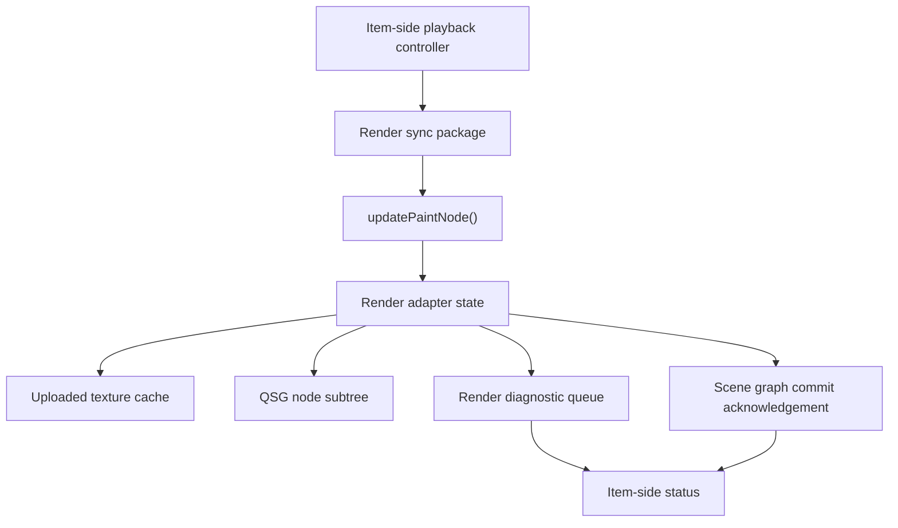

# Render Adapter Lifecycle

This document defines the architecture direction for the render-thread adapter that turns candidate `ImageViewport` frame snapshots into Qt Quick scene graph resources and reports when a frame becomes scene graph committed.

The render adapter is an implementation boundary, not a public API. It receives immutable display snapshots and presentation parameters from the item side, owns the scene graph subtree used for drawing, reports render-preparation failures back to the item-side status model, and acknowledges successful scene graph commit for QML-visible displayed state.

## Thread Boundary

`ImageViewport` QML state, provider sessions, playback decisions, coordinate conversion state, and request status should remain item-side state.

The render adapter should not call into providers, resolve sequence data, wait for frame availability, perform codec composition, or read mutable QML-facing objects while updating scene graph nodes.

The synchronization payload from item side to render side should be a compact render package: active generation, candidate snapshot identity, immutable frame payload, a precomputed mapping value object, source rect, target/content rect, viewport clip rect, mirroring flags, filtering flags, opacity-relevant state, and a monotonically increasing presentation revision.

The mapping value object should be computed once on the item side and reused by coordinate conversion and render synchronization. It should contain the normalized source geometry, target geometry, visible content rect, clip rect, mirror state, zoom and pan transform, and enough inverse-mapping data for hit testing. Render and coordinate conversion should not maintain independent layout calculations.

The render package should be treated as a value snapshot. If item-side state changes while a render pass is in flight, the next synchronization should deliver a newer revision rather than mutating render-thread data in place.

Render-preparation diagnostics should cross back to item-side status through a queued or synchronized handoff. The render adapter should not directly mutate QML-visible status from arbitrary render-thread code.

Render-thread resources should be owned by the adapter or by the returned `QSGNode` subtree. `QSGNode`, `QSGTexture`, and backend-specific resource handles should not be stored in QML-visible objects or provider-owned frame snapshots.

## `updatePaintNode()` Responsibilities

`updatePaintNode()` should be the only path that creates or mutates the scene graph subtree for `ImageViewport`.

Candidate snapshot changes, presentation changes, scene graph rebuilds, and retryable render-preparation changes should schedule a scene graph update rather than forcing immediate rendering work from the item-side controller.

If there is no candidate or retained display snapshot and no visual background to render, `updatePaintNode()` should return no image node and release any node-owned texture state that is no longer reachable.

If a candidate snapshot exists, `updatePaintNode()` should create or reuse the viewport's scene graph subtree, then update the node geometry, source rectangle, target rectangle, clipping, texture binding, filtering, mipmap filtering, and texture-coordinate mirroring from the latest render package.

The first implementation should prefer a narrow subtree: an optional rectangular clip node for the viewport's internal image-content clip and a `QSGImageNode` for the textured image rectangle. The clip node exists to implement viewport image clipping and should not be confused with Qt Quick `Item::clip` behavior for child items.

Geometry changes that do not require a new texture, such as item resize, pan, zoom, fit/crop recomputation, alignment, or mirroring, should update node rectangles and texture coordinates without replacing the uploaded texture when the frame payload is unchanged.

Texture changes should be driven by candidate snapshot identity and upload policy. A timed frame advance, seek result, replacement, normalization-policy change, mipmap upload option change, or scene graph rebuild may require a different texture even when the node geometry is otherwise stable. Presentation-only changes such as `smooth`, target geometry, clipping, and mirroring should not force a different texture identity when the payload and upload-affecting options are unchanged.

`updatePaintNode()` should not synchronously decode missing frames. If the requested frame is unavailable, the item-side controller should keep the retained displayed snapshot in the render package until a replacement snapshot has become a candidate.

If solid or checkerboard background presentation is implemented in the initial render path, it should use explicit background scene graph nodes or materials behind the image node. `QSGImageNode` should remain responsible for textured image content, not for generating viewport backing visuals.

## Texture Creation And Destruction

The baseline upload path should create `QSGTexture` objects from immutable `QImage`-like payloads associated with candidate or retained display frame snapshots.

The CPU-image upload contract, including snapshot lifetime, upload context, pixel-format normalization, alpha handling, device-pixel-ratio treatment, and preparation failure rules, is defined in [QImage Texture Upload Contract](qimage-texture-upload-contract.md).

Texture creation should happen only when the scene graph is valid and the render adapter has enough information to bind the texture to the current window/backend context.

Uploaded texture cache identity should include active generation, frame identity, payload identity, relevant normalization policy, upload-affecting texture options such as mipmap preparation, and scene graph compatibility such as window/backend/device context. Smooth filtering and texture-coordinate mirroring should normally be node or sampler state rather than payload identity.

The currently displayed texture should be protected from speculative cache eviction. Prepared previous or next textures may be evicted whenever memory policy, generation change, scene graph invalidation, or backend changes make them stale.

When a new texture replaces the displayed texture, the old texture may remain in the uploaded cache if it is still compatible and useful for nearby playback. Otherwise it should be destroyed through the render-thread resource lifecycle.

Scene graph invalidation should discard all uploaded texture cache entries and node-owned graphics resources. This must not invalidate provider snapshots, decoded-frame caches, QML-visible sequence state, or the item-side displayed snapshot.

After scene graph invalidation, the adapter should rebuild needed textures from retained immutable snapshots when rendering resumes. Cache warmth should not be required for correctness.

## Upload Failure

A decoded frame is not renderable until the render adapter can present it as a scene graph resource.

If texture creation fails for the latest candidate snapshot, the render adapter should report a render-preparation error to the item-side status model with generation and frame identity.

Upload failure should not cause `updatePaintNode()` to block, retry indefinitely in the same frame, or clear retained content automatically.

If an older displayed texture is still valid and the retain policy allows it, the viewport may continue presenting that older texture while request status reports the render-preparation failure for the latest request.

If no previously displayable texture exists, upload failure leaves the viewport visually empty while request status reports an error.

Late or stale upload failures should be ignored when their generation, frame identity, or presentation revision no longer matches the active render package.

A candidate snapshot becomes display-committed only after the adapter has successfully bound a compatible texture and applied the corresponding geometry for the active presentation revision. This acknowledgement means the viewport's scene graph subtree has been updated; it does not guarantee that the frame has already reached the screen through a swap, present, or compositor step. QML-visible displayed frame, content geometry, and `hasDisplayableFrame` should follow this committed state rather than mere provider acceptance.

## Qt Quick Lifecycle Hooks

The implementation should explicitly account for `update()`, `updatePaintNode()`, `releaseResources()`, window changes, scene graph invalidation, item destruction, and queued render diagnostics.

Item-side state changes that affect rendering should call `update()` rather than touching scene graph resources directly.

`releaseResources()` and scene graph invalidation should release uploaded textures, node-owned resources, and render-side cache entries without closing provider generations or clearing retained item-side snapshots.

Window changes should invalidate scene graph compatibility for uploaded textures. A texture prepared for one window, backend, or graphics device should not be reused after the adapter can no longer prove compatibility.

Render diagnostics and scene graph commit acknowledgements should be generation-scoped, frame-scoped, and revision-scoped. They must be discarded if the item has been destroyed, the generation is no longer active, or a newer presentation revision superseded them.

Scene graph commit acknowledgement should be idempotent. Processing an acknowledgement for a revision that is already display-committed must not schedule an endless update or acknowledgement loop.

## Adapter State

The render adapter should keep only render-side state: the current node subtree, uploaded texture cache, last applied presentation revision, last displayed texture identity, and queued render-preparation diagnostics.

The adapter should treat decoded frame snapshots as immutable inputs. It may hold references to snapshots long enough to upload or rebuild textures, but it should not mutate frame metadata or pixel data.

The adapter should accept that the node subtree may be destroyed and recreated by Qt Quick lifecycle events. Recreating the subtree should not require resetting playback state or provider sessions.

The adapter should prefer idempotent updates. Applying the same render package twice should not create duplicate textures, duplicate nodes, or duplicate status errors.

## Design Consequences

The first implementation should be structured so playback and provider tests do not depend on Qt scene graph objects, while render-adapter tests can focus on package-to-node decisions, cache invalidation, and error reporting.

The render adapter should be able to start with a one-texture cache containing only the displayed frame, then grow to a small previous/current/next uploaded cache without changing public behavior.

Future native texture or `QRhiTexture` payloads should enter as additional texture preparation paths behind the same adapter boundary. They should not require exposing `QSGTexture` ownership to QML callers or sequence providers.
