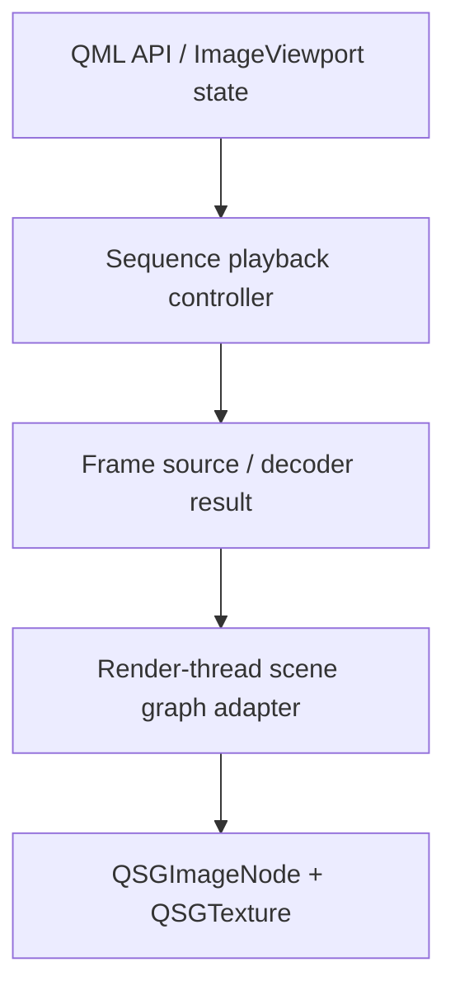
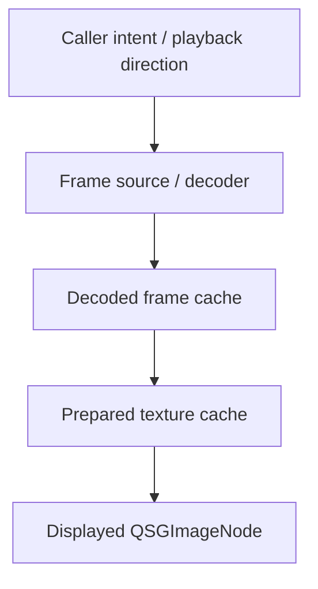

# Rendering Architecture

The library is structured as a Qt 6 QML module backed by C++ Qt Quick types.

`ImageViewport` is implemented as a `QQuickItem` subclass so it can participate directly in the Qt Quick scene graph. Rendering behavior is intentionally left as a scaffold concern for now; future implementation should choose the narrowest scene graph strategy that satisfies image display, scaling, and viewport interaction requirements.

The initial rendering architecture should use Qt Quick's scene graph directly without introducing a custom graphics pipeline. `ImageViewport` owns QML-visible state and playback state on the item side, then synchronizes displayable frame data into a render-thread scene graph adapter.



The first implementation target should be `QImage`-backed frames uploaded to `QSGTexture` and displayed through `QSGImageNode`. This path matches the required still-image and sequence-playback behavior while keeping decoding, playback, and scene graph presentation separated.

The first implementation boundary and explicit non-goals are defined in [Initial Implementation Boundary](initial-implementation-boundary.md).

The provider boundary, frame lifetime, and frame representation rules are defined in [Frame Provider Boundary](frame-provider-boundary.md).

The request/result protocol for provider interaction is defined in [Provider Protocol](provider-protocol.md).

The minimal C++ type direction for the provider facade and provider core is sketched in [Minimal C++ Type Sketch](cpp-type-sketch.md).

Playback control, preparation policy, and provider error propagation are defined in [Playback, Preparation, And Status](playback-preparation-status.md).

The controller's internal playback transitions are defined in [Playback State Machine](playback-state-machine.md).

Render-thread resource ownership, `updatePaintNode()` behavior, texture cache invalidation, and upload-failure handling are defined in [Render Adapter Lifecycle](render-adapter-lifecycle.md).

The baseline `QImage` to `QSGTexture` upload contract is defined in [QImage Texture Upload Contract](qimage-texture-upload-contract.md).

The initial test layering and verification strategy are defined in [Test Strategy](test-strategy.md).

`QSGImageNode` is the preferred initial node abstraction because it already models a textured rectangle with a target rectangle, a source rectangle, texture-coordinate mirroring, texture filtering, and mipmap filtering. These concepts align with the viewport's required placement, clipping, mirroring, `smooth`, and `mipmap` behavior. The first render path should obtain the node through `QQuickWindow::createImageNode()` rather than directly constructing backend-specific node classes.

The render-thread adapter should own or safely hand off scene graph resources according to Qt Quick render-thread rules. `QSG` objects should not become part of the QML-facing state model, and QML-visible state should describe image content, playback, and viewport mapping rather than native graphics objects.

The initial architecture should not start with `QQuickPaintedItem`, `QQuickFramebufferObject`, `QQuickRhiItem`, or `QSGRenderNode`. `QQuickPaintedItem` adds an extra software-painting and upload path, `QQuickFramebufferObject` is OpenGL-specific, and `QQuickRhiItem` or `QSGRenderNode` are lower-level tools for custom GPU rendering rather than the narrowest path for displaying decoded image frames.

Future provider work may add richer frame representations alongside `QImage`, including texture factories, `QRhiTexture`-backed frames, or native texture import. Those extensions should preserve the same high-level pipeline: QML state drives playback, playback selects a logical frame, and the render adapter presents that frame through the scene graph.

## Frame Preparation and Cache Direction

The architecture should allow frame preparation to be layered instead of treating every frame change as decode-and-upload work on the display path.

Decoded image data should act as the first reusable preparation layer. This layer may hold logical frames, frame metadata, durations, orientation-normalized image data, and other CPU-side results produced by the source or decoder. It should reduce decoding latency without exposing scene graph resources to callers.

Uploaded textures should act as a second preparation layer owned by the render-thread side of the viewport. This layer may keep the currently displayed texture plus nearby candidate textures, such as previous and next frames, so frame changes can avoid a synchronous texture upload when the prepared texture is still valid.



Internal design should represent preparation intent rather than native texture ownership. The playback controller can derive that nearby frames, playback-direction frames, or a bounded frame window are likely to be needed soon, but callers should not need to pass `QSGTexture` objects, manage render-thread lifetimes directly, or rely on cache warmth for correctness.

The viewport should remain responsible for deciding how far a preparation request can be carried. Depending on memory budget, scene graph state, window lifetime, frame size, and backend capability, the same controller intent may result in decoded-frame preparation only, uploaded texture preparation, or no retained cache beyond the displayed frame.

Prepared texture caching should be treated as an optimization, not as part of the semantic frame model. Playback, requested-frame reporting, displayed-frame reporting, coordinate conversion, replacement failure behavior, and retained-frame behavior should remain correct even when the texture cache is empty, discarded, or rebuilt after scene graph invalidation.

The design should keep room for cache policy controls such as preparation window, playback-direction prefetch, decoded-frame budget, texture budget, and cache status reporting, but those controls should describe policy and observability rather than prescribing a concrete GPU resource exchange protocol.

The module boundary is the QML import:

```qml
import ImageViewport
```

QML is the primary visual item surface: applications should place, bind, and control `ImageViewport` as a Qt Quick item. C++ is a first-class construction and extension surface for `ImageSequence`, frame objects, provider adapters, and decoder integration; those C++ types should support the QML module rather than turn `ImageViewport` itself into a URL loader or decoder owner.
