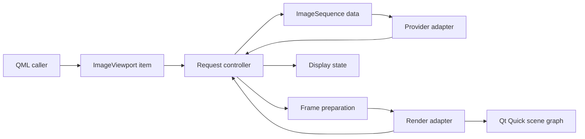

# Subsystem Boundaries

`ImageViewport` should keep source adaptation, request control, frame preparation, and scene graph presentation separate. The item is the QML-facing owner of properties and commands; internal subsystems turn those commands into provider requests, prepared frame payloads, retained display state, and render updates.

## Item Boundary

The item owns public properties, command outcomes, QML notifications, geometry conversion, and presentation state. It should not decode files, probe URLs, inspect archives, or expose scene graph resources through public API.

Controller transitions report observable changes and external effects as typed outputs. The item applies those outputs by incrementing revisions, emitting QML notifications, scheduling render updates, and synchronizing Qt timers; the controller does not emit QML signals or call scene graph update entry points directly.

## Sequence Boundary

`ImageSequence` is the immutable or provider-backed content handle accepted by the viewport. It carries enough construction-time data to open independent display generations without tying correctness to QObject parent ownership.

Sequence data is the authority for construction-time identity, declared capabilities, known static metadata, provider session construction, the strong provider-session factory reference, and the stable affinity or executor needed to open sessions after the original adapter QObject is gone. Known static metadata is an authoritative constraint for accepted generations created from the sequence. A shared immutable timing value owns frame intervals, frame starts, total duration, and position-to-frame lookup for built-in timed lists and validated provider metadata. Validated provider metadata becomes the authority for provider-backed frame count, timing value, seek bounds, sequence-wide public logical image size, frame seek support, position seek support, and timed playback support within the accepted generation that requested it. Looping is derived from the public `looping` property plus validated timed playback support; it is not a separate provider capability. Metadata identity is generation-scoped rather than display-request-scoped: a metadata result may update the active generation after the current display request has changed, provided the provider session and sequence generation still match and the generation has not closed.

## Controller Boundary

The controller owns active sequence generation identity, display-request ordering, status projection, retained display state, playback phase, and stale-result filtering. It should be verifiable without relying on wall-clock sleeps or real scene graph objects.

The accepted sequence generation and displayed content identity are distinct controller facts. Request status, request reason, command outcomes, command diagnostics, playback capability, requested frame or position, and metadata-derived observations derive from the accepted sequence generation and its current display request. Display status, displayed frame or position, displayed image size, geometry, and display revision derive from display state, which is the committed payload identity plus presentation identity. A retained display is valid when displayed content belongs to an earlier display request than the accepted request, including an earlier request in the same sequence generation or an earlier generation. Display revision increments when display ownership or display status changes, even when the visible payload and presentation mapping are unchanged, and presentation-only changes increment it even when no payload is committed.

Sequence generation identifiers are monotonically increasing and never reused within an item lifetime. Display-request identifiers are monotonically increasing within their sequence generation and are replaced by explicit seek, playback advancement, accepted metadata-bound target selection, clear, or replacement. Every display request records its origin as explicit seek, playback advancement, metadata-bound selection, or initial display. Assignment creates an initial display request: complete validated construction-time metadata selects frame `0` immediately, while unknown or partial provider metadata leaves the target unknown until metadata validation can create a metadata-bound selection. Metadata validation creates the metadata-bound initial frame `0` request only when the active request is an unknown-target non-playback initial request; after a newer seek, play command, clear, or replacement supersedes it, metadata only updates generation facts and revalidates the current active target unless `stop()` has created a fresh unknown-target non-playback initial request. Origin controls supersession: `stop()` cancels playback-advancement requests and restores the latest non-playback target when one exists by keeping the still-active non-playback request, creating a fresh accepted non-playback display request identity for the same target, or promoting already committed same-generation content for that target to the accepted display identity. When `stop()` cancels a playback start that was waiting on metadata after superseding the unknown-target initial request, it creates a fresh unknown-target non-playback initial request identity so later validated metadata can create the metadata-bound initial frame `0` request without reviving the superseded request identity. Explicit seeks that remain active may still commit after `stop()`, and play accepted before metadata is available supersedes the current unknown-bounds display request and waits for metadata-bound first-playable-target selection. A fresh request identity created by `stop()` uses new provider or preparation ownership if work is still needed; old results for the previously superseded request identity remain stale. When validated metadata arrives while the active request is a playback start waiting on metadata, the controller resolves timed playback capability before creating any non-playback metadata-bound initial selection; if playback is supported, it creates a playback-origin accepted display request for the first playable target, publishes requested frame and position from the validated timing model, and links the provider playback token before provider, preparation, or render results can affect public state. If timed playback is unsupported or contradicts construction-time capability facts, playback stops and the active request reports the documented unsupported or error state. Metadata updates generation facts, then revalidates only current active targets that were accepted while bounds or capabilities were unknown; metadata-bound selections created from validated metadata are already bound by those facts. A current unknown-bounds target that becomes out of range is display-request-terminal `Unsupported` with `InvalidRequest`; a current unknown-capability target whose seek mode or playback capability becomes unavailable is display-request-terminal `Unsupported` with `UnsupportedRequest`; stale target rejection is ignored after a newer request supersedes it. Provider frame request tokens are public adapter identities scoped to one provider session and one display request. Provider metadata tokens are public adapter identities scoped to one provider session and one sequence generation. Provider playback-advancement tokens represent provider-session playback work and are linked to playback-origin accepted display-request identities when metadata selects a playback target; frame-ready results for those tokens validate against the linked display request before preparation or render ownership begins, and end-of-sequence results create or promote the final-frame accepted display request according to the playback rules. Every provider result, preparation result, render commit, and render failure is checked against the sequence generation and request or playback token identity it answers before it can change public state.

The controller owns the state transitions for `NoRequest`, loading, ready, unsupported, error, empty display, ready display, and retained display. Generation-terminal failures close the accepted generation's outstanding metadata, frame, preparation, and render interests and can be replaced only by clear or sequence replacement. Display-request-terminal failures seal only the display request they describe; a newer valid explicit seek or playback-selected target may supersede them when generation metadata remains valid. A stale terminal result may not overwrite newer state.

The controller owns public wait-reason projection. Provider wait is true while active metadata or frame production is outstanding, request queued is true only while the accepted display request has not entered its next provider, preparation, or render stage because a previously accepted operation in the same serialized pipeline must finish or release ownership first, upload pending is true while a validated payload is waiting for preparation or upload ownership, and render waiting is true while a prepared payload is waiting for positive item geometry or render acknowledgement. Once an older operation cannot affect public state, it is stale and must not keep the accepted request queued. Retained visual fallback alone does not imply `RequestQueued`; the wait reason reflects the accepted request's pipeline, not the age of the pixels still visible. When multiple wait flags are true, the projected request reason is `ProviderWaiting`, then `RequestQueued`, then `UploadPending`, then `RenderWaiting`; terminal unsupported or error reasons replace every waiting reason. `requestRevision` changes when the projected public reason changes, not merely because an unprojected lower-priority wait flag toggles.

Render synchronization enters the controller as typed render acknowledgement inputs carrying the display request and prepared payload identities they answer. Before the item calls the render adapter, controller render synchronization snapshots any pending prepared payload identity and upload-ready data that the render attempt may acknowledge; item code consumes that snapshot rather than reading mutable pending request state directly. Snapshotting a pending provider payload does not publish request readiness or display ownership; those transitions happen only after the controller accepts the render commit acknowledgement for the prepared payload identity. The controller owns the request, display, retained-display, diagnostics, and playback transitions caused by accepted render acknowledgements, and returns change sets that the item applies through QML notifications, revision increments, timer synchronization, and render scheduling.

Provider frame callbacks enter the controller for token/session acceptance and preparation-state selection before the item-side adapter runs frame preparation, then pass the admitted provider-frame result back to the controller. The controller owns the request, display, diagnostics, retained-display, prepared-payload, and playback transitions caused by accepted or rejected provider-frame admission, and returns change sets that the item applies through QML notifications, revision increments, timer synchronization, and render scheduling. Active provider frame terminal results are normalized into controller events after token validation; the controller owns their display-request-terminal status, diagnostic, queued-work cleanup, and playback-stop consequences. Metadata terminal results are normalized into generation-scoped controller events after token validation; the controller owns their status, diagnostic, metadata-token cleanup, pending-playback cleanup, and playback-stop consequences, while the provider adapter still closes the transport session. Provider metadata-ready callbacks still validate and admit metadata in the provider adapter; metadata admission rejection and construction-time capability or fact contradictions are normalized into controller events for generation-terminal status, diagnostic, pending-playback cleanup, and playback-stop projection before the provider adapter closes the transport session. Accepted provider metadata facts are normalized into a controller event for metadata readiness, timing kind, seek/playback supports, logical size, and timing intervals before metadata-bound target policy runs. After validated metadata facts are available, metadata-bound target rejection for unsupported playback, unsupported position seek, or out-of-range selected frames is normalized into controller events for display-request-terminal status, target adjustment, diagnostic clearing, pending-playback cleanup, and playback-stop projection. Successful metadata-bound target selection is normalized into a controller event for display-request identity, target publication, latest non-playback tracking, provider-frame loading projection, pending-playback cleanup, and provider frame dispatch. Provider waiting/progress callbacks validate token scope before asking the controller to project the active loading request as provider waiting. Provider end-of-sequence callbacks validate token scope before asking the controller to project protocol-violation outcomes or apply valid playback end-of-sequence target policy.

The controller projects unknown provider metadata as loading state and unavailable metadata observations. It does not synthesize frame counts, durations, seek bounds, frame seek support, position seek support, or timed playback support before a construction-time declaration or validated metadata result provides those facts. Validated metadata changes to those public observations increment `requestRevision` even when the accepted request identity, status, reason, and target do not otherwise change.

## Preparation Boundary

Frame preparation validates dimensions, timing, alpha policy, orientation policy, and payload admission before render synchronization. Full color-management policy is outside the public API; any color tags carried internally must not change public status, geometry, or coordinate conversion unless a future public contract promotes them. Preparation should produce upload-ready payloads whenever practical and return structured admission results with stable cause, accepted facts when applicable, public status/reason projection, and bounded diagnostic when validation fails. Provider frame admission receives the controller-selected generation, display-request, and prepared-payload identity for the active request and returns accepted upload-ready payload data in that internal prepared-payload result shape before controller state publishes or snapshots that payload. Provider metadata admission returns the accepted metadata kind and timing value before controller generation state is updated. Construction-time provider known facts use a sibling admission result before the factory accepts them as sequence constraints. Preparation failures surface through request status only when they affect the display-critical request.

Preparation is the resource admission boundary. It rejects non-positive or non-finite public logical image sizes, invalid timing, metadata and payload mismatches, publicly unsupported payload shapes, missing required byte-size metadata, and payloads outside the published limits before render-side ownership begins. Sequence metadata owns the sequence-wide public logical image size; frame-ready envelopes must match it, and mismatches report payload rejection. A supported payload that satisfies published admission limits but cannot be accepted because of backend capacity or backend-specific failure reports render failure rather than payload rejection, even when the failure is detected before scene graph ownership begins.

Limit ownership is centralized in the sequence factory and preparation boundary. Factories use the published limits for synchronous construction rejection; provider-backed generations use the same published limits when validating metadata and frame-ready envelopes. Platform or backend ceilings may raise the published values when available, but they may not reduce the public minimum contract.

## Render Boundary

The render adapter owns Qt Quick scene graph interaction. It receives prepared payloads and presentation mapping, updates nodes and textures, and reports commit or failure without leaking `QSGNode`, `QSGTexture`, or backend-specific handles into public API.

Render commits are acknowledgements for a specific prepared payload identity. Presentation revisions for geometry, background, quality preferences, mirroring, zoom, pan, fill mode, and alignment are tracked separately and may update display observations without changing payload readiness. A failed payload commit changes request state only when it belongs to the active accepted generation, active display request identity, and active prepared-payload identity; otherwise it is discarded as stale cleanup.
