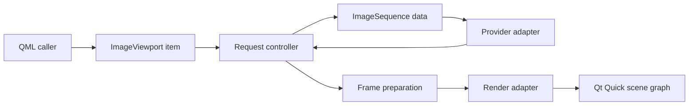

# Subsystem Boundaries

`ImageViewport` should keep source adaptation, request control, frame preparation, and scene graph presentation separate. The item is the QML-facing owner of properties and commands; internal subsystems turn those commands into provider requests, prepared frame payloads, and render updates.

## Item Boundary

The item owns public properties, command outcomes, QML notifications, geometry conversion, and presentation state. It should not decode files, probe URLs, inspect archives, or expose scene graph resources through public API.

## Sequence Boundary

`ImageSequence` is the immutable or provider-backed content handle accepted by the viewport. It carries enough construction-time data to open independent display generations without tying correctness to QObject parent ownership.

## Controller Boundary

The controller owns active generation identity, request ordering, status projection, retained display state, playback phase, and stale-result filtering. It should be testable without relying on wall-clock sleeps or real scene graph objects.

## Preparation Boundary

Frame preparation validates dimensions, timing, alpha policy, orientation/color policy, and payload admission before render synchronization. It should produce upload-ready payloads whenever practical and surface failures through request status only when they affect the display-critical request.

## Render Boundary

The render adapter owns Qt Quick scene graph interaction. It receives prepared payloads and presentation mapping, updates nodes and textures, and reports commit or failure without leaking `QSGNode`, `QSGTexture`, or backend-specific handles into public API.
