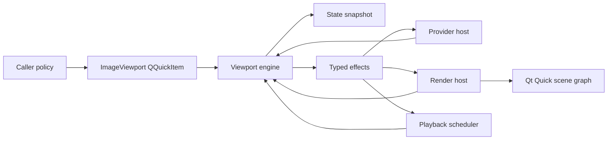

# Subsystem Boundaries

`ImageViewport` separates Qt item adaptation, viewport state transitions, provider transport, frame preparation, render synchronization, playback scheduling, and scene graph presentation. The public item exposes coherent snapshot state; the viewport engine owns canonical viewport state and returns typed effects.

## Caller Policy Boundary

The consuming application owns document and application policy: source discovery, navigation scope, page pairing, fallback policy, source identity, route-transition meaning, action availability, decoder backend choice, cache backend choice, display-store lifetime, predecode policy, refinement policy, credentials, sandbox policy, and gesture interpretation before it becomes a viewport command. The viewport accepts only `ImageSequence` handles through typed presentation-target values.

The caller may express transition intent through `PresentationTargetTransitionPolicy`, but it does not compute canonical viewport geometry. Fit, zoom, pan, content position, scan position, rotation, mirroring, spread direction, page gap, visible rectangles, coordinate conversion, display status, playback phase, request status, and revision tokens have one canonical owner inside the viewport engine.

## Item Boundary

`ImageViewport` is a Qt/QML adapter. It owns public properties, QML registration, command entry points, notification emission, window/item geometry capture, and conversion between QML values and engine inputs. It does not own request identity, stale-result filtering, provider token policy, render acknowledgement policy, playback phase, canonical presentation state, or scene graph resources.

The item exposes `ImageViewportStateSnapshot` as the public observation surface. It must not re-create flat property projections as independent mutable state. Every public observation comes from the latest engine snapshot.

The item applies every engine transition through one item-private transition executor. A transition contains the snapshot delta, provider transport ordered before and after publication, playback scheduling intent, and internal diagnostics. Command, provider, render, geometry, and scheduler call sites submit complete transitions and do not apply individual result fields themselves.

Transition execution is ordered: before-publication provider transport, coherent state publication and notifications, internal diagnostics, after-publication provider transport, then playback scheduling. Provider transport may synchronously re-enter the engine and submit nested transitions; transport and publication remain nested in execution order, while playback scheduling is deferred until the outermost transition completes. The latest nested non-no-op scheduling effect wins and is applied once, so an older outer transition cannot overwrite scheduling derived from newer canonical state.

The item schedules render updates, synchronizes playback scheduling, delivers provider requests, closes provider sessions, and emits QML notifications through this executor. It does not interpret provider events, match tokens, mutate request status directly, or publish display readiness without an engine transition.

## Engine Boundary

The viewport engine is the state-transition core. It owns accepted presentation-target identity, role generation identity, request ordering, provider token identity, prepared payload identity, render acknowledgement identity, status projection, diagnostics, playback phase, retained display state, presentation state, and revision allocation.

Engine entry points are typed inputs: presentation-target commands, presentation commands, playback commands, provider events, render acknowledgements, render failures, item geometry changes, and scheduler ticks. Engine outputs are typed effects plus a snapshot delta. The engine does not emit QML signals, invoke provider sessions, call Qt Quick update functions, start timers, or access scene graph objects.

Engine state is role-indexed. Primary and secondary storage live behind role views keyed by page role instead of exposing independent mutable primary and secondary fields. Aggregate spread logic may intentionally compare required roles for atomic readiness, terminal projection, retained display, playback ownership, and geometry.

Engine operation units are split by domain: assignment, presentation, provider, render, playback, metadata, diagnostics, and snapshot projection. `ViewportEngine` remains the sole owner of one canonical state store, while each operation receives a non-owning capability view containing only the state required by that transition. Read-only dependencies are exposed as const references and mutable access is limited to the state domains the operation is permitted to change. Domain operations never receive the complete state store, retain capability views beyond one transition, or recover broader mutable access through the engine facade.

The engine facade exposes complete typed transition entry points rather than token allocation, queue manipulation, admission, reduction, geometry projection, or scheduling helpers. Cross-domain transactions such as presentation-target assignment use an explicit composite capability instead of composing mutations through public low-level ports. Shared contracts are acyclic value definitions, and implementation-only helpers remain private to their operation unit.

Command handling is transactional. The engine validates public value shape before capability, failure-scope, or generation-state checks; a malformed presentation target, transition policy, presentation command, seek target, role, coordinate input, or numeric value is rejected before any request, display, presentation, provider, render, playback, or retained-display state mutates. Accepted commands allocate the required identities and revisions before effects leave the engine. Rejected commands may update command diagnostics and command revision only.

Accepted presentation-target and spread transitions are target-spread transactions. A target that includes both roles reaches ready display ownership only after every required role payload is validated and render-committed for the active target identities. Terminal projection is engine-owned: loading remains loading while required roles are pending, terminal error takes precedence over unsupported, primary role diagnostics win tied terminal status, and stale or non-required role results cannot publish partial spread state.

Broad mutable controller ports are not part of the architecture. External facts needed by a transition are captured into typed input snapshots before entering the engine.

## Snapshot Boundary

Snapshot projection is a first-class engine output. `ImageViewportStateSnapshot` groups request, display, presentation, role, diagnostics, and revisions into one coherent public observation. A snapshot is not a mutable controller port and must not expose private state references.

Snapshot value objects follow the canonical schema in [ImageViewport State](../spec/image-viewport-state.md). They use explicit invalid values for unavailable observations. Callers do not infer unknown data from absent fields, stale flat properties, public diagnostic strings, provider URL shape, payload raster size, or QML image cache state.

Snapshot projection preserves separate accepted-request, visible-display, and presentation ownership domains. Retained display snapshots carry the displayed generation and displayed presentation identity that produced the visible pixels; retained pixels must not satisfy accepted-target readiness, command admission, capability checks, playback support, or diagnostics for a newer accepted request.

Revision tokens are owned by the engine. Request, display, presentation, command, snapshot, and demand revisions advance only for their documented ownership domains. QML sees equality-only opaque tokens and must not receive numeric revision values; C++ may copy tokens and compare equality without relying on numeric ordering. Public helpers provide invalid-token checks and equality/currentness tests without exposing ordering. QML notification emission follows snapshot changes; QML binding order is not part of correctness.

## Sequence Boundary

`ImageSequence` is an opaque content handle for immutable or provider-backed image data. Factories own construction-time validation for still frames, timed frame lists, and provider descriptors. Sequence data owns construction-time source logical facts, declared capabilities, authored animation facts, provider session factory, and affinity/threading contract.

Sequence factories do not create viewport requests, display state, provider sessions, render state, scene graph resources, cache work, network work, archive traversal, or application navigation policy.

## Provider Boundary

Provider transport is owned by a narrow provider host. The host owns session storage, callback delivery, command delivery, cancellation delivery, session close delivery, threading policy, and cleanup scheduling. It consumes engine provider effects and reports normalized typed provider events back to the engine.

The provider host does not own token matching, request queues, failure-scope projection, public diagnostics, playback phase, render updates, or public notification emission. Provider transport storage treats engine provider-generation state as authoritative.

Provider session interaction uses one typed request and one typed event channel. Transport adapters may manage QObject affinity and queued delivery, but they must not branch public behavior on diagnostic strings or mutate engine state outside typed provider events.

Frame, position, and playback provider requests carry engine-authored `ImageSequenceProviderDisplayDemand`. Demand projection belongs to the engine because it depends on canonical source logical size, resolved frame identity, visible logical rect, viewport geometry, physical-pixel-aware zoom, rotation, mirror state, quality and exactness preferences, render constraints, caps, budgets, allocation generation, current payload facts, and demand revision. Providers may use demand to select complete-frame payload detail, but they do not own viewport geometry or render state.

## Render Boundary

The render host owns Qt Quick scene graph synchronization, render adapter access, render resource handoff, and conversion from engine-authored render snapshots to render adapter input. It reports render commit or failure back to the engine using prepared payload identities and role payload identities from the render attempt.

The render host does not read provider sessions, deliver provider commands, own playback timers, mutate public observations, or decide request readiness. Scene graph ownership, texture ownership, QML image-provider URLs, and load acknowledgement mechanics remain outside the public API; production rendering is encapsulated inside the public `ImageViewport` item.

## Playback Scheduler Boundary

The playback scheduler owns timer state, elapsed-time capture, and timeout callbacks. It consumes engine scheduling effects and sends elapsed-time ticks back as engine input. It does not own playback phase, request identity, target selection, loop policy, provider token allocation, render acknowledgement state, or notification emission.

## Diagnostics Boundary

Public diagnostics are derived from structured failure categories plus bounded redacted text. Engine logic branches on typed status, reason, outcome, capability, and failure-scope values, never on public diagnostic strings.

Internal diagnostics are structured attribution events for cleanup, scheduling, and render-failure reporting. They must not become public branching inputs and must not affect public status, reason, command outcome, or revision semantics except through typed engine transitions.
