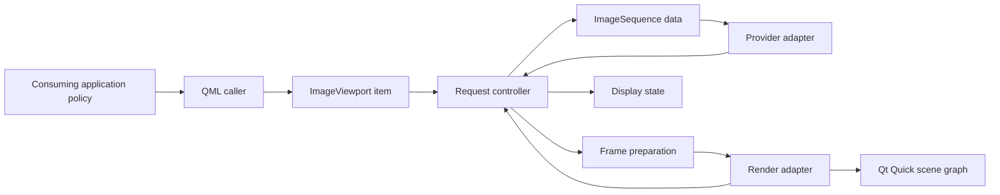

# Subsystem Boundaries

`ImageViewport` must keep consuming-application policy, source adaptation, request control, viewport presentation state, frame preparation, and scene graph presentation separate. The item is the QML-facing owner of properties and commands; internal subsystems turn those commands into provider requests, prepared frame payloads, retained display state, viewport-owned presentation geometry, and render updates.

## Caller Policy Boundary

The consuming application owns document and application policy: which source or page to open, active navigation scope, page number, primary page selection, whether to attach a secondary page, secondary fallback policy for cover, wide, video, last, unpaired, or other application cases, route transition meaning such as same-scope navigation, new document, or image-to-video, shortcut availability, toolbar/action routing, title selection, deletion target selection, archive navigation position, source identity, decoder backend choice, cache backend choice, predecode backend choice, and gesture interpretation before it becomes a viewport command. The caller supplies accepted `ImageSequence` page sources for the primary and optional secondary roles through one page-set transition and may choose when to issue viewport commands. The caller may also express page-set transition intent, including retain versus clear, fit and zoom preservation or reset, content-position handoff, rotation and mirror reset or preservation, spread direction, page gap, scan handoff, and same-target refinement annotation; it does not compute the resulting canonical viewport state.

Source permission and sandbox policy are enforced outside the viewport. The viewport must not acquire files, URLs, archive entries, credentials, network resources, temporary source paths, decoder handles, cache entries, or predecode work through ambient authority; those decisions must be resolved by caller policy, sequence factories, or provider adapters before data enters the viewport request path. Provider and factory outputs still pass through viewport admission, token, and diagnostic boundaries before they can affect public state.

Viewport presentation state has a no split-brain rule. Fit mode, effective and manual `zoomPercent`, item-level manual zoom range, manual zoom step policy, nearest-visible anchor calculation, content position, viewport frame, pannability, visible rectangles, coordinate conversion, scan position, display rotation, mirror flags, spread direction, page gap, and spread virtual canvas geometry have exactly one canonical owner inside `ImageViewport`. Callers may persist user preferences or issue commands, but they must not keep independent canonical zoom, pan, fit, rotation, mirroring, visible-rect, direction, gap, spread-geometry, manual zoom range, or anchor-clamping state that the viewport must reconcile against.

## Item Boundary

The item owns public properties, command outcomes, QML notifications, command entry points, and the QML-visible projection of viewport-owned presentation state. It exposes accepted primary and secondary sequences as observations, accepts spread replacement through `setPageSet(...)`, and exposes standalone spread-direction and page-gap setters as presentation commands; it must not let independent property assignment ordering create a two-page accepted spread. Public input normalization is enforced at this boundary: non-`ImageSequence` page-set values, invalid enum values, non-finite presentation numbers, and malformed transition-policy values must be rejected before provider work, request identity, display state, playback state, or revision tokens can change. Direct assignment for writable presentation properties, where exposed by a language binding, must enter the same validation, no-partial-apply, notification, diagnostic, and revision path as the equivalent command-style mutation without creating a second source of truth. Manual zoom helper properties, helper invokables, nearest-visible anchor helpers, and stepped zoom commands are item projections of controller-owned presentation state; the item must not introduce application geometry state, alternate render-demand policy, or render-resource injection to answer them. The item must not decode files, probe URLs, inspect archives, choose document pages, manage caches or predecode queues, decide route meaning, choose action availability, or expose scene graph resources through public API.

The item owns the public value-type projection. Range, rectangle, size, point, coordinate-result, page-geometry, transition-policy, command-outcome, and revision-token observations must cross the QML and C++ boundary as typed values with stable fields, units, unavailable-value rules, equality behavior, and notification semantics. Map-like QML access, where offered, is only a binding projection; internal boundaries must not treat untyped maps as the canonical data model for public values.

Controller transitions report observable changes and external lifecycle or command intents as typed outputs. The item applies those outputs by advancing revision tokens, emitting QML notifications, scheduling render updates, synchronizing playback scheduling, and delivering provider commands, cancellation, or session close intents through the provider transport boundary; the controller does not emit QML signals, call scene graph update entry points, or invoke provider transport helpers directly.

Item-side provider transport is owned by a narrow provider host. The host owns provider bridge client behavior, role-specific bridge instances, provider session callbacks, command delivery, cancellation, session close delivery, and deferred provider-controller event scheduling. It may read accepted sequence construction facts needed to open sessions and may call controller provider inputs with normalized typed events and dispatch failures, but it must not own request identity, token matching policy, public notification emission, playback scheduling, render updates, or scene graph state. `ImageViewportPrivate` owns the provider host and applies the controller change sets, diagnostics, render updates, playback synchronization, and public notifications produced after provider-host calls.

Item-side render synchronization is owned by a narrow render host. The host owns `updatePaintNode(...)` synchronization, render adapter access, scene graph resource handoff, and conversion from controller-authored render snapshots to render adapter input. It reports render commits and failures back to the controller using prepared-payload identities and role payloads from the render attempt, but it must not read provider session state, deliver provider transport, own playback timer state, or mutate public observations directly. `ImageViewportPrivate` owns the render host and applies controller change sets, playback synchronization, render update scheduling, and public notifications produced after render-host calls.

Item-side playback scheduling is owned by a narrow playback scheduler. The scheduler owns timer state, elapsed-time capture, and timeout callbacks that trigger controller playback advancement through the item boundary. It may ask the controller for the next interval and deliver elapsed milliseconds back to controller playback APIs, but it must not own playback phase, request identity, target selection, looping policy, provider token allocation, render acknowledgement state, or public notification emission. `ImageViewportPrivate` owns the scheduler and remains responsible for applying controller change sets, provider transport effects, render updates, and public notifications produced after scheduler-driven playback advancement.

## Sequence Boundary

`ImageSequence` is the immutable or provider-backed content handle accepted by a viewport page role. It carries enough construction-time data to open independent display generations without tying correctness to QObject parent ownership.

The public `ImageSequence` type is an opaque handle. Still-image payloads, timed-list frame storage, provider construction facts, provider capabilities, provider session factories, timing internals, and test-only inspection hooks live behind private implementation interfaces and must not be stored as public-header data members, exposed through installed headers, or read directly by item, controller, provider transport, render, or factory code outside the sequence boundary.

Sequence data is the authority for construction-time identity, declared capabilities, construction-time facts, authored animation facts, provider session construction capability, and the affinity or execution context needed to open sessions after the original adapter QObject is gone. It is not the authority for viewport fit, zoom, pan, rotation, spread placement, source navigation, or application source identity. Construction-time facts are authoritative constraints for accepted generations created from the sequence. Authored animation facts describe initial-display autoplay eligibility, progressive animation readiness support, and authored loop policy without owning playback scheduling outside the controller. Immutable timing data owns frame intervals, frame starts, total duration, and position-to-frame lookup for built-in timed lists and validated provider metadata. Validated provider metadata becomes the authority for provider-backed frame count, timing data, seek bounds, sequence-wide public logical image size, frame seek support, position seek support, timed playback support, and runtime-authored animation facts within the accepted generation that requested it. Effective looping is derived by the controller from the public `looping` property, authored loop policy, and validated timed playback support; `looping: true` forces infinite looping, while `looping: false` follows authored loop policy. Looping is not a separate provider capability. Metadata identity is generation-scoped rather than display-request-scoped: a metadata result may update the active generation after the current display request has changed, provided the provider session and sequence generation still match and the generation has not closed.

Sequence factories are the construction boundary for still frames, timed frame lists, and provider adapters. They synchronously validate construction input against published limits, orientation, transparency, timing, value-shape rules, and provider known-fact constraints before returning either an opaque sequence or factory diagnostics. Factory construction must not create viewport request state, display state, presentation state, provider sessions, source probing, decoding, cache population, predecode work, network access, archive traversal, service calls, or scene graph work. Provider-backed sequences may capture only the bounded session-creation capability, declared facts, authored animation facts, and affinity/threading contract needed for future accepted generations; expensive provider work begins only after the controller accepts a generation and opens a session through the provider protocol.

## Controller Boundary

The controller owns active page-set identity, per-role sequence generation identity, display-request ordering, status projection, retained display state, playback phase, viewport presentation state, page-set transition transactions, and stale-result filtering. Time, provider output, preparation output, presentation commands, page-set transition commands, and render acknowledgements enter the controller as explicit inputs; controller correctness must not depend on sleeping wall-clock threads, reading scene graph object state, duplicating QML geometry calculations, or observing provider callbacks outside the typed event boundary.

Controller implementation units may be split by responsibility only when they preserve this single controller authority. Page-set orchestration, presentation mutation, metadata projection, provider event handling, render synchronization, and playback advancement may live in separate private implementation files, but they operate on the same controller-owned state, emit typed change sets and transport effects, and must not introduce independent state owners, alternate revision counters, or direct item, provider-transport, or scene-graph side effects.

The controller facade is a narrow internal contract, not a dumping ground for domain-local operation details. It exposes only the entry points consumed by the item boundary, provider host, render host, playback scheduler, and private test support; provider, render, playback, presentation, metadata, and assignment internals must not become public controller methods merely to share code across implementation files.

Shared private DTOs that cross the controller facade, provider host, render host, playback scheduler, and owner-specific operation boundaries live in acyclic owner contract headers. Provider transport effects, render synchronization payloads, command and playback results, assignment results, and metadata projections may be shared private contracts when they are returned across those boundaries; implementation-only helper types stay in owner-specific helper headers or implementation-local namespaces. Contract headers must not include implementation helper headers or grant unrelated mutable access to controller state.

Controller context and state-port interfaces are narrow dependency boundaries, not service locators over the full viewport model. Extracted controller operations receive role-indexed read or mutation ports for the request, provider, display, timing, geometry, or presentation slices they need; they must not receive broad mutable access to unrelated state domains under a generic context, port, or helper abstraction.

Controller helper headers are owned by subsystem responsibility rather than by convenience. Domain-neutral helpers may expose typed value projection, role-indexed state selection, and side-effect-free predicates; provider, presentation/geometry, render/display, and playback helpers live in owner-specific private headers whose names match the implementation units that consume them. A helper header must not give an implementation unit broad mutable access to unrelated controller state domains or smuggle controller transition methods across subsystem boundaries.

Per-role controller storage is addressed through role-indexed private views at subsystem boundaries. Provider event handling, provider dispatch, token matching, queue state, session state, render synchronization, pending payload ownership, displayed payload identity, playback timing, playback advancement, stop restoration, and stale-result filtering must select request, provider, display, and timing slices by `PageRole` rather than branching across primary and secondary fields at each mutation site. Direct primary/secondary storage access is limited to the role-view boundary and aggregate spread logic that intentionally compares or combines both roles for atomic readiness, terminal projection, retained display, playback ownership, or geometry. Any structural enforcement of this rule must identify the role-view and aggregate-spread exception boundaries explicitly rather than relying on incidental source layout.

The accepted page set, accepted per-role sequence generation, and displayed content identity are distinct controller facts. Request status, request reason, command outcomes, command diagnostics, playback capability, requested frame or position, and metadata-derived observations derive from the accepted page set and its per-role display requests. Display status, displayed frame or position, displayed page sizes, displayed spread size, geometry, and display revision token derive from display state, which is the committed role payload identities plus presentation identity. A retained display is valid only when controller state selected retention for a newer accepted request and displayed content belongs to an earlier display request than the accepted request, including an earlier request in the same sequence generation or an earlier page-set generation. Clear-before-load transitions enter empty display instead of retained display. Display revision tokens advance when display ownership or display status changes, including entering or leaving retained display, even when the visible payload and presentation mapping are unchanged, and presentation-only changes advance them even when no payload is committed.

Accepted readiness and visible readiness are separate controller projections. The controller must publish accepted-target readiness only from the accepted request identity, and visible inspection readiness only from committed display state. Retained pixels may keep visible geometry inspectable, but they must not satisfy accepted-target readiness, capability checks, playback support, command admission, or diagnostics for the newer accepted request.

Viewport presentation state is controller-owned data. It includes fit mode, effective zoom percent, manual zoom percent, item-level manual zoom range, manual zoom step factor, content size, content position, maximum content position, horizontal and vertical pannability, viewport frame, visible item rectangle, visible spread rectangle, visible page rectangles, per-page item rectangles, nearest-visible anchor calculations, coordinate conversion state, scan position, display rotation, horizontal and vertical mirror flags, spread direction, page gap, and the virtual spread canvas geometry that places primary and secondary pages. The item may cache or expose projected values returned by the controller, but it must not store a second mutable source of truth for canonical presentation. QML bindings and caller code observe this state or request changes through commands; they do not compute or publish replacement canonical values.

Manual zoom range and step calculations are presentation ownership, not caller policy. The controller derives the item-level manual zoom maximum from the visible display identity, retained display identity when retained pixels are visible, item bounds, effective device pixel ratio, current presentation geometry, installed render-demand inputs, and the public display-demand ceiling. The minimum preserves the public command boundary for finite positive manual zoom values, and helper clamping is side-effect-free. An installed build that has no narrower render-demand source uses the public display-demand ceiling as the render-demand input until such a source exists, while preserving the same item-level API boundary.

Nearest-visible anchor calculation is presentation geometry ownership. The controller-owned geometry projection clamps to the visible spread or role-scoped page rectangle using the same retained-or-ready display state, transform state, and half-open coordinate domains as ordinary coordinate conversion. These helpers inspect visible presentation geometry only; they do not create accepted request readiness, mutate pan or zoom, or make an application page-navigation decision.

Standalone spread-direction and page-gap commands enter the controller as presentation mutations, not request mutations. After validating the value, the controller updates canonical direction or gap, recomputes spread placement, content size, pannability, visible rectangles, page rectangles, coordinate conversion state, scan bounds, and clamped content position from the current canonical viewport state, and returns item-visible change sets. These commands do not accept a new page set, change request identity, touch provider/session work, transfer playback ownership, or infer source identity. If the value is already canonical, the controller returns an accepted no-op with no observable value, diagnostic, or revision change. Invalid direction or gap input is a no-partial-apply outcome that preserves presentation state, geometry, display state, request state, provider work, playback phase, diagnostics, and revision tokens.

Reset-view commands enter the controller as presentation mutations that restore the default view transform from canonical geometry: contain fit, contain-derived effective zoom, default manual zoom demand for that contain fit, and scan-start content position and scan state clamped to the current spread, rotation, mirror, gap, direction, and item geometry. Reset view must not mutate page-set identity, source identity, request identity, provider/session work, playback ownership, spread direction, page gap, rotation, mirror flags, background, quality preferences, looping, authored animation facts, or request diagnostics. When no presentable geometry exists, the controller stores the default view preference and returns empty geometry observations until content and item geometry can produce a presentation.

Page-set transition policy is validated and applied at the controller boundary as one transaction. A successful non-empty transition accepts the new primary and optional secondary sequences, chooses retained or empty visible display, updates fit mode, manual and effective zoom, content position, scan position, display rotation, mirror flags, spread direction, page gap, spread geometry, request identity, playback ownership, diagnostics, and revision effects before provider, preparation, or render output can publish state. A successful transition with `null` primary is a clear-style operation only after the item has validated page-role arguments and the controller has validated the transition policy; the `clear()` command enters the same clear transaction without page-role arguments or transition effects. The controller ignores any validated supplied secondary role, clears accepted request and page-set identity, closes accepted generation interests, stops playback, removes retained display content, publishes empty request, display, and geometry observations, and preserves presentation preferences such as fit, zoom, content position, scan position, rotation, mirror flags, spread direction, page gap, background, quality preferences, and looping unless a separate accepted presentation command changes them. Invalid page-role arguments or transition-policy values, including invalid explicit fit mode, spread direction, page gap, missing explicit values, or reset-to-contain conflicts, are no-partial-apply rejections that preserve accepted page-set identity, presentation state, retained display state, queued provider work, playback phase, provider/session ownership, request diagnostics, and request/display revision tokens. Command diagnostics for invalid transition policy are produced through the same command-diagnostic boundary as other invalid commands. The item and QML must not repair replacement state by issuing ordered follow-up commands after a page-set replacement.

Role-scoped command admission is controller-owned. The controller must reject or ignore commands addressed to roles that are not present in the accepted page set before they can change request identity, playback state, provider work, preparation work, render state, or retained display content. A secondary role without an accepted primary role is not an accepted page set and must not become an independently playable or seekable generation. A two-page spread is accepted only through one page-set transaction carrying both roles, so controller state never depends on ordered independent primary and secondary assignments.

Command admission must use one ordered validation boundary for calls that reach the viewport command surface. The item normalizes public value types and rejects malformed enum values, invalid public value objects, missing required fields in command value types, and non-finite numeric inputs before the controller evaluates request state. The controller then evaluates role presence, intrinsic command-domain validity, failure scope, and capability support in that order. Intrinsic command-domain failures that are known for a present role, such as negative seek targets or targets outside known seek bounds, are invalid outcomes before unsupported-capability or generation-terminal checks. Stepped zoom command admission is controller-owned: the command computes its target through the controller-owned manual zoom step helper, then enters the same command-outcome, diagnostic, revision, validation, clamping, and anchor-preservation path as direct manual zoom. Command diagnostics and command revision effects are controller-owned projections: invalid, unsupported, and ignored commands publish command diagnostics unless the public command contract explicitly preserves prior diagnostics, and accepted commands clear prior command diagnostics only through the documented accepted-command rules. Controller command implementations construct these outcomes through one private helper boundary that owns command diagnostic mutation and command revision effects; documented diagnostic-preserving exceptions must be explicit call sites rather than duplicate helper implementations.

Two-page spread commit is atomic at the display-state boundary. When the accepted page set has a secondary role, the controller may track provider, preparation, and render readiness per role, but it publishes ready display ownership and ready spread geometry only after every role required by that page set has a validated prepared payload and accepted render commit. A partial target spread may remain pending or fail, but it cannot become the active presentation with missing secondary geometry. Required-role wait flags are aggregated before public wait-reason projection. A terminal failure for any required role seals the target spread as terminal, prevents partial ready publication, and leaves visible display in the state chosen by the transition policy: retained previous presentation for retain transitions, or empty display for clear-before-load transitions. Deterministic terminal projection must prefer `Error` over `Unsupported`; when terminal status ties, it must use the primary role's terminal reason and diagnostics, and when only one role has the winning terminal status, it must use that role's reason and diagnostics. Primary-only fallback is represented by the caller supplying only the primary role.

Same-target refinement is transition intent over new accepted sequence/request identities, not source-identity inference. The controller does not compare application source identities. When the caller supplies refinement intent, the controller follows the explicit transition fields for retain versus clear, fit and zoom preservation or reset, content-position handling, rotation reset or preservation, mirror reset or preservation, spread direction, and page gap. `SameTargetRefinement` combined with clear-before-load, rotation reset, mirror reset, direction change, or page-gap change is valid because the annotation does not override those fields. The controller treats old preview provider, preparation, and render results as stale after the refined request is accepted. Refinement must not require QML to recompute zoom, pan, spread geometry, visible rectangles, or scan position.

Sequence generations, display requests, provider request tokens, prepared payloads, render acknowledgements, and presentation snapshots are separate identity domains owned by the controller and the boundaries it authorizes. Identities must be strictly ordered for stale-result rejection and must not be reused while late provider, preparation, render, or command results can arrive. Public request, display, and command revisions are projections of one controller-owned non-zero revision allocator shared by request, display, and command observations; public QML is not part of stale-sensitive ordering.

Revision advancement, request diagnostics, command diagnostics, wait-reason projection, target-spread terminal recording, target-spread terminal projection, provider dispatch failure publication, render failure attribution, and playback phase publication are controller-owned mutation primitives. Domain operations may call those primitives, but they must not duplicate their observable revision, diagnostic, terminal, wait, or phase side effects. The command-outcome helper boundary remains the owner for command diagnostic mutation and command revision effects unless the architecture explicitly replaces that boundary.

Initial target selection is a controller invariant. Complete validated construction-time metadata may select frame `0` during assignment; unknown or partial provider metadata leaves the target unknown until validated metadata can create a metadata-bound request. Metadata may update generation facts after the active display request has changed, but it may create the initial metadata-bound target only when the current active request is still the unknown-target non-playback initial request, or a fresh unknown-target initial request created by the documented stop-restoration rules. Newer accepted seeks, playback starts, clears, and replacements remain authoritative, and stale metadata or target rejection cannot publish terminal state after supersession.

Request origin is retained as controller state so stop, pause, seek, playback, metadata-bound selection, clear, and replacement can be ordered without reviving superseded identities. Playback-specific request ordering, loop handling, autoplay, and stop restoration are enforced by the playback state-machine contract; provider token allocation, token scope, command serialization, and end-of-sequence interpretation are enforced by the provider protocol contract. Every provider result, preparation result, render acknowledgement, render failure, and stale-sensitive command outcome must match the active controller identity domain before it can change public state.

The controller owns the state transitions for `NoRequest`, loading, ready, unsupported, error, empty display, ready display, and retained display. Generation-terminal failures close the accepted generation's outstanding metadata, frame, preparation, and render interests and can be replaced only by clear or sequence replacement. Display-request-terminal failures seal only the display request they describe; a newer valid explicit seek or playback-selected target may supersede them when generation metadata remains valid. A stale terminal result may not overwrite newer state.

Authored animation facts are controller timing inputs, not provider-owned visible scheduling. Autoplay, progressive animation readiness, finite authored loops, and authored infinite loops must pass through the same request identity, provider token, preparation, render acknowledgement, retained-display, and stale-result rules as explicit playback. Caller commands remain authoritative over authored playback intent through the playback state-machine contract.

The controller owns public wait-reason projection. Provider wait is true while active metadata or frame production is outstanding, request queued is true only while the accepted display request has not entered its next provider, preparation, or render stage because a previously accepted operation in the same serialized pipeline must finish or release ownership first, upload pending is true while a validated payload is waiting for preparation or upload ownership, and render waiting is true while a prepared payload is waiting for positive item geometry or render acknowledgement. Once an older operation cannot affect public state, it is stale and must not keep the accepted request queued. Retained visual fallback alone does not imply `RequestQueued`; the wait reason reflects the accepted request's pipeline, not the age of the pixels still visible. When multiple wait flags are true, the projected request reason is `ProviderWaiting`, then `RequestQueued`, then `UploadPending`, then `RenderWaiting`; terminal unsupported or error reasons replace every waiting reason. The request revision token changes when the projected public reason changes, not merely because an unprojected lower-priority wait flag toggles.

Public diagnostics are derived from structured failure categories plus optional sanitized public text. Factory, provider, preparation, render, and controller boundaries must classify failures before publishing text; the controller owns diagnostic lifetime, revision effects, and whether a diagnostic belongs to a request, command, request-owned warning, or presentation-fallback warning. Request diagnostics and command diagnostics have separate ownership and revision rules, and retained display state must not carry an earlier generation's request diagnostic or warning into the accepted replacement. Boundaries that accept provider or backend text must enforce the published length limit, plain-text normalization, and redaction of private paths, URLs, credentials, raw exception text, and unbounded payload excerpts unless the application explicitly supplied that same text as user-facing content. Internal logic must branch on typed status, reason, outcome, and capability values, never on public diagnostic strings.

Internal diagnostics are private production-compiled structured attribution events, separate from public diagnostics and not part of the installed API. Provider cleanup delivery failures record role, operation, metadata-token validity and id, frame-token validity and id, whether cleanup was queued, and whether cleanup remains pending. Deferred provider scheduler failures record role, active generation, active request id, queued request id, queued target kind, and failed operation. Accepted render failures record failed role, generation, request id, prepared payload id, and render failure cause. Tests may observe these events through private support, but event production must not depend on test-only compilation.

Render synchronization uses controller-authored immutable snapshots for the prepared payload identity, upload-ready data, target spread, and presentation mapping that a render attempt may acknowledge. The item and render adapter consume those snapshots rather than reading mutable pending request state. Snapshot creation must not publish request readiness or display ownership; those transitions happen only after the controller accepts a render acknowledgement for the prepared payload identity or complete target spread. The controller owns the request, display, retained-display, diagnostics, presentation, and playback transitions caused by accepted render acknowledgements and returns item-visible change sets.

Provider lifecycle and callback handling use a single controller event boundary. Session-open failures, metadata-ready results, frame-ready results, waiting or progress updates, terminal provider results, cancellations, and end-of-sequence results are normalized into typed controller inputs before any public state changes. The event boundary is role-symmetric: primary and secondary provider transport paths must deliver the same result kinds and payload ownership semantics, and no transport layer may drop callback classes because the session belongs to the secondary role. The controller validates identities, classifies failure scope, owns token and queued-work state, and emits controller-authorized lifecycle or command intents for transport delivery. Item-side provider transport delivers those intents and normalized callbacks, but must not own token matching, failure-scope projection, cleanup policy, or request-state mutation.

Provider frame dispatch is controller-owned. Command, playback, metadata-bound target, and playback end-of-sequence transitions use one dispatch boundary for queueing, token allocation, cancellation intent, close intent, and stale-deferred-work validation. Transport must only deliver controller-authorized provider commands and callbacks.

The controller projects unknown provider metadata as loading state and unavailable metadata observations. It owns one role-scoped metadata projection path for primary and secondary frame counts, durations, seek bounds, frame seek support, position seek support, and timed playback support, using construction-time declarations and validated runtime metadata as the only fact sources. It does not synthesize frame counts, durations, seek bounds, frame seek support, position seek support, or timed playback support before a construction-time declaration or validated metadata result provides those facts. Validated metadata changes to those public observations advance the request revision token even when the accepted request identity, status, reason, and target do not otherwise change.

## Preparation Boundary

Frame preparation validates dimensions, timing, transparency metadata, orientation policy, and payload admission before render synchronization. Full color-management policy is outside the public API; any color tags carried internally must not change public status, geometry, or coordinate conversion unless an explicit public contract covers them. Preparation owns conversion from admitted frame data to renderer-admissible payloads and returns structured admission results with stable cause, accepted facts when applicable, public status/reason projection, and bounded diagnostics when validation fails. Provider frame admission receives controller-selected generation, display-request, page-role, and prepared-payload identities and must produce accepted payload data before controller state can publish or snapshot that payload. Provider metadata admission returns the accepted metadata kind and timing value before controller generation state is updated. Construction-time provider known facts use the same admission boundary before the factory accepts them as sequence constraints. Preparation failures surface through request status only when they affect the display-critical request or a role required by the accepted target spread.

Preparation is the resource admission boundary. It rejects non-positive or non-finite public logical image sizes, invalid timing, metadata and payload mismatches, publicly unsupported payload shapes, missing required byte-size metadata, and payloads outside the published limits before render-side ownership begins. It classifies those rejections as unsupported payload shape or size, malformed metadata or payload envelope, missing validation data, metadata public-limit violation, or provider protocol violation before public status/reason projection. Sequence metadata owns the sequence-wide public logical image size; frame-ready envelopes must match it, and mismatches report payload rejection. A supported payload that satisfies published admission limits but cannot be accepted because of backend capacity or backend-specific failure reports render failure rather than payload rejection, even when the failure is detected before scene graph ownership begins.

Limit ownership is centralized in the sequence factory and preparation boundary. Factories use the published limits for synchronous construction rejection; provider-backed generations use the same published limits when validating metadata and frame-ready envelopes. Platform or backend ceilings may raise the published values when available, but they may not reduce the public minimum contract.

Display-demand limits are owned by the controller and render boundary rather than by source admission. The controller rejects manual zoom values outside the published display-demand limits before changing canonical fit, zoom, or content-position state. The render boundary reports render failure or documented quality fallback for otherwise admitted content that cannot be committed for the current presentation demand; it must not lower canonical zoom or reinterpret a display-demand failure as source payload rejection.

## Render Boundary

The render adapter owns Qt Quick scene graph interaction and any backend-specific resource selection used by the installed build. It receives prepared role payloads and a viewport-owned presentation mapping, updates nodes and textures, and reports commit or failure without leaking `QSGNode`, `QSGTexture`, `QRhi`, native texture handles, render-pass objects, or backend-specific lifetimes into public API. Callers do not own scene graph resources for viewport display; scene graph ownership remains encapsulated inside the public `ImageViewport` item.

Render commits are acknowledgements for a specific prepared payload identity and, for spread targets, the complete set of role payloads required by the accepted page set. Presentation revision tokens for geometry, background, quality preferences, mirroring, fit mode, zoom percent, content position, spread direction, page gap, rotation, scan position, and pannability are tracked separately and may update display observations without changing payload readiness. A failed payload commit changes request state only when it belongs to the active accepted generation, active display request identity, active page role, active prepared-payload identity, and active target spread; otherwise it is discarded as stale cleanup.
