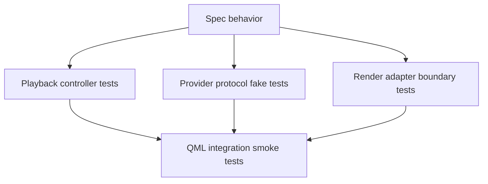

# Test Strategy

This document defines the testing strategy for the initial `ImageViewport` implementation boundary. It describes which behavior should be verified at each layer before relying on full Qt Quick rendering tests.

The strategy follows the architecture split: playback decisions are tested without scene graph resources, provider protocol behavior is tested with fake providers, render adapter decisions are tested at the package boundary, and QML integration is covered by thin smoke tests.

## Test Layers

Playback controller tests should be pure item-side tests. They should not construct `QQuickItem`, `QSGNode`, `QSGTexture`, real decoder libraries, or real wall-clock timers.

Provider protocol tests should use fake provider sessions and fake result sinks. They should verify generation scoping, request identity, waiting/error delivery, late stale result handling, capability-driven behavior, and preparation hints without depending on GIF, WebP, AVIF, HEIF, JXL, or QMovie implementations.

Render adapter boundary tests should focus on render package interpretation, node or texture action decisions, cache invalidation, retained texture behavior, upload failure diagnostics, and idempotent updates. They should not require real codec inputs.

QML integration smoke tests should verify that the QML module can be imported, the item can be constructed, key properties can be bound, a simple fake sequence can become displayable, and basic state changes are observable from QML.

Full visual correctness tests should be introduced selectively. Pixel-perfect rendering tests are useful later, but the first implementation should rely primarily on deterministic controller, protocol, and adapter-boundary tests.

## Playback Controller Matrix

The playback controller should be tested with a fake clock, fake sequence metadata, and fake provider result events.

Core state tests should cover stopped, playing, paused, ended, empty sequence, initial display, clear sequence, and sequence replacement.

Request lifecycle tests should cover metadata ready, metadata error, frame ready, waiting, frame error, unsupported request, superseded request, and late result from an old generation. Assertions should distinguish public unsupported status from public error status.

Timed playback tests should cover per-frame durations, speed scaling, next-frame waiting, late frame acceptance, no burst catch-up after late frames, infinite looping, finite loop completion, and final displayed-frame retention at end.

Deferred rendering tests should cover loss of scene graph availability, no error for unavailable rendering context, request-status reason that identifies render-deferred waiting rather than provider waiting, no offscreen burst advancement, and timing continuation from the latest scene graph committed frame when rendering resumes.

Seek tests should cover immediate ready seek, waiting seek, seek error, out-of-range seek with known frame count, provider rejection with unknown frame count, seek while playing, seek while paused, and seek after ended.

Retention tests should cover replacement loading, replacement failure, frame-level error during playback, no prior display on first error, retained display after error, clearing as an explicit caller action, and retained previous-generation content whose displayed state is marked as not belonging to the active sequence.

Assertions should include playback phase, requested frame target, displayed frame, completed loops, active generation, pending request identity, request status, display status, candidate snapshot identity, displayed snapshot identity, preparation intent, accepted result decisions, ignored result decisions, and status diagnostics.

## Provider Fake Strategy

The fake provider should be scriptable. A test should be able to declare sequence info, capabilities, frame results, waiting results, errors, warnings, and delayed or out-of-order delivery.

The fake provider should record requests. Tests should assert sequence-info request count, frame request targets, request reasons, normalization policy, cancellation calls, generation close calls, and preparation hints.

The fake provider should be able to model random-access, sequential-only, rewindable, streaming, prefetchable, unknown-frame-count, unknown-duration, stable-duration capabilities, provider-side normalization support, and normalization that can only be satisfied by viewport CPU preparation.

The fake provider should be able to model stateful sequential and single-flight providers. Tests should verify that the controller avoids overlapping display-critical requests for those providers while preserving stale-result filtering.

The fake provider should deliver immutable frame snapshots with simple synthetic payload identities. Controller and protocol tests should not require real image pixels unless the test specifically targets upload or QML integration.

Fake snapshot tests should include a frame whose dirty region or logical rect is smaller than the canvas while the payload remains a full self-contained canvas-equivalent display frame. The viewport should treat the subrect data as hints, not as a requirement to compose against a previous frame.

Normalization fake tests should include metadata-preserving orientation with unnormalized pixels, strict color requests outside the supported conversion scope, and best-effort policy warnings. These tests should verify actual displayed pixel geometry, unsupported strict policy status, and warning propagation respectively.

Late result tests should be first-class. The fake provider should be able to send a result for a cancelled request, an older generation, an older seek, or a speculative preparation request, and the controller should ignore it unless it matches the current display intent.

## Render Adapter Boundary

Render adapter tests should use render packages that contain immutable snapshot identity, payload identity, logical geometry, source rect, target rect, clip rect, mirroring flags, filtering flags, mipmap flag, generation, and presentation revision.

Geometry tests should verify that resize, pan, zoom, fit/crop/pad placement, alignment, mirroring, and clipping update node geometry or texture coordinates without requiring a new texture when the payload is unchanged.

Texture tests should verify first upload, reuse for the same payload, replacement for a new candidate snapshot, scene graph commit acknowledgement, scene graph invalidation, cache eviction of speculative textures, and protection of the currently displayed texture.

Failure tests should verify CPU-preparation failure handoff, texture upload failure diagnostics, no automatic clearing of retained display, no repeated duplicate diagnostics for the same revision, and stale failure ignoring.

Normalization tests should verify strict color or orientation failure, best-effort diagnostics, metadata-preserving payloads, and distinct cache identity when policy changes alter prepared payloads.

Adapter tests may use a fake texture factory or adapter seam instead of a real GPU context where practical. Tests that require real `QSGTexture` creation should be small integration tests rather than the main adapter test surface.

## QML Integration Smoke

QML smoke tests should verify `import ImageViewport`, item construction, default property values, sequence assignment, status changes, and simple display readiness using a fake in-memory sequence.

Property binding tests should cover playback phase, requested frame, displayed frame, frame count when known, request status, display status, error string, content rectangle, painted size, mirror flags, smooth, mipmap, zoom, pan, and retain behavior at a smoke level.

Coordinate conversion smoke tests should cover empty content, fit padding, valid image point, mirrored content, zoom/pan adjustment, and item-local coordinates.

Rendering smoke tests should verify that a small synthetic frame can be presented without crashing and that scene graph invalidation or item destruction does not leak observable playback state.

QML smoke tests should avoid depending on external image files, filesystem paths, or Qt image plugins. The test sequence should be provided through the same provider boundary intended for applications.

## Out Of Initial Scope

The first test strategy does not require real decoder conformance suites for GIF, WebP, AVIF, HEIF, JXL, or QMovie-compatible providers.

The first test strategy does not require native texture import tests, `QRhiTexture` payload tests, region/LOD loading tests, tiled presentation tests, arbitrary content rotation tests, or full color-management tests.

The first test strategy does not require exhaustive pixel-perfect output comparison across every Qt Quick backend. Backend-specific visual tests can be added after the render adapter boundary is stable.

The first test strategy does not require built-in gesture tests because automatic wheel, drag, pinch, selection, annotation, and crop interactions are outside the initial implementation boundary.

## Design Consequences

The implementation should keep playback control separate enough to run deterministic tests without a `QQuickWindow`.

The provider boundary should have a small fake implementation before real decoder adapters are written.

The render adapter should expose enough internal boundary structure to test package interpretation and upload decisions without making `QSGTexture` public API.

Tests should prefer deterministic generated frames and synthetic metadata over fixture files unless a test explicitly targets file-backed provider adapters in a later phase.
