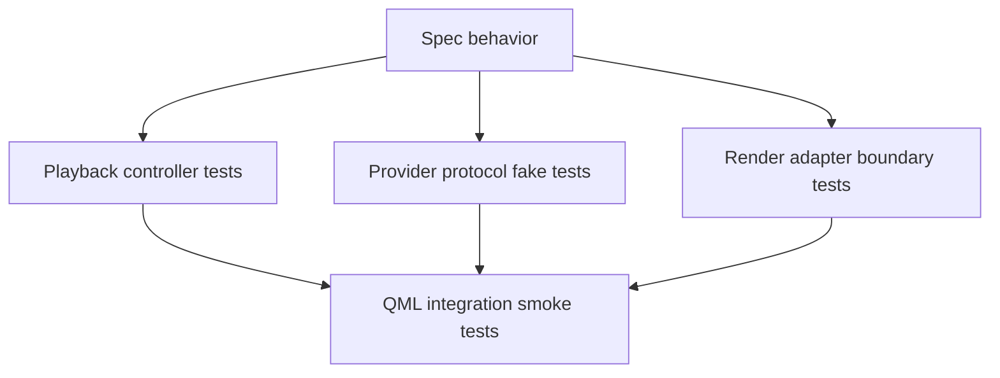

# Test Strategy

This document defines the testing strategy for the initial `ImageViewport` implementation boundary. It describes which behavior should be verified at each layer before relying on full Qt Quick rendering tests.

The strategy follows the architecture split: playback decisions are tested without scene graph resources, provider protocol behavior is tested with fake providers, render adapter decisions are tested at the package boundary, and QML integration is covered by thin smoke tests.

## Test Layers

Tests should be grouped by milestone. `M0 required` tests prove the internal split with fake providers, deterministic controller state, one QImage-backed display path, and a small QML import/construct surface. `M1 required` tests prove the first caller-usable public API: sequence construction helpers, still and timed-frame display, playback commands, retained replacement behavior, presentation controls, coordinate conversion, and status observations. Future provider-class tests cover streaming, sequential-only recovery, real decoder adapters, native textures, region/LOD, and richer color pipelines.

Playback controller tests should be pure item-side tests. They should not construct `QQuickItem`, `QSGNode`, `QSGTexture`, real decoder libraries, or real wall-clock timers.

Provider protocol tests should use fake provider sessions and fake result sinks. They should verify generation scoping, request identity, waiting/cancelled/error delivery, late stale result handling, capability-driven behavior, and preparation hints without depending on GIF, WebP, AVIF, HEIF, JXL, or QMovie implementations.

Render adapter boundary tests should focus on render package interpretation, node or texture action decisions, cache invalidation, retained texture behavior, upload failure diagnostics, and idempotent updates. They should not require real codec inputs.

QML integration smoke tests should verify that the QML module can be imported, the item can be constructed, key properties can be bound, a simple fake sequence can become displayable, and basic state changes are observable from QML.

Full visual correctness tests should be introduced selectively. Pixel-perfect rendering tests are useful later, but the first implementation should rely primarily on deterministic controller, protocol, and adapter-boundary tests.

## Playback Controller Matrix

The playback controller should be tested with a fake clock, fake sequence metadata, and fake provider result events.

Core state tests should cover stopped, playing, paused, ended, empty sequence, initial display, clear sequence, and sequence replacement.

Request lifecycle tests should cover metadata ready, metadata error, frame ready, waiting, frame error, unsupported request, superseded request, and late result from an old generation. Assertions should distinguish public unsupported status from public error status.

Timed playback tests should cover per-frame durations in milliseconds, finite-positive speed scaling, rejection or normalization of invalid speed values, next-target waiting, late frame acceptance, source-defined loop behavior resolved from finite, infinite, none, or unknown provider metadata, none or unknown source-loop fallback to one play-through, finite loop counts as total play-throughs, no burst catch-up after late frames, infinite looping, finite loop completion, and final displayed-frame retention at end.

Deferred rendering tests should cover render context unavailable, presentation suspended, commit pending, render availability regained, update scheduling for pending candidates after rendering resumes, acceptance of matching provider results as pending candidates while rendering is deferred, no early displayed-state update before render commit, no error for unavailable rendering context, request-status reason that identifies render-deferred waiting rather than provider waiting, no offscreen burst advancement, `visible: false` or window suspension as lifecycle-driven suspension, pure geometric offscreen placement not being treated as render unavailability, and timing continuation from the latest scene graph committed frame when rendering resumes.

Zero-size item tests should be M1 required. They should verify that non-positive item bounds prevent a new candidate from becoming display-committed, report the public render-deferred request reason with an internal presentation-suspended cause, preserve any previously committed displayed snapshot as retained state, expose empty visible geometry, make item-to-image conversion invalid, and resume commit/timing only after positive bounds return.

Seek tests should cover immediate ready seek, waiting seek, same-request completion after waiting, retry-required waiting providers, seek error, out-of-range seek with known frame count, provider rejection with unknown frame count, stable-index capability disabled, seek while playing, seek while paused, and seek after ended.

Retention tests should cover replacement loading, replacement failure, frame-level error during playback, in-generation seek or playback waiting without clearing the current display, no prior display on first error, retained display after error, clearing as an explicit caller action, retained previous-generation content whose displayed state is marked as not belonging to the active sequence, replacement retention policy variants, and playback or seek commands continuing to target the active generation rather than retained previous content.

Assertions should include playback phase, requested display target, displayed frame, completed loops, active generation, pending request identity, request status, display status, candidate snapshot identity, displayed snapshot identity, displayed payload identity when known, presentation revision, preparation intent, render availability, accepted result decisions, ignored result decisions, and status diagnostics.

## Provider Fake Strategy

The fake provider should be scriptable. A test should be able to declare sequence info, capabilities, frame results with attached diagnostics, waiting results, errors, and delayed or out-of-order delivery.

The fake provider should record requests. Tests should assert sequence-info request count, frame request targets, request reasons, orientation policy, baseline color policy, cancellation calls, cancellation acknowledgement results, generation close calls, and preparation hints.

The fake provider should be able to model stable display indexes, no stable display indexes, random-access, sequential-only, rewindable, streaming, prefetchable, unknown-frame-count, unknown-duration, stable-duration capabilities, provider-side orientation normalization support, color metadata preservation support, and orientation normalization that can only be satisfied by viewport CPU preparation.

The fake provider should be able to model stateful sequential and single-flight providers. Tests should verify that the controller avoids overlapping display-critical requests for those providers while preserving stale-result filtering, and that a logically superseded target is queued until terminal result, `Cancelled` acknowledgement, or generation close makes a new display-critical request legal. Single-flight fake providers should also model the invalid provider case where a request slot never reaches a terminal result so tests can assert that such a provider is defensively closed or reported through internal diagnostics rather than blocking the controller forever. When an old in-flight request returns a frame after a newer target is queued, tests should assert that the old frame is not display-committed and that the queued target is requested next.

The fake provider should deliver immutable frame snapshots with simple synthetic snapshot identities and payload identities. Controller and protocol tests should not require real image pixels unless the test specifically targets upload or QML integration. Snapshot identity tests should include providers with no stable display indexes.

Fake snapshot tests should include a frame whose dirty region or logical rect is smaller than the canvas while the payload remains a full self-contained canvas-equivalent display frame. The viewport should treat the subrect data as hints, not as a requirement to compose against a previous frame.

Normalization fake tests should include metadata-preserving orientation with unnormalized pixels, strict orientation requests outside the supported normalization scope, best-effort orientation warnings, and color metadata preservation without conversion. These tests should verify actual displayed pixel geometry, unsupported strict orientation status, warning propagation, and the absence of baseline strict color-conversion behavior respectively.

Late result tests should be first-class. The fake provider should be able to send a result for a cancelled request, an older generation, an older seek, or a speculative preparation request, and the controller should ignore it unless it matches the current display intent.

Preparation tests should verify that prepared frames can enter decoded or uploaded caches without changing display status, request status, playback phase, or displayed frame, and that they are promoted only when they match the active display-critical target. Cache identity tests should include non-index targets using mandatory snapshot identity plus presentation timestamp or provider revision identity rather than stable frame index, and uploaded texture tests should distinguish snapshot identity, payload identity, and presentation revision.

## Render Adapter Boundary

Render adapter tests should use render packages that contain immutable snapshot identity, payload identity, logical geometry, source rect, target rect, clip rect, mirroring flags, filtering flags, mipmap flag, background mode/color and item-bounds backing geometry, generation, and presentation revision.

Geometry tests should verify that resize, item-logical-pixel pan, centered zoom, fit/crop/pad placement, alignment, mirroring, explicit viewport clipping, and logical image rect to physical texture source rect conversion update node geometry or texture coordinates without requiring a new texture when the payload is unchanged.

Texture tests should verify first upload, reuse for the same snapshot and payload identity, replacement for a new candidate snapshot, node-commit acknowledgement after successful node update, scene graph invalidation, `releaseResources()` cleanup through node-lifetime-coupled render-side ownership or scene-graph invalidation cleanup without direct GUI-thread deletion of render resources, cache eviction of speculative textures, protection of the currently displayed texture, eviction ordering when a live node still references a texture, and explicit non-ownership of cache-owned textures by the `QSGImageNode`.

Upload-option tests should verify that requested mipmap and actual texture capability or fallback result are distinct cache identity inputs, that a non-mipmap fallback is not reused as a mipmap-capable texture, that the first implementation disables atlas participation entirely, and that later atlas enablement would need explicit texture-coordinate correction tests.

Failure tests should verify CPU-preparation failure handoff, texture upload failure diagnostics, no automatic clearing of retained display, no repeated duplicate diagnostics for the same revision, and stale failure ignoring.

Upload retry tests should verify that a failed upload is terminal for the current presentation revision, that reapplying the same failed package does not duplicate diagnostics, and that materially different triggers such as scene graph rebuild, backend/window compatibility change, mipmap fallback change, explicit retry or replacement, or new payload identity allow another attempt.

Normalization tests should verify strict orientation failure, best-effort orientation diagnostics, metadata-preserving payloads, metadata-preserving color state without conversion, and distinct cache identity when policy changes alter prepared payloads.

Adapter tests may use a fake texture factory or adapter seam instead of a real GPU context where practical. Tests that require real `QSGTexture` creation should be small integration tests rather than the main adapter test surface.

## QML Integration Smoke

QML smoke tests should verify `import ImageViewport`, item construction, default property values, unique enum-key lookup, sequence assignment, status changes, and simple display readiness using a fake in-memory sequence.

M0 QML smoke tests may stop at import, item construction, failure to directly instantiate `ImageSequence {}`, failure to instantiate the base `ImageSequenceProviderAdapter {}`, default enum/property exposure, QML references to all public enum values, invokable return conversion, typed `fromFrames(...)` surface checks where practical, mapping result object shape, and no-op command stability. M1 QML smoke tests should include `ImageSequenceFactory` construction recipes and a fake in-memory sequence becoming displayable at positive item bounds.

C++ scaffold tests should reject accidental empty-content routes. They should verify that ordinary code cannot default-construct an `ImageSequence` as content, that a null or invalid factory input returns null, that `fromFrames(...)` accepts typed `TimedImageFrame` entries rather than arbitrary JavaScript object payloads, and that facade destruction is routed through the same controller state transition as explicit sequence clearing once generation state exists.

Property binding tests should cover playback phase, requested frame, displayed frame, frame count when known, request status, display status, error string, content rectangle, painted size, mirror flags, smooth, mipmap, zoom, pan, and retain behavior at a smoke level.

Coordinate conversion smoke tests should cover empty content, fit padding, valid image point, mirrored content, zoom/pan adjustment, and item-local coordinates.

Rendering smoke tests should verify that a small synthetic frame can be presented without crashing and that `releaseResources()`, scene graph invalidation, window changes, or item destruction do not leak observable playback state. Geometry tests should treat pure offscreen placement separately from render lifecycle suspension so playback freeze behavior does not depend on an implementation guessing visibility from scene placement.

QML smoke tests should avoid depending on external image files, filesystem paths, or Qt image plugins. The test sequence should be provided through the same provider boundary intended for applications.

## Out Of Initial Scope

The first test strategy does not require real decoder conformance suites for GIF, WebP, AVIF, HEIF, JXL, or QMovie-compatible providers.

The first test strategy does not require native texture import tests, `QRhiTexture` payload tests, region/LOD loading tests, tiled presentation tests, arbitrary content rotation tests, or full color-management tests.

The first test strategy does not require exhaustive pixel-perfect output comparison across every Qt Quick backend. Backend-specific visual tests can be added after the render adapter boundary is stable.

The first test strategy does not require built-in gesture tests because automatic wheel, drag, pinch, selection, annotation, and crop interactions are outside the initial implementation boundary.

## Design Consequences

The implementation should keep playback control separate enough to run deterministic tests without a `QQuickWindow`.

The provider boundary should have a small fake implementation before real decoder adapters are written.

The render adapter should expose enough internal boundary structure to test package interpretation and upload decisions without making `QSGTexture` public API.

Tests should prefer deterministic generated frames and synthetic metadata over fixture files unless a test explicitly targets file-backed provider adapters in a later phase.
