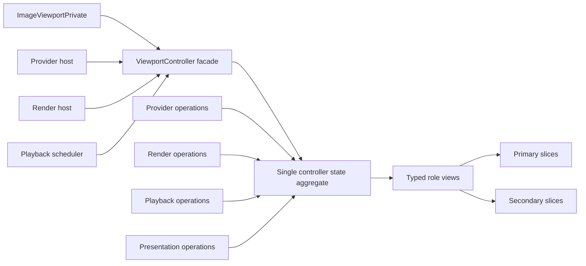

# Controller Refactoring Implementation Plan

This document is a user-requested execution plan, not a public specification or durable architecture contract. Durable user-visible guarantees remain in `docs/spec/`, durable subsystem contracts remain in `docs/architecture/`, and any milestone that changes those guarantees must update and commit the applicable intent document before implementation. If the repository later introduces a dedicated `docs/roadmap/` plan for this work, this document can move there without changing its non-normative status.

## Objective

Reduce controller complexity without changing observable behavior by shrinking the `ViewportController` surface, moving domain-local declarations and operations behind owner-specific boundaries, strengthening role-indexed state access, and centralizing repeated mutation rules for revisions, diagnostics, waits, terminal projection, and transport effects.

## Final End State

`ViewportController` remains the single authority for accepted page-set identity, request identity, display ownership, playback phase, presentation state, provider token state, and stale-result rejection, but it is no longer the place where every domain-local type and transition helper is declared.

`viewportcontroller_p.h` exposes only the controller facade, shared state aggregate, cross-domain identity/value types, and the narrow entry points consumed by `ImageViewportPrivate`, `ImageViewportProviderHost`, `ImageViewportRenderHost`, `ImageViewportPlaybackScheduler`, and private tests.

Provider, render, playback, presentation, metadata, and assignment operations each own their domain-local result types, helper functions, and state-view helpers. Shared private DTOs live in acyclic owner contract headers; implementation-only helpers remain in owner-specific helper headers or implementation-local namespaces.

`ViewportControllerContext` and `ViewportControllerPort` are explicit refactor targets rather than permanent broad access surfaces. Extracted operations receive narrow role-indexed read or mutation ports for the state slices they need, not raw mutable access to the full request, display, provider, and sequence model.

Controller state remains one aggregate for authority and ordering, but mutation code reaches role-local request, provider, display, and timing data through typed role views rather than direct primary/secondary field access except in explicit aggregate-spread logic.

State-changing code uses shared primitives for revision advancement, command/request diagnostics, wait-reason projection, target-spread terminal projection, provider transport effects, render commit acknowledgement, and playback phase publication.

Structural tests enforce the architecture boundaries that are easy to regress mechanically: owner-specific helper usage, role-view access, host isolation, scheduler isolation, render-host isolation, command-outcome ownership, provider event admission, and public-header hygiene. They must target durable forbidden ownership or access patterns, not incidental wording or arbitrary file layout.

Behavior tests remain focused on stable contracts rather than implementation wording, and each refactoring milestone keeps the full test suite green before moving to the next milestone.

## Non-Goals

- Do not change public QML or C++ API behavior as part of these milestones unless a milestone explicitly starts with the required spec and architecture updates.
- Do not split controller authority into independent state owners; extracted operations must still operate on controller-owned state and typed controller inputs/outputs.
- Do not rewrite provider, render, playback, and presentation domains in one pass.
- Do not add tests that assert incidental source wording or file layout except for intentional structural boundary tests.

## Execution Rules

- Run one milestone per `/goal` unless the milestone is explicitly marked as safe to combine with the next one and the earlier milestone produces no file changes.
- Start each implementation milestone from a clean or understood working tree and record unrelated existing changes before editing.
- Add or adjust focused structural or behavior tests before implementation when a milestone introduces a new durable boundary.
- Keep commits small and use Conventional Commits with the `Co-authored-by: Codex <noreply@openai.com>` trailer when Codex materially authors the change.
- Verify every milestone with `cmake --build <build-dir> && ctest --test-dir <build-dir> --output-on-failure` when an existing configured build is available, or `just test` when using the repo default build.

## Milestone 0: Baseline Inventory And Guardrails

Intent: Establish the current controller surface, owner mapping, and test baseline before moving declarations or state access.

Work: Inventory `ViewportController` public/private methods by owner domain, inventory result/event structs in `viewportcontroller_p.h`, inventory direct primary/secondary state access in `src/viewportcontroller*.cpp` and owner helper headers, and decide which accesses are legitimate aggregate-spread logic.

Work: Produce a symbol-level allowlist for role-view boundaries and aggregate-spread helpers before tightening role-view structural tests, so the tests catch real ownership drift without rejecting intentional spread-combination code.

Work: Add or tighten structural tests only where the next milestones need machine-enforced protection and the assertion is about a durable boundary rather than incidental wording.

Acceptance: The inventory identifies provider, render, playback, presentation, metadata, assignment, revision, command-outcome, and test-probe ownership for the current controller surface.

Acceptance: The full test suite passes before any implementation refactor starts.

Suggested commit: `test(controller): guard controller refactor boundaries` if tests change, otherwise no code commit is required for inventory-only work.

## Milestone 1: Move Owner-Local Types Out Of The Controller Header

Intent: Reduce `viewportcontroller_p.h` by relocating result, event, and helper-only structs to the domain that owns them.

Work: Introduce acyclic owner contract headers for shared private DTOs before moving declarations. Helper headers may remain implementation-only and may depend on `viewportcontroller_p.h`; DTO contract headers must not depend on helper headers or create include cycles.

Work: Classify provider transport effects, render synchronization DTOs, command/playback/assignment results, metadata projection, and other facade-visible return types as facade or host DTOs. Move them only to shared private contract headers, not to implementation-local namespaces, unless the facade return type changes in the same milestone.

Work: Move only owner-local event/result/helper structs that are not part of facade change sets to the provider, render, playback, presentation, metadata, or assignment owner selected by the inventory.

Work: Keep only cross-domain identity/value types in `viewportcontroller_p.h`, such as shared state, request/display identity, prepared-payload identity, role identifiers, revision tokens, and facade entrypoint declarations.

Work: Update includes so unrelated implementation units do not receive broad provider/render/playback declarations by including the main controller header.

Acceptance: No observable behavior changes.

Acceptance: `viewportcontroller_p.h` is materially smaller and domain-local declarations are reachable only through owner-specific headers or implementation-local namespaces.

Acceptance: Existing structural boundary tests still pass, and new structural tests cover any newly declared owner-local header rule.

Suggested commit: `refactor(controller): move owner-local controller types`

## Milestone 2: Narrow The Controller Facade Surface

Intent: Separate true facade entry points from operations that are only implementation details of one domain.

Work: For each domain file, convert controller member functions that are not consumed outside that domain into implementation-local functions or owner-specific operation functions that receive narrow role-indexed state ports.

Work: Keep facade methods only where the item boundary, provider host, render host, playback scheduler, or private tests need to enter the controller.

Work: Preserve the single controller authority by passing typed state views and returning typed change sets/effects rather than giving extracted functions independent ownership. Do not preserve the current broad `ViewportControllerContext` or `ViewportControllerPort` shape merely under a new name.

Acceptance: The `ViewportController` declaration contains fewer domain-internal helpers and exposes a clearer group of externally consumed entry points.

Acceptance: Private tests continue to observe behavior through stable test hooks rather than reaching newly extracted implementation details.

Acceptance: Full tests pass.

Suggested commit: `refactor(controller): narrow controller facade`

## Milestone 3: Complete Role-Indexed Provider State Access

Intent: Make provider event handling and dispatch role-symmetric by default.

Work: Route provider generation state, active request state, latest non-playback request state, queued request state, token state, and provider metadata projection through provider role views.

Work: Replace direct `state.provider` versus `state.secondaryProvider` and `request.activeRequest` versus `request.secondaryActiveRequest` access in provider code with role-view helpers except where aggregate-spread logic intentionally compares roles.

Work: Add or tighten a structural test that allows direct primary/secondary access only in the role-view boundary and named aggregate-spread helpers.

Acceptance: Provider behavior tests remain unchanged and pass for both primary and secondary roles.

Acceptance: Provider code does not contain ad hoc primary/secondary branching for local role-state selection.

Suggested commit: `refactor(provider): use role-indexed controller state`

## Milestone 4: Complete Role-Indexed Render And Display State Access

Intent: Make render synchronization, render acknowledgement, pending payload ownership, and displayed payload ownership use the same role-view discipline as provider logic.

Work: Route displayed request, displayed image size, displayed image, pending payload, prepared-payload identity, and render acknowledgement matching through display role views.

Work: Keep aggregate-spread readiness and terminal projection explicit, since those intentionally combine primary and secondary roles.

Work: Extend structural coverage to catch direct display primary/secondary field access outside the display role-view boundary and aggregate-spread helpers.

Acceptance: Render scenegraph and render commit tests pass.

Acceptance: Two-page spread commit remains atomic and retained-display behavior is unchanged.

Suggested commit: `refactor(render): use role-indexed display state`

## Milestone 5: Complete Role-Indexed Playback State Access

Intent: Make play, pause, stop, seek, playback advancement, loop handling, and stop restoration use explicit role views where they touch role-local request/provider/display slices.

Work: Convert playback code that selects primary or secondary request/provider/display data into role-view accessors.

Work: Preserve aggregate playback ownership rules where one playback driver must coordinate the accepted spread.

Work: Add focused behavior tests only if existing playback tests do not cover a refactored boundary such as secondary provider stop restoration, queued playback cancellation, or loop transition ownership.

Acceptance: Playback controller tests and provider playback tests pass.

Acceptance: Playback code has a clear distinction between role-local state selection and aggregate playback ownership.

Suggested commit: `refactor(playback): use role-indexed controller state`

## Milestone 6: Centralize Mutation Primitives

Intent: Remove repeated handwritten state mutation patterns that make revisions, diagnostics, waits, and terminal projections hard to audit.

Work: Introduce or consolidate helpers for request revision advancement, display revision advancement, command revision advancement, accepted-command diagnostic clearing, invalid/unsupported/ignored command diagnostic publication, wait-state publication, target-spread terminal recording, target-spread terminal projection, provider dispatch failure publication, and render failure diagnostic recording.

Work: Replace duplicate mutation sequences with the shared primitives one domain at a time.

Work: Preserve the existing `ImageViewportInternal::CommandOutcome` boundary and `command_outcome_boundary` structural test. Centralize only remaining duplicated mutation paths unless the inventory shows that the existing command-outcome helper itself must change.

Work: Preserve documented diagnostic-preserving exceptions as explicit call sites.

Acceptance: Existing behavior tests that cover command failure preservation, request/display revision behavior, provider terminal projection, provider stale results, render acknowledgement identity, and retained display still pass.

Acceptance: Mutation helpers are small and domain-named; they do not become a new broad convenience layer that grants unrelated mutable access.

Suggested commit: `refactor(controller): centralize state mutation primitives`

## Milestone 7: Header Hygiene And Dependency Cleanup

Intent: Make the final shape easier to maintain by reducing broad includes, unnecessary declarations, and owner leakage after the main extractions are complete.

Work: Remove unused includes from controller, provider, render, playback, presentation, and helper headers.

Work: Prefer forward declarations where the owner boundary allows them.

Work: Keep test-only probes behind `IMAGEVIEWPORT_PRIVATE_TEST_PROBES` and prevent production code from depending on probe-only types.

Acceptance: Build and tests pass from a clean configure.

Acceptance: Installed public-header tests still pass and no private implementation type leaks into installed headers.

Suggested commit: `refactor(controller): clean controller dependencies`

## Milestone 8: Final Verification And Documentation Reconciliation

Intent: Confirm that the refactoring reached the intended maintainability state without changing product behavior or durable architecture contracts accidentally.

Work: Run the full suite from a clean build and run lint if the local environment has the required Qt and clang tooling.

Work: Re-read `docs/architecture/subsystem-boundaries.md`, `docs/architecture/provider-protocol.md`, `docs/architecture/rendering.md`, and `docs/architecture/playback-state-machine.md` against the final code shape.

Work: Confirm that any milestone that intentionally changed durable ownership, structure, boundary, identity, or lifecycle intent already updated and committed the relevant architecture document before implementation. Milestone 8 only reconciles accidental drift, newly discovered documentation gaps, or final wording that was intentionally deferred because it was not a durable contract change.

Acceptance: Full tests pass, structural tests pass, and any architecture changes are documented as end-state contracts rather than migration progress.

Acceptance: The controller header is no longer the catch-all location for domain-local details, role-local state access is mechanically guarded, and repeated mutation rules have one auditable implementation path.

Suggested commit: `docs(controller): reconcile controller refactor plan` only if documentation changes are needed.

## Recommended First `/goal`

Run Milestone 0 as the first `/goal`. If it adds or tightens guardrails, commit those tests and stop. Include Milestone 1 only when Milestone 0 produces no file changes and the inventory confirms type relocation is mechanical.

Suggested objective: "Complete Milestone 0 from `docs/implementation-plan.md`: inventory controller ownership, classify controller DTOs and methods by owner, produce any needed role-view allowlist, add or tighten structural guardrails only if they protect durable boundaries, verify the suite, and commit the result. Continue into Milestone 1 only if Milestone 0 produces no file changes and the type relocation is mechanical."
