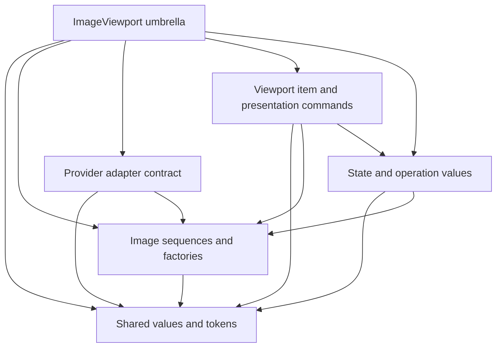

# Repository Component Boundary

`ImageViewport` is a repository-internal component with one consumer, KiriView. The application build compiles and links the component directly and registers its QML type as part of the application-owned QML surface. The build must not install or advertise a standalone SDK, QML URI and import version, exported package target, compatibility version, or independently consumable plugin.

The component must remain a separately named build target so ownership and dependencies are explicit. KiriView production code depends only on the declared component interface; it must not include engine-private headers, provider-host transport internals, render-host types, scene graph resources, native texture handles, or instrumentation types.

## Component Header Boundary

Component declarations are partitioned into five canonical interface subjects: shared values and tokens, image sequences and factories, the provider adapter contract, the viewport item and presentation commands, and state snapshots, command results, and coordinate input and result values. The supported include forms are defined by the [component-boundary specification](../spec/image-viewport-component-boundary.md). Other declarations and all implementation definitions remain private to the component.

The umbrella header is declaration-free and includes all canonical subject headers. It is a convenience entry point, not a separate declaration source. The subject headers form an acyclic dependency graph; arrows below point from a subject to a subject it may depend on.

Shared enums, opaque tokens, roles, ranges, and value primitives needed by more than one subject belong to shared values rather than the viewport item. State and operation values do not depend on the item declaration, provider implementations do not acquire a Qt Quick item dependency merely to use protocol values, and snapshot consumers do not acquire provider-session transport merely to observe state.

KiriView and the component evolve atomically in one repository. A contract change updates the component interface, application integration, and focused coverage together; it does not preserve old signatures, duplicate values, compatibility adapters, ABI shims, or versioned QML imports for hypothetical consumers.

Backend libraries are private component build dependencies unless KiriView must use one through another application-owned boundary. Backend choice does not make graphics API resources, scene graph object lifetime, texture injection, or render synchronization part of the component interface.

## Limit Authority

Source and display limits have one immutable value authority shared by the C++ and QML projections. Sequence factories, presentation-command admission, provider metadata admission, and frame preparation consume that authority rather than duplicating constants. Source logical dimensions use the full positive signed-`int` domain and their pixel-count ceiling is derived from that type authority rather than a handwritten decimal.

Payload raster and byte ceilings are separate unconditional allocation limits. Effective payload admission satisfies those ceilings and every valid tighter runtime cap for the active render environment. An unavailable runtime cap remains unavailable in provider demand and never relaxes a component limit or constrains source logical geometry. Limit checks and derived dimension, scale, pixel, duration, and byte calculations complete with overflow-safe arithmetic before allocation, payload copying, or render ownership.
