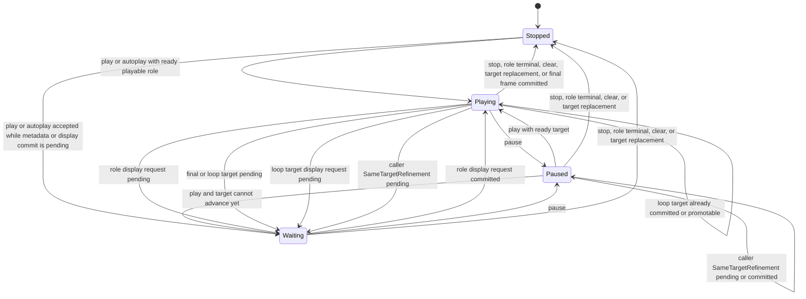

# Playback State Machine

Playback state belongs to the viewport engine, not the render host, provider, scheduler, KiriView integration owner, or QML. Primary and secondary roles each own an independent instance of the same state machine, including intent, phase, selected target, elapsed frame progress, authored loop progress, pending playback request, and latest non-playback target.

## Role State

`Stopped` means the role has no playback clock consuming frame duration. `Playing` means the engine may advance that role when its current display request is ready. `Waiting` means playback intent exists but metadata, provider work, payload admission, usable render geometry, or complete-spread render commit prevents that role from consuming additional sequence time. `Paused` preserves the role's current target and elapsed progress without consuming time.

Each role snapshot projects its own phase. A still or absent role is stopped. A timed role may be playing, waiting, or paused independently of its sibling. Aggregate terminal request state stops every role before snapshot publication, but a non-terminal wait, pause, authored-loop completion, or explicit stop for one role does not change the sibling role.

Clear and `NewTarget` replacement stop playback for the replaced generation. The new generation starts each role only through an explicit `play(role)` command or that role's validated authored autoplay. Autoplay eligibility resolves independently per role, so metadata completion order and another role's eligibility cannot select or suppress playback.

`SameTargetRefinement` transfers each present role's intent, selected target, elapsed frame progress, and authored loop progress to its replacement generation. A playing role becomes waiting until its refined target commits, a paused role remains paused, and a stopped role remains stopped.

A target transition using `RestorePrevious` freezes the pinned prior roles without accumulating elapsed time while the replacement is pending. If the replacement commits, the pinned role state is retired. If it fails, the engine restores the pinned phases, targets, elapsed progress, authored loop progress, provider sessions, and payload ownership atomically and resumes scheduling from the restored elapsed state without catch-up.

`play(role)`, `pause(role)`, and `stop(role)` affect only the addressed present role. Pause changes playing or waiting to paused. Stop retires work created only by that role's playback advancement, preserves independent explicit seek work, and restores that role's latest non-playback target when one exists. A command that already matches the role phase follows the component no-op contract and cannot disturb its sibling.

If a pending role request commits after pause, visible content may update but that role remains paused. Stop never revives a retired request identity: restoration either keeps a still-active matching non-playback request or allocates a fresh request for the stored target. Late playback results remain stale.

## Requests And Render Commit

Playback target advancement uses the same role-scoped request path as explicit seeking so status, retention, provider waiting, request queueing, upload pending, render waiting, and errors remain consistent. The request path records role and request origin so stop can retire playback-generated work without cancelling an explicit seek or sibling work.

An advancing role may prepare a candidate while its sibling keeps its committed payload. Rendering always receives a complete-spread snapshot: the candidate role changes, the sibling role retains its current payload identity, and one matching commit atomically installs the new visible spread. Waiting for that commit stops elapsed-time consumption only for the advancing role.

Explicit seek acceptance records the addressed role's target, latest non-playback target, diagnostics reset, and waiting projection before target materialization dispatches a provider request, waits for metadata, or publishes an in-memory frame. Seeking while playing preserves that role's playback intent. Invalid or unsupported seek leaves its target and phase intact.

A provider `FrameReady` event alone does not resume playback. The payload passes admission and reaches the accepted display identity through a matching complete-spread render commit. A provider or render result for an older role target after a newer seek, loop, clear, or replacement is stale and cannot change either role.

## Scheduling And Timing

The engine emits independently identified scheduling effects for each playing role. The scheduler owns timer resources and monotonic elapsed capture and returns timeout facts carrying role, generation, and schedule identity. A host may coalesce physical wakeups, but it cannot merge role clocks, lose role identity, or use one role's pending work to suppress another role's deadline.

Frame timing comes from validated sequence metadata and authored animation facts. If a role's timing metadata is unavailable, that role waits with unknown requested frame and position without inventing loop progress or accumulating catch-up time. A sibling with complete metadata continues normally.

Frame intervals are half-open over sequence duration. A play-once role reaching total duration selects the final frame without publishing a beyond-final target and stops only after that target commits or matching visible final-frame pixels are promoted. A looping role wraps from total duration to position zero without exposing a transient out-of-range position.

The engine may reserve a candidate loop crossing when it accepts a wrapped-frame request, but authored loop progress advances only when that role's wrapped target commits or is promoted. Completed plays are tracked per role against that role's authored play-once, finite, or infinite policy. The shared caller `looping` preference forces infinite looping independently for every role when true and otherwise leaves each role under its authored policy. Invalid seeks, unsupported seeks, provider failures, render failures, and stale results discard only the affected reservation unless aggregate terminal projection stops the complete target.
