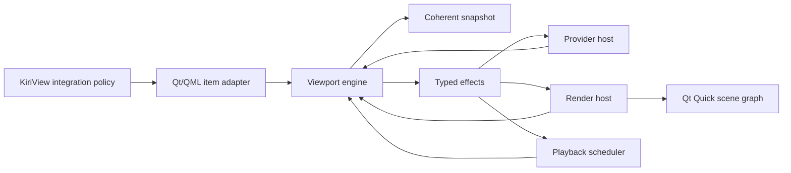

# Subsystem Boundaries

`ImageViewport` separates Qt item adaptation, canonical viewport state transitions, provider transport, frame preparation, render synchronization, playback scheduling, and scene graph presentation. The engine is the sole owner of canonical viewport state; surrounding hosts execute typed effects and return typed facts without becoming alternate state authorities.

## Dependency Direction

The item adapter, provider host, render host, and scheduler depend on engine input, effect, and snapshot value contracts. The engine depends on domain values and narrow host capabilities, not on the component item, provider implementations, timers, scene graph objects, or backend resources. Hosts must not call one another to coordinate viewport behavior; all cross-subsystem decisions return through an engine transition. Shared value contracts are acyclic and contain no mutable subsystem ownership.

## Caller Policy Boundary

KiriView owns source discovery, navigation scope, page pairing, fallback policy, application source identity, route-transition meaning, action availability, decoder and cache choices, display-store lifetime, predecode and refinement payload production policy, credentials, sandbox policy, gesture interpretation, stepped reading movement, and nearest-point or snapping policy before they become viewport commands. The viewport accepts only `ImageSequence` handles through typed presentation-target values.

KiriView must enforce application ownership and authorization before invoking the component. The item applies the same value validation and state-transition contract to every declared C++ and QML entry point and must not be treated as an application-owner authorization boundary.

The caller expresses transition intent through `PresentationTargetTransitionPolicy`, but the engine owns fit, zoom, content position, rotation, mirroring, spread direction, page gap, visible geometry, coordinate conversion, status, playback phase, diagnostics, and revisions. Caller policy must not repair a partially applied target transition through ordered follow-up mutations.

## Item Boundary

The component item owns repository-local QML registration, command entry points, component property and signal adaptation, item/window geometry capture, and conversion between declared Qt values and engine inputs. It publishes only complete engine snapshots and must not maintain independent mutable projections of request, display, presentation, or role state.

The item executes engine-authored effects through the appropriate host and returns resulting provider, render, geometry, and scheduler facts to the engine. It must preserve the engine's required ordering between accepted state publication, external effects, and notification emission. Synchronous callbacks and inputs arriving from other threads are serialized at this boundary so callers never observe a partially applied transition and an older transition cannot overwrite state or scheduling derived from a newer one.

The item does not interpret provider events, allocate request or revision identities, match stale results, decide render readiness, own playback phase, or retain scene graph resources.

## Engine Boundary

The engine owns accepted presentation-target and per-role generation identities, request origin and ordering, provider tokens, demand revisions, prepared payload and render-attempt identities, status and diagnostics projection, independent per-role playback state, restorable and discardable retained commits, preferred and effective zoom, canonical presentation state, and all component revisions. State is partitioned by these invariants under one owner; no operation or host may acquire a broad mutable controller port.

Engine inputs are typed commands and facts. Every input is reduced as one serialized transaction that either produces a coherent new state plus effects or leaves canonical state unchanged. Public value shape is validated before capability, failure-scope, or generation-state checks. Rejected commands may affect only command diagnostics as permitted by the public command contract, and coordinate helper validation is a read-only geometry operation that cannot affect command state.

External effects are created only after their owning generation, request, demand, payload, or render identity is accepted into canonical state. Results must carry those identities back to the engine; mismatched or retired results are stale and cannot mutate state, diagnostics, revisions, playback, or visible content. Cancellation and cleanup are idempotent, and engine-side retirement never waits for provider or render acknowledgement.

Presentation-target replacement is an atomic cross-domain transaction. It validates the complete role set and policy, allocates a new target generation, derives target presentation state or stores its unresolved generation-scoped geometry intent, selects retained or empty display, establishes initial per-role requests, and applies the documented playback transition before publishing effects. `RestorePrevious` additionally moves the complete prior commit into a pinned restoration slot containing its accepted generation, provider sessions, request and presentation state, payload handles, display projection, and per-role playback state. A clear target admits only the canonical clear policy, removes retained ownership, and leaves presentation preferences unchanged. Caller-declared same-target refinement establishes its requests for the transferred selected targets and additionally requires authoritative compatible metadata, equal logical sizes, an unchanged role set, and equal timing and authored-animation contracts; provider refinement remains within its accepted generation.

A target spread reaches ready request and display ownership only when every required role payload for the active identities is validated and render-committed. The engine owns separate terminal domains: generation terminal facts are keyed by generation and role, while display-request terminal facts are keyed by generation, display-request identity, and role. It projects the applicable facts through one aggregate precedence: a failed identity cannot return to loading or ready, error supersedes unsupported, and primary facts supersede a tied secondary diagnostic. Pending sibling work may be retired only when every possible sibling outcome is provably unable to change the aggregate status, reason, or winning diagnostic; in particular, a pending primary role must remain eligible to replace a tied secondary diagnostic, and any pending role after an unsupported result must remain eligible to report a higher-precedence error. No sibling success can publish a partial spread. A terminal replacement under `RestorePrevious` records a recovered-transition failure observation, retires only the failed generation, and atomically promotes the pinned slot back to accepted and committed state before snapshot publication. A later admitted role request may allocate a new display-request identity and recover from request-terminal failure; generation-terminal state admits no recovery request and requires clear or target replacement. Transport session availability is an execution fact and cannot independently authorize or reject commands once the terminal domains have determined recovery. Presentation changes and demand bookkeeping reuse committed payload ownership and do not reset ready request status. Only an unsatisfied newer payload-selection requirement or active auxiliary refinement marks displayed payloads non-current; auxiliary refinement completion may replace payload ownership, but its ordinary failure cannot overwrite ready request state or request-terminal diagnostics.

Retained display is a separate ownership domain. It carries the displayed generation and presentation identity that produced its pixels and cannot satisfy the newer target's readiness, capabilities, playback, or commands. Discardable fallback under `KeepFailedTarget` may release payloads for resource pressure and publish empty placeholder display without changing the accepted request or presentation state. A restoration slot is not visual-only fallback: its complete ownership graph is pinned until the replacement commits or terminally restores, and resource admission must fail the replacement rather than dismantle that slot.

## Snapshot Boundary

Snapshot projection is an engine responsibility. `ImageViewportStateSnapshot` groups request, display, presentation, per-role observations, diagnostics, and revisions into one immutable coherent value. Projection follows the canonical schema and valid status/phase combinations in [ImageViewport State](../spec/image-viewport-state.md); unavailable observations use the specified invalid values.

Request, display, canonical-presentation, target-presentation projection, displayed-presentation projection, command, snapshot, and per-role demand revisions have separate ownership. Canonical-presentation identity follows every component presentation field; target and displayed projection identities follow only inputs that affect the accepted or displayed render/geometry projection. A token advances only when a field or projection in its domain changes. Snapshot publication and `stateChanged` follow complete snapshot changes, while an accepted no-op preserves every revision and emits no notification. Tokens remain opaque and equality-only at component boundaries.

The engine allocates valid request, display, presentation, command, and snapshot revision identities before publishing the initial snapshot. Each role request snapshot projects its own playback phase, and aggregate terminal request state retires every role's playback before snapshot publication.

Coordinate helpers consume the same displayed-geometry projection as rendering and role geometry. They must use the retained displayed presentation identity when retained pixels are visible and must never combine it with the newer target presentation.

## Sequence Boundary

`ImageSequence` is an opaque content handle for validated in-memory or provider-backed image data. Factories own construction-time validation for still frames, timed frame entries and intervals, provider descriptors, authored animation facts, and public source limits and return the canonical typed factory result without partially constructed handles. In-memory construction stores immutable frame, timing, seek, and animation facts; provider construction stores authoritative descriptor facts and session-creation capability. Neither performs a viewport request, provider source access, session creation, render work, scene graph work, or application navigation.

Provider-backed handles may be used concurrently. Each accepted role generation receives an independent provider session; failure to create one is scoped to that generation and enters the engine as provider failure.

## Provider Boundary

The provider host owns session storage, request and event delivery, threading-contract enforcement, best-effort cancellation and close delivery, transferred frame-handle and application failure-handle release delivery, and affinity-correct destruction. Its event-ingress and cleanup ownership outlives any revocable item callback until transferred handles and closing sessions converge. It consumes engine effects and returns normalized typed events and typed host-failure causes, including command-delivery failure for response-bearing commands. Provider-authored free-form diagnostic text does not cross this boundary. An admitted provider failure may carry a typed generic cause plus an opaque application failure handle; the host validates its shape but never resolves or renders the reference. The engine owns the admitted handle until its failure observation becomes unreachable, and the host delivers exact-once release on the specified affinity. The host does not own token admission, request queues, terminal scope, command recovery, component failure projection, diagnostics, playback, rendering, or notifications.

Each provider session has one serialized command stream. Provider events may originate from worker facilities, but the host normalizes their delivery before engine reduction. Frame, position, and playback requests carry engine-authored demand; providers may select complete-frame detail but cannot own or infer viewport geometry, target identity, or render state.

## Preparation And Render Boundaries

Frame preparation validates and normalizes complete CPU-backed payloads into the source logical page-space contract before render ownership. Source logical geometry and payload resources are separate authorities: logical metadata establishes page identity without causing proportional allocation, while payload raster, retained bytes, backend texture size, per-demand byte cap, and display budget constrain actual resource ownership. Preparation must enforce metadata consistency, timing identity, orientation, exactness, source-to-payload mapping, and every applicable logical and payload limit with overflow-safe calculations before allocation-dependent copying or rendering for both in-memory and provider-backed sources. A well-formed inexact payload under `RequireExact` returns unsupported payload rejection; malformed or inconsistent payload facts return error payload rejection. Preparation returns immutable prepared values or a structured failure and does not publish readiness.

The render host owns Qt Quick synchronization, backend resource handoff, and scene graph lifetime. It consumes an engine-authored render snapshot and returns commit or failure acknowledgements carrying the complete target and role payload identities. It must not inspect provider sessions, reconstruct canonical geometry, choose request status, run playback timers, or publish public observations.

## Playback Scheduler Boundary

The scheduler owns timer resources, monotonic elapsed-time capture, and timeout delivery. It consumes independently identified per-role scheduling effects and returns elapsed intervals with their role, generation, and schedule identity. The engine alone owns each role's phase, target selection, loop policy, catch-up suppression, provider request identity, and stop/pause ordering. Physical wakeup coalescing cannot merge role clocks or remove role identity.

## Trust, Diagnostics, And Observability

All caller and provider values are untrusted at their admission boundary. Shape, enum, finite-number, size, timing, byte, token, role, generation, demand, failure-cause, failure-handle, and failure-reference checks must occur before the value can influence allocation, rendering, or canonical state. Arithmetic used for dimensions, durations, and byte bounds must be overflow-safe. Payload content, caller credentials, and provider-authored free-form text must not enter component diagnostics. A valid opaque failure reference is correlation data only and cannot affect engine branching, allocation, rendering, or diagnostic text; malformed, rejected, and stale handles still enter exact-once release.

Component diagnostics are viewport-authored from typed failure categories and trusted internal validation results and follow the ownership and clearing rules in the state specification. The diagnostic value boundary applies plain-text normalization and Unicode-scalar truncation before publication, and engine decisions never branch on diagnostic strings. Internal observability records structured subsystem, role, generation, request, demand, payload, render-attempt, and failure-reference presence with failure categories sufficient to attribute stale drops, admission failures, cleanup, and backend failures; it must not change component outcomes or expose image content, credentials, raw provider diagnostics, application failure contents, opaque reference representations, or backend object addresses.
