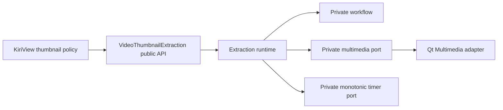

# Repository Component Boundary

`VideoThumbnailExtraction` is a repository-internal component with one consumer, KiriView. It owns the capability from one admitted video-source request to one bounded representative image or typed failure. The application compiles and links it as a separately named static target and does not install or advertise an SDK, exported package target, compatibility version, QML module, or plugin.

## Ownership

The component owns:

- request and result values, public limits, typed failure causes, the move-only job handle, and callback delivery;
- request admission, representative-image selection, bounded scaling, output validation, terminal state, and cancellation suppression;
- the private workflow, extraction deadline, multimedia backend port, and default Qt Multimedia adapter;
- media-player, video-sink, metadata observation, frame conversion, and extraction-only playback resources.

KiriView owns:

- source discovery, source-class eligibility, authorization, freshness, and navigation or session identity;
- thumbnail demand, priority, concurrency, preemption, cache lookup and installation, cache identity, publication, image-store lifetime, and stale-demand rejection;
- collection-entry access, direct-media routing, application playback state, user-visible failure projection, and localization.

The component receives a source URL only as extraction input. It must not derive application identity from that URL, traverse neighboring media, open a collection entry through application-private authority, install a cache record, publish an image-provider URL, or borrow a media player from application playback.

KiriView may adapt `VideoThumbnailExtractionJob` to an application job or provider port, but that adapter remains outside the component. The component must not depend on KiriView's async wrappers or callback types merely to satisfy application composition.

## Language And Build Baseline

The component follows the repository application build's ISO C++23, compiler, standard-library, and Qt baseline. Its implementation and supported headers compile as ISO C++23 with vendor language extensions disabled, and the target publishes that compile requirement to KiriView.

The canonical build target is `VideoThumbnailExtraction`. Public headers require only Qt Core, Qt GUI, and the C++ standard library. Qt Multimedia is a private target dependency. The component must not depend on Qt QML, Qt Quick, KIO, KDE Frameworks, the Rust support library, `KiriViewCore`, or application source directories.

Arrows point in the allowed dependency direction. The private workflow depends on public value semantics and private plain facts and effects; it does not depend on the runtime, `QObject`, timers, `QMediaPlayer`, or `QVideoSink`. The backend and timer adapters execute workflow effects and return facts through the runtime rather than calling each other.

## Header Boundary

The supported include forms are defined by the [public specification](../spec/video-thumbnail-extraction.md#repository-internal-interface). The umbrella header is declaration-free and includes the canonical subject header. All supported declarations use the `kiriview` namespace and component-prefixed names.

The public subject header declares only public limits, request, result, failure, job, callback, and start-operation values. It must not include private workflow, backend, timer, media-fact, candidate-selection, effect-plan, player, sink, cache, navigation, session, collection, or test-support declarations.

Private headers are available only while compiling the component and its component-local tests. KiriView production targets and tests that exercise only the public contract must not add the private source directory to their include path.

KiriView and the component evolve atomically in one repository. An intentional contract change updates the component and its sole consumer together and does not preserve duplicate signatures, app-owned aliases, legacy provider shapes, compatibility adapters, or ABI shims.

## Limit And Diagnostic Authority

`VideoThumbnailExtractionLimits` is the single immutable authority for the public output and diagnostic limits. Request admission, embedded-image acceptance, decoded-frame acceptance, scaling, terminal result construction, and diagnostic normalization consume that authority rather than duplicating constants.

Dimension and byte calculations are overflow-safe. A candidate is rejected before an output allocation or copy that would exceed a limit. Final admission measures the actual retained `QImage` byte size rather than inferring it solely from width, height, or an assumed pixel format.

The limits bound component-retained output and diagnostics. They do not claim that a platform codec uses no transient decode buffers; the multimedia adapter must nevertheless release rejected frames promptly, avoid retaining multiple full-frame candidates without a bounded reason, and stop backend work after terminal invalidation.

Backend messages and source URLs are untrusted diagnostic inputs. The component maps outcome categories to typed causes before text projection, normalizes and bounds any retained diagnostic, removes credentials and URL user information, and never branches on diagnostic wording.
