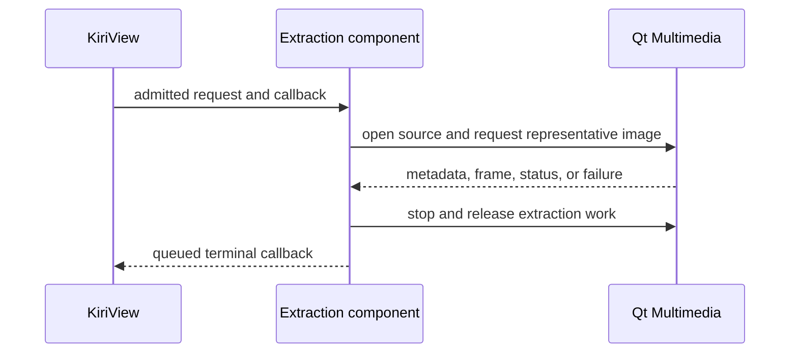

# Extraction Runtime

Each extraction operation has one lifecycle authority that exclusively accepts multimedia and deadline events, selects a terminal outcome, controls callback eligibility, and retires extraction resources. Internal object decomposition, event representation, and dispatch mechanisms remain implementation choices.

## Request Admission

The component validates the complete request against the public contract before touching the source or starting multimedia or deadline work. Rejection produces an `InvalidRequest` result subject to the same asynchronous affinity and cancellation guarantees as any other terminal result.

An admitted operation owns its request values after start returns and does not borrow the caller's request or URL storage. The start barrier prevents callback delivery before `startVideoThumbnailExtraction` returns, including when request rejection or multimedia behavior produces a terminal outcome synchronously.

Receiver validity, callback presence, event-dispatcher availability, and affinity-thread use are caller preconditions defined by the [public asynchronous-operation contract](../spec/video-thumbnail-extraction.md#asynchronous-operation) rather than request admission conditions.

## Source Access

The caller keeps its authorization and any caller-owned access grant, mount, lease, or equivalent prerequisite valid while the public job is active. The component owns every source-facing resource it creates and stops source access before the job becomes inactive.

Source access is read-only and confined to extraction from the supplied source. The component does not request write authority, mutate source content or caller-managed metadata, create source-adjacent artifacts, derive identity or freshness, or acquire application-private access authority.

## Representative-Image Authority

The component alone decides whether an embedded image or decoded frame is usable and which admissible image represents the source. Qt Multimedia supplies source capabilities, metadata, frames, status, and failures but does not acquire application cache, navigation, scheduling, publication, or playback authority.

Representative-image selection remains bounded in time and retained resources. Candidate positions, interest scoring, thresholds, and decoded-candidate ordering remain private policy because the public result promises no exact frame, timestamp, or cross-platform image equivalence.

## Serialization And Reentrancy

Startup, multimedia events, deadline expiry, cancellation, cleanup, and terminal delivery are serialized per operation so they cannot produce concurrent state transitions or multiple callbacks. A terminal outcome is immutable once selected, and no later event may replace it.

Terminal invalidation prevents further multimedia or deadline events from affecting the operation before cleanup performs actions that may synchronously or asynchronously reenter the component. Reentrant and already queued events observed after invalidation are ignored. The implementation may satisfy these outcomes with any lifecycle and dispatch structure that preserves ordering, affinity, and exact-once delivery.

## Completion, Cancellation, And Destruction

The public job remains active from return until cancellation, receiver destruction, or the moment terminal delivery begins. Selecting a terminal result stops the deadline and extraction work but preserves cancellation authority while callback delivery is pending. Immediately before invoking the callback, the operation marks the job inactive and retires cancellation authority.

Cancellation first makes terminal selection and pending delivery ineligible, then releases multimedia, deadline, and candidate resources. This ordering makes cleanup-time reentrancy harmless. Repeated cancellation is a no-op, cancellation never constructs a failed result, and canceling during pending terminal delivery suppresses that delivery.

The receiver's affinity thread owns public job state and callback delivery rather than multimedia resource lifetime. Receiver destruction has the same suppression behavior as cancellation and prevents queued delivery from dereferencing it. Start, moving or replacing an active job, cancellation, and destruction of an active job occur on that thread. Internal resources stop and retire according to their own ownership and affinity requirements; lifecycle authority is invalidated before teardown so those resources can no longer affect terminal selection or delivery.

The callback runs after the job becomes inactive, enforcing the public guarantee that callback code may release the job, destroy the receiver, or start another extraction without reentering an active instance.

Logical inactivity and physical retirement are distinct lifecycle facts. Component-created multimedia and deadline resources remain owned until their teardown completes, and physical retirement is reported only after those resources are destroyed. Callers may therefore suppress publication immediately while retaining aggregate resource admission and duplicate or concurrency identity through physical retirement.

## Deadline, Failure, And Resource Admission

Each admitted operation has a bounded monotonic deadline under component resource policy. Deadline behavior does not depend on wall-clock changes or application scheduling state.

The component maps multimedia outcomes and its own terminal reasons to the public typed failure causes before constructing diagnostics. A reliably identified inaccessible source maps to `SourceUnavailable`, a reliably identified unsupported format or extraction operation maps to `UnsupportedMedia`, and a multimedia or conversion error without a more specific reliable classification maps to `BackendFailure`.

Embedded images and decoded frames are untrusted resource inputs. For each operation, the component uses overflow-safe dimension calculations, validates positive dimensions, bounds retained candidate data, and admits a successful result only when its long edge and `QImage::sizeInBytes()` satisfy the public limits. Component-controlled materialized source, transformation, and result pixel storage stays within the public one-operation working bound. Successful output has self-contained pixel-storage lifetime; failed completion retains no candidate image. KiriView admits that working bound before invoking the component, transfers the surviving output charge through the final pixel alias, and separately owns aggregate admission, concurrency, priority, and resource-pressure policy across operations. Multimedia-backend-private storage remains outside the host-accounted bound.

Internal observability, if present, must use bounded, non-sensitive projections. It must not record image content, credentials, complete source URLs, backend object addresses, or unbounded backend diagnostics.
