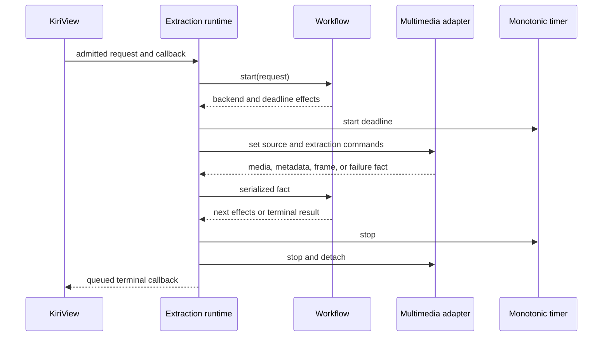

# Extraction Runtime

Each extraction operation has one runtime owner and one private workflow instance. The runtime is the sole owner allowed to accept backend or timer facts, execute workflow effects, claim terminal completion, and invoke the caller callback.

## Request Admission

The public adapter validates the complete request against the public contract before constructing a multimedia backend, timer, or workflow-owned candidate state. Rejection produces an asynchronous typed `InvalidRequest` result through the same completion path as any other terminal result and does not touch the source.

An admitted operation copies or moves all request values into its runtime owner. The caller's URL object, callback storage, and request object are not borrowed after start returns.

The public start barrier prevents callback delivery before `startVideoThumbnailExtraction` returns. A terminal fact produced synchronously during request startup or a reentrant backend command is retained by the runtime and delivered only through the queued completion path after that barrier.

## Workflow Boundary

The workflow is a deterministic reducer over one ordered stream of admitted request, media-status, duration, seekability, position, embedded-image, decoded-frame, backend-failure, and deadline facts. It returns plain effects for deadline control, backend source and playback commands, and terminal completion. It owns representative-image selection state and terminal decision state but owns no `QObject`, multimedia object, timer, callback, thread, cache, or application identity.

The workflow may prefer a usable embedded cover image to an embedded thumbnail, sample a bounded set of positions for seekable media, fall back to first-frame extraction for non-seekable media, and retain a bounded fallback candidate. Candidate positions, interest scoring, thresholds, and the order among decoded candidates remain private policy because the public result promises no exact frame or timestamp.

For one identical ordered fact stream, the workflow produces the same ordered effects and terminal classification. Platform codec behavior may change the fact stream and therefore does not create a cross-platform image-equivalence guarantee.

## Backend And Timer Ports

The backend port owns extraction-only source, play, pause, seek, stop, media-fact, metadata-image, and decoded-frame operations. The default adapter exclusively owns its `QMediaPlayer`, `QVideoSink`, metadata observations, signal connections, and frame-to-`QImage` conversion. It reports plain facts and images and does not decide request validity, candidate order, timeout outcome, failure presentation, cache policy, or completion.

The timer port owns one monotonic single-shot deadline resource and reports only deadline expiry. Wall-clock time, UI timers, and application scheduling state do not enter workflow state. The exact duration is one component resource-policy value shared by production and injected timer adapters, not duplicated by the workflow and runtime.

Private backend and timer ports are injectable inside the component boundary so lifecycle and policy can be exercised without real multimedia or elapsed wall-clock time. Injection is not part of KiriView's supported public interface.

## Serialization And Reentrancy

All backend callbacks, timer firing, cancellation, and startup effects enter one runtime-owned serialized event loop. Backend and timer facts pass through one FIFO before workflow reduction; cancellation retires runtime authority before any later queued fact is considered. If a backend synchronously emits a signal while executing a source, seek, playback, pause, or stop command, the resulting fact is appended and processed only after the current effect dispatch returns. Neither backend nor timer callbacks may recursively enter the workflow or invoke caller completion directly.

Effect dispatch preserves workflow order. A terminal effect invalidates workflow input and completion eligibility before executing stop, disconnect, destruction, or callback-related effects that can reenter the runtime. Facts already queued after terminal invalidation are discarded without changing the result.

## Completion, Cancellation, And Destruction

An active runtime has one claimable completion token. Ready and failed terminal paths atomically claim it, mark the public job inactive, invalidate further workflow input, stop the deadline, detach backend callbacks, and stop backend work before scheduling caller delivery. Only the claimed terminal result reaches the callback.

Cancellation first retires the completion token and invalidates workflow input, then stops the timer and backend and releases pending candidates. This ordering makes errors, frames, metadata, position changes, and timer events emitted reentrantly during cleanup harmless. Repeated cancellation is a no-op, and cancellation never constructs a failed result.

The receiver owns callback context, not backend state. Receiver destruction cancels the operation and prevents queued completion from dereferencing the receiver. Runtime, backend, timer, and queued-delivery resources are destroyed on the receiver's affinity thread. The public job may be moved as a value, but start, cancellation, replacement, and destruction of an active job occur on that same thread.

The callback runs only after the job is inactive and the component no longer retains it. Callback code may destroy the receiver, start another extraction, replace application demand, or release related application state without reentering an active instance.

## Failure And Resource Admission

The runtime maps private backend categories and workflow terminal reasons to the public typed failure causes. Unsupported format and unavailable source remain distinguishable when the backend supplies that distinction; an unclassified multimedia error maps to `BackendFailure`. Failure mapping occurs before diagnostic construction.

Embedded images and decoded frames are untrusted resource inputs. The runtime validates non-null positive dimensions, overflow-safe scaling, actual retained output bytes, and the public limits before a candidate can complete successfully. Rejected or superseded images are released promptly, and the workflow retains at most one bounded decoded fallback in addition to the candidate currently being processed.

Successful completion transfers exactly one admitted `QImage` to the result. Failed completion retains no candidate image. Internal observability may record typed cause, lifecycle phase, candidate source class, cancellation, and stale-event counts, but it must not record image content, credentials, complete source URLs, backend object addresses, or unbounded backend diagnostics.
